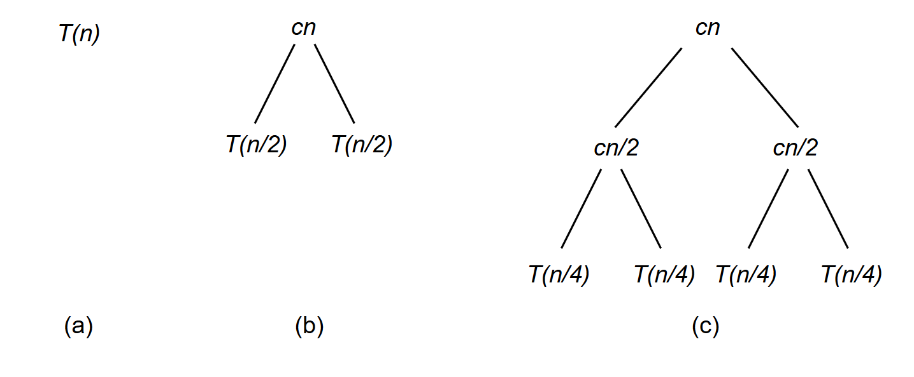
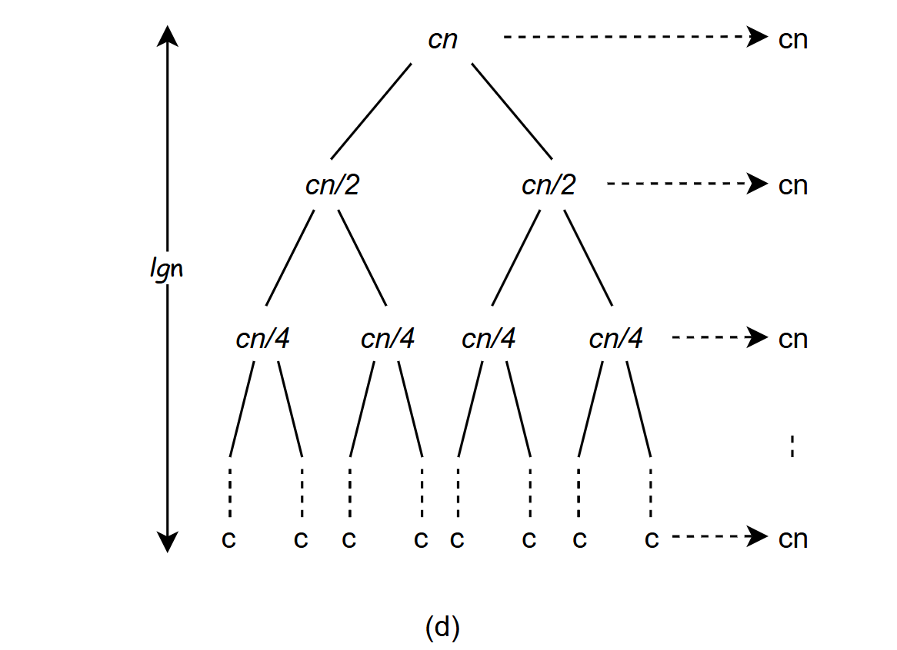

### 01-算法基础

#### 0.写在前面

​	看这本书的目的，总感觉会有用到，提升个人能力，这种能力提升不算是技能型的，而是锻炼思考方式，为以后在工作中遇到问题时能有更多的思路去解决问题。当然，学习记录能让我对书的内容理解或许会更深刻些，也为xx准备下，能出点儿力最好了。

#### 1.概述

​	开宗明义，本章的目的是为了介绍一下贯穿本书的一个框架，后面的算法设计与分析都是在这个框架下进行的，这部分内容基本独立。在此读书记录中，对算法的描述主要采用C/C++语法进行表达。

#### 2.插入排序

输入：n个数的一个序列$\langle \, a_1, a_2,\,...\,a_n \,\rangle$ 。

输出：输入序列的一个排列$\langle a'_1, a'_2, \,...\, a'_n \,\rangle$，满足$a'_1 \leqslant a'_2 \leqslant ... \leqslant a'_n$ 。

**INSERTIOON-SORT**

```c++
void insertion_sort(int A[], int n)
{
    for (int j = 1; j < n; ++j) {
        int key = A[j];
        int i = j- 1;
        // 将key插入到已排好序的数组中
        while (i >= 0 && A[i] > key) {
            A[i+1] = A[i];
            i -= 1;
        }
        A[i+1] = key;
    }
}

```

上述算法中，A[0..j-1]实际是表示的是已排好序的数组，作者将这样一些性质定义为一个循环不变式，主要用来帮助理解算法的正确性，对于循环不变式，我们需要证明以下三条性质：

​	**初始化：**循环的第一次迭代前，它为真。

​	**保持：**如果循环的某次迭代前它为真，那么下次迭代前它仍为真。

​	**终止：**在循环终止时，不变式为我们提供了一个有用的性质，该性质有助于证明算法是正确的。

当前面两条性质成立时，在每次循环开始前循环不变式为真，第三条性质也许是最重要的，因为我们需要用循环不变式来证明算法正确性，通常和导致循环终止的条件一起使用，下面对于插入排序，如何证明上述这些性质成立：

**初始化：**首先证明在第一次循环迭代之前（当j=1时），循环不变式成立。当然，这是显而易见的，第一次循环迭代之前只有A[0]一个元素，因此循环不变式成立。

**保持：**代码中第7-9行将大于key的元素往后移动，直到给A[j]找到一个合适的位置，第11行将A[j]的元素放进去，j移动到下一个位置，此时子数组A[0..j-1]由原来的A[0..j-1]的元素组成，因此在下一次迭代开始之前，将保持循环不变式。

**终止：**第3行循环终止条件表示j能够达到 n，因此将循环不变式中表述的j换成n，在循环不变式中将j用n代替，则有子数组A[0..n-1]由原来在A[0..n-1]中的元素组成，但已排序的序列，而A[0..n-1]就是整个数组，因此推断出整个数组已排序，算法正确。


#### 3.分析算法

​	算法分析的结果意味着预测算法需要的资源数量。一般来说，通过分析某个问题的几种求解算法，我们可以选出一种最有效的算法，当然可能不止一种，但往往可以抛弃几个较差的算法。在分析算法之前，我们需要明泉当前受限于要使用的实现技术模型，包括所用的资源及其代价模型。


##### 3.1.**插入排序算法分析**

我们先由繁到简改进，最初计算公式我们假定使用所有语句代价为$c_i$，对于j=1..n-1，n为数组长度，假定$t_j$表示，对于某个A[j]，代码中


```c++
void insertion_sort(int A[], int n)
{											代价	    次数
    for (int j = 1; j < n; ++j) {			c1		 n
        int key = A[j];						c2		 n - 1
        // 将key插入到已排好序的数组中
        int i = j- 1;						c4		 n - 1
        while (i >= 0 && A[i] > key) {      c5       r5
            A[i+1] = A[i];					c6		 r6
            i -= 1;							c7		 r7
        }
        A[i+1] = key;						c8		 n - 1
    }
}
```

其中
$$
r5 = \sum\limits_{j=1}^{n-1} t_j , \quad r6 = \sum\limits_{j=1}^{n-1}(t_j - 1), \quad r7 = \sum\limits_{j=1}^{n-1}(t_j - 1)
$$
 因此计算n个值输入的算法的运行时间T[n]，我们将代价与对应循环次数乘积并求和得到：
$$
T(n) = c_1n + c_2(n - 1) + c_4(n - 1) + c_5 \sum_{j=1}^{n-1} t_j + c_6 \sum_{j=1}^{n-1}(t_j - 1) + c_7\sum_{j=1}^{n-1}(t_j - 1) + c_8(n - 1)
$$
即使对于给定规模的输入，一个算法的运行时间也可能依赖于给定规模下的哪个输入，在本算法中体现在层的while循环上面，如果给定的输入已经排好序，算法出现最佳情况，此时对于每个j = 1，2，...，n-1，每个while条件都不成立，因此都有$t_j = 1$，运行时间为：
$$
T(n) = (c_1 + c_2 + c_4 + c_5 + c_8)n - (c_2 + c_4 + c_5 + c_8)
$$

对于上述结果，我们可以简化成$T(n) = an + b$的形式。对于一个反向排序的数组，则导致最坏的情况。必须将每个A[j]与排好序的数组比较，因此对j = 1,2，... n -1,有$t_j = j + 1$,所以：
$$
\sum_{j=1}^{n-1}t_j = \sum_{j=1}^{n-1}(j + 1) = \frac{n(n + 1)}{2} - 1
$$
以及
$$
\sum_{j = 1}^{n-1}{(t_j - 1)} = \sum_{j = 1}^{n-1}(j) = \frac{n(n - 1)}{2}
$$
最坏情况下运行时间为：
$$
T(n) = (\frac{c_5}{2} + \frac{c_6}{2} + \frac{c_7}{2}) n^2 + (c_1 + c_2 + c_4 + \frac{c_5}{2} - \frac{c_6}{2} - \frac{c_7}{2} + c_8)n - (c_2 + c_4 + c_5 + c_8)
$$
可以将该最坏情况运行时间表示为 $an^2 + bn + c$，其中常量a、b、c 依赖于语句代价 $c_i$ 。因此，它是 $n$ 的二次函数。


##### 3.2.最坏与平均情况

​	上述分析中我们看了最好与最坏两种情况，在后续部分中我们将集中**分析最坏情况的运行时间**，即对于规模为n的输入，算法的最长时间，理由：

-  算法最坏情况时间确定了任何输入的时间上界
-  对某些算法，最坏的情况经常出现。例如信息检索等
-  “平均情况”往往与最坏情况大致一样差


##### 3.3.增长量级

​	上述分析过程中，我们简化了最终的时间计算表达式，忽略了每条语句的实际代价，即 $c_i$ ,接下来我们做更进一步简化，我们真正感兴趣的是运行时间的增长量级，所以我们只考虑公式中最重要的项，低阶项对我们来说不太重要，同时我们也忽略重要项的系数，因为在输入很大时常量因子不如增长率重要，我们在记录上述排序算法最坏情况运行时间用$\Theta(n^2)$来表示


#### 4.设计算法

上述讲的插入排序使用了增量的方法，此处讲述使用“分治法”的算法设计方法，后后面将会更是深入进行探究。

##### 4.1.分治法

分治法思想是将原问题分解为几个规模较小但类似于原问题的子问题，递归地求解这些子问题，然后再合并这些子问题的解来建立原问题的解。

分治模式在每层递归时的三个步骤：

1.  **分解**原问题为若干子问题。

2.  **解决**这些子问题或者递归的求解各子问题。

3.  **合并**这些子问题的解成原问题的解

##### 4.2.归并排序

归并排序算法完全遵循分治模式，操作如下：

1. 分解：分解待排序的n个元素的序列成各具 $n/2$ 个元素的两个子序列。
2. 解决：使用归并排序递归的排序两个子序列
3. 合并：合并两个已排序的子序列以产生已排序的答案


```c++
#define MAX_INT 0x7fffffff
void merge(int A[], int p, int q, int r)
{
	int len1 = q - p + 1; 	// 数组1长度
    int len2 = r - q;		// 数组2长度
    int *L = new int[len1];
    int *R = new int[len2];
    // 备份数组
    for (int i = 0; i < len1; ++i) {
        L[i] = A[p + i];
    }
    for (int j = 0; j < len2; ++j) {
        R[j] = A[q + j + 1];
    }
    // 合并：比较L和R两个数组中的元素，将较小的元素放入A数组中，并移动对应的下标。
    for(int i = 0, j = 0, k = p; k <= r; ++k) {
        if (L[i] <= R[j])
            A[k] = L[i++];
        else
            A[k] = R[j++];
    }
    delete L;
    delete R;
    return;
}
```

上述merge函数合并 **A[p...q]  & A[q + 1..r] **两个子数组，先申请两个临时数组，将需要合并的数组copy过去，然后依次比较两个数组中的元素，回填到A数组中。

循环不变式定义：

> ​	在开始时A[p..k-1]按从小到大的顺序包含，L[0..len1-1] & R[0..len2-1]中的k-p个最小元素。进而，L[i] & R[j] 是各自所在数组中未被复制回A的最小元素值。


**初始化：**第一次迭代前，k=p，所以A[p..k-1]为空，同时i=j=0，循环不变式中两个条件成立。

**保持：**假定L[i] $\leqslant$ R[i]，此时L[i]是未被复制到A数组的最小元素，在L[i]复制到A数组前，数组包含k-p个最小元素，赋值后包含k-p+1个元素，并增加 $i$ 值和 $k$ 值，为下次循环前重新建立该循环不变式。反之，L[i]  >  R[j] 亦可证明**循环不变式**保持不变

**终止：**k=r+1时，子数组A[p..k-1]就是包含了k-p=r-p+1个最小元素，表示L&R两个数组中所有元素均已复制回A数组中。


如何理解merge函数的执行时间是 $\Theta(n)$ （n为合并的数组总长度，此处 $n = r - p + 1$ ）? 先看代码中copy两个数组部分，迭代次数总计为n，而每次迭代需要常量时间；后面合并代码中迭代次数也是n，因此总的执行时间是 $\Theta(n)$。

```c++
void merge_sort(int A[], int p, int r)
{
    if (p >= r) return;
    int q = (p + r) / 2;
    merge_sort(A, p, q);
    merge_sort(A, q+1, r);
    merge(A, p, q, r);
	return;
}
```

merge_sort将排序数组中A[p..r]划分为A[p..q] & A[q+1..r] 两部分，前者包含$\lceil n/2 \rceil$ 个元素，后者包含 $\lfloor n/2 \rfloor$ 个元素。


##### 4.3.分治法分析

当一个算法包含对其自身的递归调用时，我们大概率可以用递归方程或者递归式来描述其运行的时间，该方程根据在较小输入上的运行时间来描述规模为n的问题上的总运行时间，然后使用数学工具来求解该递归式并给出性能边界。

分治算法运行时间递归式来自基本模式的三个步骤。我们用 $T(n)$ 表示一个规模为n的问题求解时间。若问题足够小，对某个常量 $c$ ，$n \leqslant c$，则直接求解需要常量时间，记做 $\Theta(1)$。将问题分解成a个子问题，每个子问题的规模是原问题的 1/b（对于归并排序a=b=2），为了求解一个规模为n/b的子问题，需要$T(n)$ ，的时间，所以a个子问题需要 $aT(n)$时间，分解成子问题的时间为 $D(n)$，合并解需要时间 $C(n)$，那么得到递归式：
$$
T(n) =  \left\{\begin{array}{ll}
{\Theta(1)} & \mbox{若}\, n  \leqslant c \\
{aT(n/b) + D(n) + C(n)} & 其他  \\
\end{array}\right.
$$
**归并排序算法分析**

下面是归并排序规模为n情况下运行时间 $T(n)$ 的递归式，归并一个元素是常量时间，当n>1时，运行时间如下：

​	**分解：**分解问题仅计算中间值，因此 $D(n) = \Theta(1)$

​	**解决：**递归求解规模为n/2的两个子问题，时间为$2T(n/2)$ 时间

​	**合并：**上述分析过一个规模为n元素数组过程merge需要 $\Theta(n)$ 的时间，因此 $C(n) = \Theta(n)$

可以得到：
$$
T(n) = \left\{ \begin{array}{ll}
{\Theta(1)} & 若\; n = 1	\\
{2T(n/2) + \Theta(n)}  & 若\; n > 1\\
\end{array} \right.
$$
为了更直观的理解并给出最终的运行时间 $\Theta(n\lg{n})$，将上述递归式重写为：
$$
T(n) = \left\{ \begin{array} {ll}
{c} & {若\; n = 1} \\
{2T(n/2) + cn} & {若 n > 1}\\
\end{array}\right.
$$






为了方便看，我们假定n刚好是2的幂，根据上面的递归树，可以看到每层划分后其代价为 $cn$， 总的层数为 $\lg{n}$，因此总代价为 $cn \lg{n} + cn$ ，即 $\Theta(n)$。

#### 5.小结

​	本章节的学习，一大收获是获取了一个算法检查的方法，即我可以在不运行算法的情况下如何去分析检查算法实现的正确性。了解了如何通过计算的方式去获取一个算法的运行时间，对于算法的设计与分析流程上有了一个明确的框架认识。


#### 6.诗歌

**敕勒歌**

敕勒川，阴山下，

天似穹庐，笼盖四野。

天苍苍，野茫茫，

风吹草低见牛羊。

注：敕勒歌中呈现的是一个以高耸延绵的阴山为背景苍茫辽阔的世界，阴山下一望无垠的草原在天地间延展，似乎一直延展到天边。天地连接在一起，天空犹如一顶巨大的毡帐，笼罩大地。天空湛蓝，草原辽阔，当风吹过草原，丰茂的牧草随风低伏，显露出一群群的牛羊。
