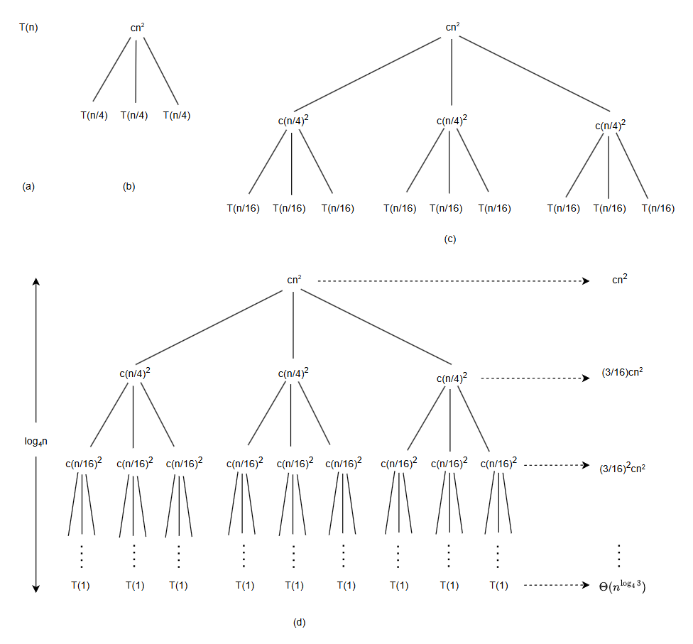

#### 03-分治策略

#### 1.概述

前面两节儿简单的提过，分治策略使用递归求解问题时分三个步骤，**分解、解决、合并**，问题规模大比较大时我们递归求解，当子问题规模减小到一定时我们考虑直接求解。对于分治算法的时间描述，一般使用递归式进行刻画，它是通过更小的输入上的函数值来描述一个函数，给个平均划分子问题的例子：
$$
T(n) = \left\{\begin{array}{ll}
\Theta(1) & {若\;n = 1\;} \\
2T(n/2)  + \Theta(n) & {若 \; n > 1\;}
\end{array}\right.
$$

求解递归式可以得到 $T(n) = \Theta(n\lg n)$ 。

本文记述三种求解递归式的方法，即得出算法的 "$\Theta$" 或 "$O$" 渐近界的方法：

1. 代入法：先猜测一个界，然后证明这个界是正确的

2. 递归树法：将递归式转换为一棵树，节点标识不同层次递归调用产生的代价，而后采用边界和技术来求解递归式

3. 主方法：使用定理，求解如下形式的递归式的界：
   $$
   T(n) = a T(n/b) + f(n)
   $$
   其中 $a \geqslant 1, \; b > 1, \; f(n)$ 是一个给定的函数，这种是常见的递归式，它刻画了这样一个分治算法：生成 a 个子问题，每个子问题的规模是原问题的 1/b，分解和合并步骤总共花费时间为 $f(n)$ 。

在分析计算的过程中，我们往往会忽略掉一些不太重要的细节，比如说划分问题规模 n/2 存在向上取整和向下取整情况，以及一些边界条件，通常影响不大，但我们需要知道什么时候会影响不大。


#### 2.最大子数组问题

​	简单描述下原问题：给了一个整数数组，每个元素代表某公司第一天到第n天的股票的价格，要求计算在给定的这些天数内买卖一次股票能获得的最大收益是多少。

##### 2.1.解决思路

1. 瞄一眼这个问题可能会想到在最低点儿买在最高点儿卖，那么利益应该是最大化的，这个方法有个前提就是，最低价格出现在最高价格前面，如果反过来就不行了。
2. 暴力求解，迭代每一个可能的买点和卖点组合，总共是 $\left( \begin{array}{c} \, n \,\\ \, 2 \, \end{array} \right)$ 种日期组合，时间复杂度是 $O(n^2)$ 。

除此之外，有更好的办法吗？当然，换个观察角度，我们考虑每天的价格变化，第 $i$ 天的价格变化被定义成了第 $i$ 和第 $i - 1$ 天的价格差，这样可以将问题转化成“寻找一段日期，在该范围内从第一天到最后一天的价格净值最大”，将其看作一个数组A，问题转化成了求解 $A$ 数组的和最大的非空连续子数组，这样的数组被称**作最大子数组**。使用分治策略求解，我们尽可能的将数组 $A [low .. high]$ 划分为两个规模相当的子数组，找到数组中间位置 $mid$，最终解 $A[\,i .. j\,]$ 考虑如下三种情况：

- 完全位于子数组 $A[low..mid]$ 中
- 完全位于子数组 $A[mid + 1..high]$ 中
- 跨越中点，因此 $low \leqslant i \leqslant mid \leqslant j \leqslant high$

最终的解必然是上述三种情况之一，对于前两种我们递归的进行求解即可，我们只需要考虑第三种情况，寻找跨越终点的最大子数组和，然后在这三种结果中选取和最大者即可。

对于第三种情况，因为加入了必须跨越中点的条件，我们只需要找到最大的 $A[i .. mid] \;和\; A[mid + 1..j]$ 合并起来即可，代码如下：

```c++
int find_max_cross_subarray(int A[], int low, int mid, int high, int *rl, int *rh) {
	int left_sum = -0x3fff;
    int sum = 0;
    // 从mid向low迭代，找到最大和并记录下标
    for (int i = mid; i >= low; --i) {
        sum += A[i];
        if (sum > left_sum) {
            left_sum = sum;
            *rl = i;
        }
    }
    int right_sum = -0x3fff;
    sum = 0;
    // 从mid向high迭代，找到最大和并记录下标
    for (int j = mid + 1; j <= high; ++j) {
        sum += A[j];
        if (sum > right_sum) {
            right_sum = sum;
            *rh = j;
        }
    }
    // 返回左右最大数组和即可
    return right_sum + left_sum;
}
```

##### 2.2.分治算法

代码很简单，注释写清楚了，总共花费 $\Theta(n)$ 的时间，有了上述工具，分治算法的代码如下：

```c++
int find_maximum_subarray(int A[], int low, int high, int *rl, int *rh ) {
    if (high ==  low) {
        return A[high];
    }
    mid = (low + high) / 2;
    int l_i, l_j, l_sum;
    l_sum = find_maximum_subarray(A, low, mid, &l_i, &l_j); 		// 求解左侧子数组解

    int r_i, r_j, r_sum;
    r_sum = find_maximum_subarray(A, mid + 1, high, &r_i, &r_j); 	// 求解右侧子数组解

    int c_i, c_j, c_sum;
    c_sum = find_max_cross_subarray(A, low, mid, high, &c_i, &c_j);	// 求解跨mid值最大子数组

    // 选择三个结果中最大和的子数组返回
    if (l_sum >= r_sum && l_sum >= c_sum) {
        *rl = l_i;
        *rh = l_j;
        return l_sum;
    } else if (r_sum >= l_sum && r_sum >= c_sum) {
        *rl = r_i;
        *rh = r_j;
        return r_sum;
    }

    *rl = c_i;
    *rh = c_j;
    return c_sum;
}
```

代码注释中已经标明，前面两次调用 $find\_maximum\_subarray$ 自身是递归的解决划分的左右两个子数组问题，最后调用 $find\_max\_cross\_subarray$ 是为了处理上面提到的三种情况中最后一种情况，当然他们的调用顺序是可以交换的。


##### 2.3.算法分析

​	用 $T(n)$ 表示 $find\_maximum\_subarray$ 求解n个元素的最大子数组运行时间，同时假定输入规模n为2的幂以简化分析。上述代码中，该递归调用触底情况是划分子数组只有一个情况，此时执行时间 $T(1) = \Theta(1)$；当 $n > 1$ 时为递归情况，递归时问题被划分为 $n/2$ 的两个数组，求解两个子数组时间为 $2T(n/2)$；对于最后调用 $find\_max\_cross\_subarray$ 的时间为 $\Theta(n)$，综上可以得到以下递归式：
$$
T(n) = \left\{ \begin{array}{ll}
\Theta(1) & n = 1 \\
2T(n/2) + \Theta(n) & n > 1 \\
\end{array}\right.
$$

通过计算可以得到 $T(n) = \Theta(n\lg{n})$，对于为何是这个结果，可以参考前面文章中递归树的思路去做计算，当然也可以往后看，将记录多种方式求解该问题。可以从不同的方向角度看待问题，同上面一样，将问题做个简单转换，获取更优算法的思路可能更容易些。分治算法能够给出渐近最快的算法，而在其它时候，不使用分治算法或许能做得更好，对于最大子数组问题，实际上是存在一个线性时间的算法，并未使用分治算法的思想。


#### 3.代入法求解递归式

 代入法求解递归式分两步：

1. 猜测解的形式
2. 用数学归纳法求出解中的常数，并证明解是正确的

求解下面一个递归式介绍代入法流程：
$$
T(n) = 2T(n/2) + n
$$
猜测其解为 $T(n) = O(n \lg n)$，代入法要求选择合适的常数 $c > 0$，可有 $T(n) \leqslant cn\lg n$。先假定我们猜测的此上界对所有的正数 $m < n$ 都成立，特别地对于$m = n/2$ 有 $T(n/2) \leqslant c (n/2) \lg (n/2)$，将其代入递归式可以得到：
$$
\begin{array}{ll}
T(n/2) & \leqslant \; c (n/2) \lg (n/2) + n \leqslant cn\lg (n/2) + n \\
& = \; cn \lg n - cn \lg 2 + n \\
& = \; cn \lg n - cn + n \leqslant cn \lg n
\end{array}
$$
其中，对 $c \geqslant 1$，最后一步都会成立。除了上述证明外，归纳法要求我们也证明解在边界条件上面也是成立的，对于上述递归式，我们必须证明选择足够大的 $c$ 可以使得上界 $T(n) \leqslant cn \lg n$ 对于边界条件也是成立的。

原想简单记录，但其中存在一些问题，，又不得不提。我们先假设 $T(1) = 1$ 是递归式的唯一边界条件。对 $n =1$，边界条件 $T(n) \leqslant cn \lg n$ 推导出 $T(1) \leqslant c1\lg 1 = 0$，与假设 $T(1) = 1$ 矛盾，因此归纳证明的基本情况不成立。如何处理？

**扩展边界**

在这我们需要关注的一点是渐近界符号本身仅要求我们在 $n \geqslant n_0$ 上证明 $T(n) \leqslant cn\lg n$，其中 $n_0$ 是我们可以自己选择的常数。因此我们保留麻烦的边界条件  $T(1) = 1$ ，但将其从归纳证明中移除。为了做到这一点儿我们观察到对于 $n > 3$，递归式并不直接依赖 $T(1)$，将归纳证明中的基本情况替换为 $T(2) \; 和 \; T(3)$，并令 $n_0 = 2$。由 $T(1) = 1$ 我们可以得到 $T(2) = 4，T(3) = 5$。现在完成归纳证明：对某个常数 $c \geqslant 1，T(n) \leqslant cn \lg n$，方法是选择足够大的 $c$，满足 $T(2) \leqslant c2\lg 2 \;和\; T(3) \leqslant c3 \lg 3$。 能看出对于任何 $c \geqslant 2$ 都能保证对 $n = 2 \; 和 \; n = 3$ 的基本情况成立。扩展边界条件使归纳假设对较小的n成立，是一种简单直接方法。


**可能存在的问题**

上述过程中第一步的猜测，并不存在通用办法，依赖于经验，偶尔还需要创造力，也可以借助后面的递归树来辅助猜测。另外一个办法就是证明一个比较松的上界或者下界，然后缩小不确定的范围，直到收敛到渐近紧确界。在猜出紧确界情况下，但在归纳证明时却失败了，可以考虑**减去一个低阶的项**再试着去证明。在代入计算得到最终的表达式形式必须与我们假设**严格一致的形式**。在证明一些看起来比较奇怪的表达式时，我们可以考虑做一些递归式转换，可以得到我们熟悉的样子。好了，这就写到这。


#### 4.递归树求解递归式

前面已经用过了一次递归树，在这再次说明下。代入法可以先要求我们先进行猜测一个界，然后再进行代入证明，对于证明过程我们都是使用归纳法，递归树的方法给我们补齐了前面一步 - “猜测界”。在递归树中，每一个节点代表一个单一子问题的代价，子问题代表某次递归调用，求和所有的节点，得到总的递归调用的代价。在进行求和过程中如果我们做得足够精细，也可以用递归树进行证明界，下面我们看一个不那么“精确”的例子。
$$
T(n) = 3T(n/4) + \Theta(n^2)
$$

引入 $c > 0$ 调整递归式为：
$$
T(n) = 3T(n/4) + cn^2
$$
给出递归树：



**计算深度**

上图给出了从问题规模n不断拆分过程中产生的代价，因为每次问题规模减少为上一步的1/4，最终必然达到1的边界条件。问题规模为 $n$，深度为 $i$ 对应问题规模为 $1/4^i$ 的子问题，当问题规模 $1/4^i = 1$ 时，有 $i = \log_4 n$，因此递归树深度为 $\log_4 n + 1$。

**每层代价**

每层节点数量为上一层3倍，因此第 $i$ 层节点总数为 $3^i$。每一层问题规模为上一层的 $1/4$，对于 $i = 0, \,1, \, 2\, .. , \, \log_4 n - 1$，深度为 $i$ 的每个节点代价为 $c(n/4^i)^2$，因此对于深度为 $i$ 的所有子节点代价和为 $3^i c (n/4^i)^2$，树的最底层深度为 $log_4 n$，有 $3^{\log_4 n} = n^{\log_4 3}$ 个节点，每个节点代价为 $T(1)$ ，总代价为 $n^{\log_4 3} \, T(1)$，即 $\Theta(n^{\log_4 3})$。

**求解总和**
$$
\begin{array}{ll}
T(n) & = cn^2 + \frac{3}{16} cn^2 + (\frac{3}{16} )^2 cn^2 + \, \cdot \cdot  \, +
(\frac{3}{16})^{\log_4 n - 1} cn^2 + \Theta(n^{\log_4 3}) & < .. \\
& = \sum\limits_{i = 0}^{\log_4 n - 1} (\frac{3}{16})^i cn^2 + \Theta(n ^ {\log_4 3})
& < \sum\limits_{i = 0}^{\infty}  (\frac{3}{16})^i cn^2 +  \Theta(n ^ {\log_4 3}) \\
& = \frac{(3/16)^{\log_4 n} - 1}{(3/16) - 1} cn^2 +  \Theta(n ^ {\log_4 3}) & < \frac{16}{13} cn^2 + \Theta(n ^ {\log_4 3}) \\ & & = O(n^2)
\end{array}
$$
**推导验证**

至此，我们推导出了一个猜测界 $T(n) = O(n^2)$，用代入法验证正确性，即 $T(n) = O(n^2)$ 是递归式 $T(n) = 3T(n/4) + \Theta(n^2)$ 的一个上界。我们希望证明 $T(n) \leqslant dn^2$ 对某个常数 $d > 0$ 成立。使用常数 $c > 0$ 我们有：
$$
\begin{array}{ll}
T(n) & \leqslant 3T(n/4) + cn^2 \leqslant 3d  (n/4)^2 + cn^2\\
& = \frac{3}{16} dn^2 + cn^2 \leqslant dn^2
\end{array}
$$
当 $d \geqslant (16/13)c$ 时，最后一步成立，证明完毕。


#### 5.主方法求解递归式

主方法用于为如下形式的递归式提供了一种求解方法：
$$
T(n) = aT(n/b) + f(n)
$$
其中 $a \geqslant 1 \, 和 \, b > 1$，$f(n)$ 是渐近正函数。上述式子描述的是这样一种算法的运行时间：它将规模为 $n$ 的问题分解为 $a$ 个子问题，每个子问题规模为 $n/b$，其中 $a$ 和 $b$ 都是正常数。$a$ 个子问题递归进行求解，每个花费时间 $T(n/b)$。函数 $f(n)$ 包含了问题分解和子问题合并的代价。

**主定理**

**定理：** 令 $a \geqslant 1$ 和 $b > 1$ 是常数，$f(n)$ 是一个函数，$T(n)$ 是定义在非负整数上的递归式：
$$
T(n) = aT(n/b) + f(n)
$$
其中我们将 $n/b$ 解释为 $\lfloor {n/b} \rfloor$ 或 $\lceil {n/b} \rceil$。那么 $T(n)$ 有如下渐近界：

1. 若对某个常数 $\varepsilon > 0$ 有 $f(n) = O(n^{\log_{b}{a} - \varepsilon})$，则 $T(n) = \Theta(n^{\log_ba})$。
2. 若 $f(n) = \Theta(n^{\log_ba})$，则有 $T(n) =\Theta(n^{\log_ba} \lg n)$。
3. 若对某个常数 $\varepsilon > 0$ 有 $f(n) =\Omega(n^{\log_b a + \varepsilon})$，且对某个常数 $c < 1$ 和所有足够大的 $n$ 有 $a f(n/b) \leqslant cf(n)$，则 $T(n) = \Theta(f(n))$。

说明：上面三种情况都是将 $f(n)$ 与函数 $n^{\log_{b}{a}}$ 进行比较，两个函数较大者决定了递归式的解，但这的比较不是一般意义上的大小比较，必须是相差一个 $n^{\varepsilon}$ 因子。当然，上述三种情况也不能包含所有的递归式情况，比如存在的间隙，比如第三种情况中的条件是否满足。

简单记录一个地柜式计算：
$$
T(n) = 9T(n/3) + n
$$
对于上述递归式，对照主定理中的格式，有 $a= 9, \, b = 3, \, f(n) = n, \; 因此 \; n^{\log_{b}{a}} = n^{\log_{3}{9}} = \Theta(n^2)$，由于 $f(n) = O(n^{\log_{3}{9} - \varepsilon})$，其中 $\varepsilon = 1$，可以应用主定理的情况1，从而得到解 $T(n) = \Theta(n^2)$。

#### 6.小结

这一节讲的是分治策略，其重点在于递归式的求解，三种方法各有侧重，在后续的分析中，大多数情况能被第三种方式覆盖，可以快速得到结果。


风 - 解落三秋叶，能开二月花。过江千尺浪，入竹万竿斜。

咏柳 - 碧玉妆成一树高，万条垂下绿丝绦。不知细叶谁才出，二月春风似剪刀。

回乡偶书 - 少小离家老大回，乡音无改鬓毛衰。儿童相见不相识，笑问客从何处来。


