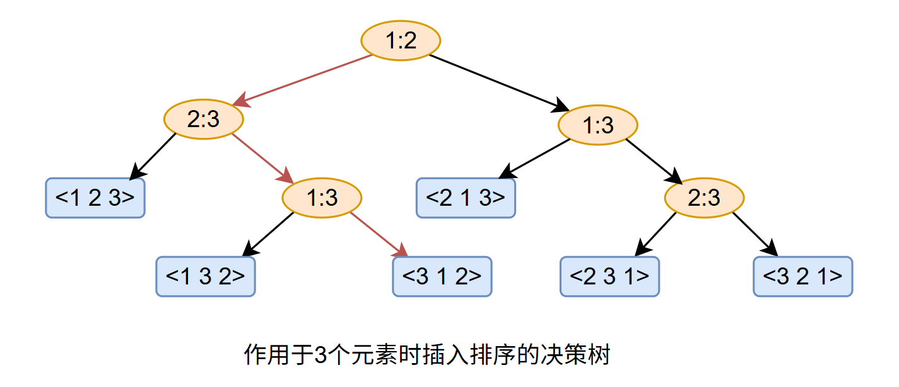
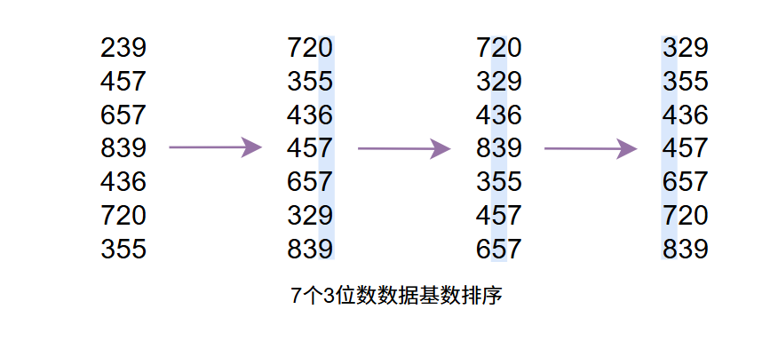
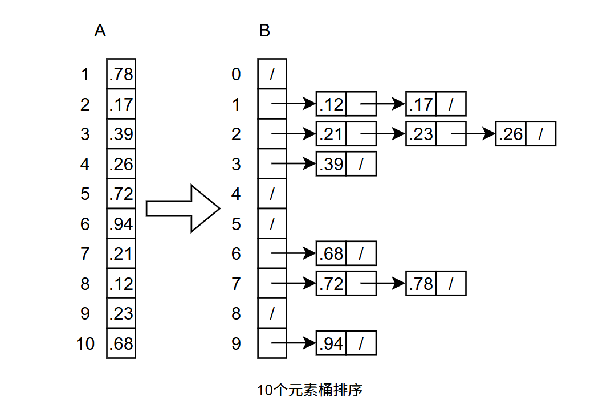

##### 算法导论-07-线性时间排序

##### 1.排序算法下界

此处讲述比较排序，给定输入序列 $< a_1，a_2，...，a_n>$，假定输入元素各异，因此对于比较符号我们仅使用 $\leqslant$ 即可得到两个元素 $a_i$ 和 $a_j$ 之间的次序关系。

对于比较排序，其比较过程可以抽象为一棵决策树，决策树是一棵满二叉树，它可以表示在给定输入规模情况下，某一特定算法对所有元素的比较操作，其中忽略了控制、数据移动等其他操作。

在决策树中，每个节点都以 $i : j$ 标记，其中 $i$ 和 $j$ 满足 $i \leqslant i，j \leqslant n$，$n$ 为输入序列中的元素个数。每个叶节点上都标注一个序列 $\pi(1)\;，\pi(2)\;，...，\pi(n)\;$。排序算法的执行对应于一条从树的根节点到叶节点的路径。每个内部节点表示一次比较 $a_i \leqslant a_j$ 。左子树表示我们确定 $a_i \leqslant a_j$ 之后的所有比较，右子树则表示 $a_i > a_j$ 之后的所有比较，当到达叶节点时表示排序算法已经确定了一个顺序 $a_{\pi(1)} \leqslant a_{\pi(2)} \leqslant ... a_{\pi(n)}$ 。因此，对于一个正确的比较排序算法来说，$n$ 个元素的 $n!$ 种可能的排列都应该出现在决策树的叶节点上，而且对每一个也节点都可以从根节点经由某条路径可达，该路径对应于比较排序的一次实际执行过程。



> 完美二叉树：高度为 $h$ 的二叉树，其包含了 $2^h - 1$ 个节点
>
> 满二叉树：要求每个节点要么有0个子节点，要么有两个子节点
>
> 完全二叉树：除最后一层外，其它层次上节点全满，且最后一层上的节点靠左排列

在决策树中从根节点到任意一个可达叶节点之间最长简单路径的长度，对应的是排序算法中最坏情况下的比较次数，因此，一个比较排序算法其最差情况下的比较次数就等于其决策树的高度。给出下面定理，并予以证明。

**定理：**在最坏情况下，任何比较排序算法都需要做 $\Omega(n\lg{n})$ 次比较。

**证明** 考虑一棵高度为 $h$ ，具有 $l$ 个可达叶节点的决策树，它对应于一个对 $n$ 个元素所做的比较排序，因此输入数据的 $n!$ 种排列有 $n! \leqslant l$ ，因此可以得到：
$$
n! \leq l \leq 2^h
$$
 两边取对数可以得到：
$$
\begin{array}{lll}
h & \geq &\lg{n!} \\
& = & \Omega(n\lg{n})
\end{array}
$$
因此前面讲述的堆排序和归并排序都是渐进最优的比较排序算法。

##### 2.计数排序

计数排序假定 $n$ 个输入的元素中每个都是在 0 到 $k$ 区间内的一个整数，其中 $k$ 为某个整数。当 $k = O(n)$ 时排序运行的时间为 $\Theta(n)$

计数排序的思想：对每一个输入元素 $x$，确定小于 $x$ 的元素个数。利用该信息可以直接将 $x$ 填入到它在输出数组中的位置上。代码：

```c
#define MAX_K
int* counting_sort(int *arr, int n) {
    int count[MAX_K + 1] = {0};
    int *output = (int *)malloc(n * sizeof(int));
    
    for (int i = 0; i < n; i++) {
        count[arr[i]]++;
    }

    for (int i = 1; i <= MAX_K; i++) {
        count[i] += count[i - 1];
    }

    for (int i = n - 1; i >= 0; i--) {
        output[count[arr[i]] - 1] = arr[i];
        count[arr[i]]--;
    }
	return output;
}

```


上述代码主要给出框架部分，三个 $for$ 循环中，第一个循环统计输入数组中每个元素数量，第二个循环统计小于输入元素 $x$ 的元素个数，第三个倒序遍历输入数组，将其值填入到输出数组对应的位置上。在输出时倒序很重要，这用于保证排序算法自身的稳定性。算法执行时间为 $\Theta(k + n)$，当 $k = O(n)$ 时，执行时间则为 $\Theta(n)$

##### 3.基数排序

**算法说明**

对给定的 $n$ 个 d 位数，比如 $n$ 个10进制的3位数，先从低位即个位开始对这 $n$ 个数进行排序，其次是十位，最后是百位，在这过程中有一点需要注意的是选取其中一位对数据进行排序时，排序算法必须是稳定的，否则会翻车，不信自己试试。过程大概，如下：



感觉上来看，我们应该是先排序高位部分，从高位往低位排序，这样也不是不行，但高位在排序后对低位排序时只能是高位相同的情况下分组进行排序，否则要爆炸。。比如对年月日进行排序，先对年排序，然后年份相同的情况下，对月进行排序，最后在年月相同的情况下对日进行排序。另外一种方法就是从低位往高位排但需要稳定的排序算法，先对日排序，其次月，最后年，可以得到正确结果，伪代码：

```c++
RADIX-SORT(A, d)
	for i = 1 to d
		use a stable sort to sort array A on digit i
```


**引理：**给定 $n$ 个 $d$ 位数，其中每一个数位都有 $k$ 个可能值，如果基数排序中对每一个数位采用的稳定排序算法耗时为 $\Theta(n+k)$，那么它就可以在 $\Theta(d(n+k))$ 时间内将这些数排好序。

**证明：**对于每一个 $r \leqslant b$，每个关键字可以看作 $d = \lceil b/r \rceil$ 个 $r$ 位数。每个数都在 0 到 $2^r - 1$ 区间的一个整数，这样就可以采用计数排序，其中 $k = 2^r - 1$ 。每一轮排序排序花得时间为 $\Theta(n+k) = \Theta(n + 2^r)$，计数排序花的总时间代价为 $\Theta(d(n + 2^r)) = \Theta((b/r)(n+2^r))$。

**时间分析**

对编程来讲，我们希望的是选择的 $r$ 值能够最小化表达式 $(b/r)(n+2^r)$ 的值。对于 $b < \lfloor \lg n \rfloor$ 情况，则对任何满足 $r \leq b$ 的 $r$，都有 $(n + 2^r) = \Theta(n)$。显然，选择 $r = b$ 时的时间代价 $(b/b)(n+2^b)=\Theta(n)$ 是渐近意义上最优的。如果 $b \geq \lfloor \lg n \rfloor$，选择 $r = \lfloor \lg n \rfloor$ 可以得到偏差不超过常数系数范围内的最优时间代价。


##### 4.桶排序

**算法说明**

桶排序假定输入数据服从均匀分布，平均情况下它的时间代价为 $O(n)$，具体来说，计数排序假定输入数据都是属于某个小区间内的整数，而桶排序则假设输入是有一个随机过程产生，数据均匀独立的分布在 $[\;0\;, \;1\,)$ 上。

桶排序将 $[\;0\;, \;1\,)$ 区间均匀地划分为 $n$ 个大小相同的子区间，或称作桶，其中 $n$ 为输入数据规模。然后将 $n$ 个输入分别放入到各个桶中。因为前置了均匀分布的条件，因此也不太可能会导致很多个数据集中落入到某个桶中的情况。



相比写代码而言，感觉画个图更能直观表示出桶排序是怎样的，看上图，其中 $A$ 是我们输入原始数据，规模为 $n$，元素取值范围在 $[\;0\;,1\,)$，$B$ 是我们分配的桶，桶的个数也是 $n$，这一点很重要，在后面的证明中会用到。算法简单分三步：

1. 将输入数组中各元素 $x$ 扩大 $n$ 倍并向下取整，得到桶的编号 $\lfloor nx \rfloor$ 并扔到桶里
2. 对每个桶里面的元素进行排序（插入排序）
3. 按顺序把每个桶中的元素取出来放一块儿

**时间分析**

除了第2步之外，其它两步的算法时间都是 $O(n)$，单独分析一下第2步中 $n$ 次的插入排序时间。假定 $n_i$ 是表示桶 $B[i]$ 中元素个数的随机变量，可以表示桶排序的时间为：
$$
T(n) = \Theta(n) + \sum_{i=0}^{n-1}{O(n_i^2)}
$$
对上面两边取期望，可以得到：
$$
\begin{array}{lll}
E[T(n)] & =  & E\left [\Theta(n) + {\sum\limits_{i = 0}^{n - 1}{O(n_i^2)}}  \right] \\
& = & \Theta(n) + \sum\limits_{i = 0}^{n - 1}{E(O(n_i^2))} \\
& = & \Theta(n) + \sum\limits_{i = 0}^{n - 1}{O(E(n_i^2))} \\
\end{array}
$$
给个断言：
$$
E[n_i^2] = 2 -  1 / n
$$
对所有 $i = 0， 1，... ，n - 1$ 成立。为此，定义指示器随机变量对所有 $i = 0， 1，... ，n - 1$ 和  $j = 1， 2，... ，n$ ，
$$
X_{ij} = I\{ \, A[j] \; 落入桶 \; i \;\}
$$
 因此，
$$
n_i = \sum_{j = 1}^{n}{X_{ij}}
$$
为计算 $E[n_i^2]$，将其展开：
$$
\begin{array}{lll}
E[n_i^2] & = &  E\left[ \left(\sum\limits_{j = 1}^{n}{X_{ij}} \right)^2\right]
= E\left[ \sum\limits_{j = 1}^{n} \sum\limits_{k = 1}^{n}{X_{ij}X_{ik}} \right]
= E\left[ \sum\limits_{j=1}^{n}{X_{ij}^{2}} \; 
+ \; \sum\limits_{1\leq j \leq n} \sum\limits_{\substack{1 \leq k \leq n \\ k \neq j}} {X_{ij} X_{ik}} \right] \\
& = & \sum\limits_{j=1}^{n}E[{X_{ij}^{2}}] \; 
+ \; \sum\limits_{1\leq j \leq n} \sum\limits_{\substack{1 \leq k \leq n \\ k \neq j}} E[{X_{ij} X_{ik}}]
\end{array}
$$
对上述结果进行分别计算：
$$
E[X_{ij}^2] = 1 ^ 2 \cdot \frac{1}{n} + 0^2 \cdot (1 - \frac{1}{n})^2 = \frac{1}{n}
$$
 当 $k \neq j$ 时，随机变量 $X_{ij}$ 和 $X_{ik}$ 相互独立，因此：
$$
E[X_{ij}X_{ik}] = E[X_{ij}]E[X_{ik}] = \frac{1}{n} \cdot \frac{1}{n} = \frac{1}{n^2}
$$
到这将这些中间结果带入计算：
$$
E[n_i^2] = 2 - \frac{1}{n}
$$
中间过程省略，自行脑补，最终我们可以得到桶排序的期望运行时间为：
$$
\Theta(n) + n \cdot O(2 - 1/n) = \Theta(n)
$$
小结：经过上述一通严谨的计算过程，我们可以得到桶排序的期望执行时间是 $\Theta(n)$，但是，刚开始看计算过程的时候，我重复看了好几次，计算过程中输入数据数量为 $n$ ，怎么桶规模也用的是 $n$ ，反复确认了下这家伙申请的桶就是 $n$，有那么多桶给你用吗，，，直观感受上来看 $n$ 个元素申请了 $n$ 个桶，同时输入数据还服从均匀分布，那不是期望每个桶里面放一个值，最终期望执行时间必然是 $\Theta(n)$ ，当然在实际应用中我们是不可能申请那么多桶的，毕竟资源有限。


##### 5.诗词

出塞 - 王昌龄

秦时明月汉时关，万里长征人未还。但使龙城飞将在，不教胡马度阴山。

芙蓉楼送辛渐 - 王昌龄

寒雨连江夜入吴，平明送客楚山孤。洛阳亲友如相问，一片冰心在玉壶。

