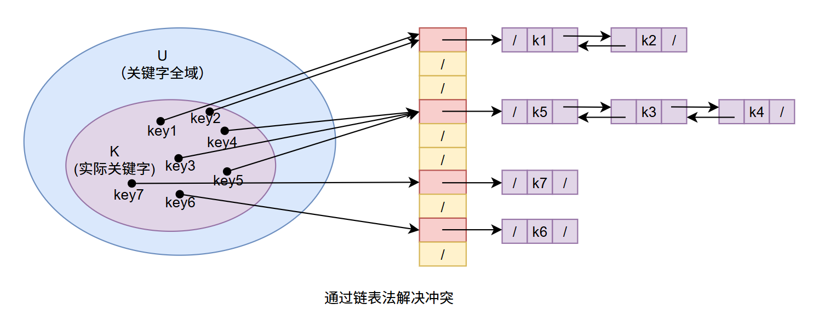

##### 算法导论-09-散列表

##### 1.概述

​	普通数组能够做到在 $$ O(1) $$ 的时间内访问任何给定位置的元素，在很多应用场景中都存在需要一种动态结构维护一些元素集合，支持插入、查找、删除等操作，散列表是这样场景下比较好的方案。

​	散列表是支持 $$ n $$ 个元素空间的 $$ key $$ 映射到 $$ m $$ 个元素空间的这样一种存储数据结构。通常情况下是 $$ key $$ 所在元素空间 $$ n $$ 太大而无法将 $$ key $$ 作为下标访问，因此需要将 $$ key $$ 进行 $$ hash $$ 运算后得到一个 $$ h(key) $$ 作为元素地址。另外散列表还会设计另外一个问题-冲突，即较大的元素空间映射到一个小空间时不可避免会出现不同的key映射到相同的值情况。

##### 2.散列表

**2.1.概述**

​	当 $$ key $$ 的全域 U 比较小的时候，key作为地址访问，即直接寻址方式是比较有效的，但如果全域 U 很大，内存中需要存储大小为 |U| 的一张表也许不太实际，另外还涉及实际存储的 $$key$$ 集合相对于 U 来说很小，这会使得分配的空间大部分将会浪费掉。当需要存储的 $$ key $$ 的集合 $$ K $$ 比所有可能的 $$ key $$ 的全域 $$ U $$ 要小很多时，散列表需要存储的空间要比直接寻址小很多。

​	我们可以将散列表的存储需求降到 $$ \Theta(|K|) $$，同时保持查找一个元素只需要 $$ O(1) $$ 的时间，不过存在的问题是这个执行时间界限是针对平均时间的，但对直接寻址方式来讲它适用于最坏情况时间的。

​	在直接寻址方式下，关键字为 $$ key $$ 的元素直接放入槽 $$ key $$ 中，在散列的方式下，该元素放入到槽 $$ h(key) $$ 中，即利用散列函数 $$ h $$ 计算出槽的位置。按下散列函数不表，下面记录一个链表处理冲突的方法。

看上图，这是处理 $$ hash $$ 冲突时最简单的办法，将冲突的元素放入到相同位置后续的链表中。另外需要注意的是上述链表采用双链表存储元素，同时插入时每次从链表的头进行插入。

**2.2.时间分析**

​	给定一个能存储 $$ n $$ 个元素、具有 $$ m $$ 个槽位的散列表 $$ T $$，定义 $$ T $$ 的**装载因子** $$ \alpha $$ 为 $$ n/m $$，后续借此分析。比较容易看出，使用链接法散列的性能最坏情况为所有 $$ key $$ 都映射到一个槽的情况，此时产生一个长度为 $$ n $$ 的链表，查找和删除时间复杂度都为 $$ \Theta(n) $$，最好是每个非空的槽位都只有一个元素的情况。因此，散列表平均性能依赖于所选取的散列函数 $$ h $$，将所有 $$ key $$ 集合分布在 $$ m $$ 个槽位上的均匀程度，此处我们假定给定的元素都等可能散列到 $$ m $$ 个槽位中的任何一个，且与其他散列位置无关。

对于 $$ j = 0，1，2，..，m - 1 $$ ，列表 $$ T[j] $$ 的长度用 $$ n_j $$ 表示，于是有：
$$
n = n_0 + n_1 + ... + n_{m - 1}
$$
并且 $$ E[n_j] = n/m $$，另外假定可以在 $$ O(1) $$ 的时间内算出散列值 $$h(k) $$，从而查找关键字为 $$ k $$ 的元素时间线性的依赖于表 $$ T[h(k)] $$ 的长度 $$ n_{h(k)} $$ 。分两种情况处理，第一种查找不成功的情况，一次不成功查找的时间复杂度为 $$ \Theta(1 + \alpha) $$，这种情况比较容易理解。第二种情况是成功的查找到关键字 $$ k $$，一次成功查找期望的时间也是 $$\Theta(1 + \alpha) $$，接下来细述此种情况。

假定需要查找的元素是 $$ n $$ 个元素中的任意一个，且等可能，在一次查找过程中检查的元素数量是 $$ x $$ 所在元素前面的数量加1，出现在链表中 $$ x $$ 前面的元素都是在 $$ x $$ 之后被插入的。为了确认所需要检查的元素数量，对 $$ x $$ 所在的链表，在 $$ x $$ 之后插入的元素数量加1，再对 $$ n $$ 个元素取平均。设 $$ x_i $$ 为插入到表中的第 $$ i(i = 1，2，.. ，n) $$ 个元素，$$ k_i = x_{i·} key$$ 。对关键字 $$ k_i $$ 和 $$ k_j $$ ，定义随机变量 $$ X_{ij} = I\{ h(k_i) == h(k_j)\} $$。在简单的均匀散列假设下有 $$ P\{h(k_i) == h(k_j)\} = 1/m $$，因此，$$ E[X_{ij}] = 1/m $$ ，于是在一次成功查找中所期望的检查次数为：
$$
\begin{array}{rcl}
E\left[ \displaystyle\frac{1}{n} \sum_{i = 1}^{n}{\left( 1 + \sum_{j = i + 1}^{n}{X_{ij}}\right)}  \right] & = &
\displaystyle \frac{1}{n} \sum_{i=1}^{n} \left( 1 + \sum_{j = i + 1}^{n}E[X_{ij}] \right) \\
& = & .. \\
& = & 1 + \displaystyle \frac{\alpha}{2} - \displaystyle\frac{\alpha}{2n} \\
\end{array}
$$
计算过程不复杂，就不写了，，可以得到一次成功查找过程所需要的全部时间为 $$ \Theta(2 + \alpha/2 - \alpha/2n) = \Theta(1 + \alpha) $$ 。上述的分析意味着加入 $$ n = O(m) $$，从而可以得到 $$ \alpha = O(1)$$，散列表的查找、插入、删除操作平均时间都可以在 $$ O(1) $$ 内搞定。

##### 3.散列函数

​	一个好的散列函数应该近似的满足简单均匀散列假设，每个关键字都等可能的散列到 $$ m $$ 个槽位中的任何一个，并与其他关键字散列到哪个槽位无关。不太容易检查这一条，因为很少能知道关键字散列所满足的概率分布，而且各关键字可能并不是完全独立的。散列函数的某些应用可能要求比简单均匀散列更强的性质，比如希望某些很近似的关键字具有截然不同的散列值。另外如果涉及一些非自然数的其他 $$key$$ 的情况，可以做一些转换，映射到自然数来用，本文后续讨论基于 $$key$$ 为自然数。

**除法散列法**

通过取 $$ key $$ 除以 $$ m $$ 的余数，$$ key $$ 映射到一个 $$ m $$ 个槽位中的某一个上，散列函数为：
$$
h(key) = key \mod m
$$
在选取 $$ m $$ 值时通常不会选为 $$ 2^p $$ 或者 $$ 2^p-1 $$ 等，一般选择一个不接近 $$ 2^p $$ 的一个素数。

**乘法散列法**

构建乘法散列函数分两步，第一步用 $$ key $$ 乘上 $$ A(0 < A < 1) $$ ，并提取 $$ key · A $$ 的小数部分。第二步，用 $$ m $$ 乘以该值，再向下取整。散列函数为：
$$
h(key) = \lfloor m·(key·A \mod 1) \rfloor
$$
​	乘法散列中对 $$ m $$ 的取值不是特别关键，一般选择 2 的某个幂次 $$ 2^p $$。

​	假定某PC一个字宽度为 $$ w $$，$$ key $$ 正好可以用一个单字表示。限制 $$ A $$ 为形如 $$ s/2^w $$ 的一个分数，其中 $$ 0 < s < 2^w $$ 且为整数。用 $$ w $$ 位的整数 $$s = A·2^w$$ 乘以 $$ key $$ ，其结果是一个 $$ 2w $$ 位的值 $$ r_1 2^w + r_0 $$，此处 $$ r_1 $$ 为结果的高位字，$$ r_0 $$ 为低位字。 $$ r_0 $$ 的 $$ p  $$ 个最高有效位为所求解的 $$ p $$ 位散列值。

​	上述方法对任何 $$ A $$ 值都适用，但在某些取值上效果更佳，最佳选择与待散列的数据特征有关。$$ Knuth[211] $$ 认为：
$$
A \approx (\sqrt5 - 1)\, / \, 2 = 0.618\;033 \;988 \;7···
$$
是个比较理想的值。

例子：假定 $$ k = 123\;456 ，p=14，m =2^{14} $$ ，且 $$ w = 32 $$，取 $$ A $$ 为形如 $$ s / 2^{32} $$ 的分数，它与 $$ (\sqrt5 - 1)\, / \, 2 $$ 最接近，于是 $$ A = 2\;654\;435\;769/2^{32} $$ ，那么 $$ k * s = 327\; 706\;022\;297\;664 = (76\;300 * 2^{32}) + 17\;612\;864$$ ，从而 $$ r_1 = 76\;300 $$ 和 $$ r_0 =17\;612\;864$$ 。取 $$ r_0 $$ 高14 bits 得到一个散列值 $$ h(key) = 67 $$ 。

**全域散列法**

​	在上面两种散列法中，基本都可以找到可以使得散列值集中到某一个槽的 $$ key $$ 序列，对任何一个特定的散列函数都可能出现这种情况，唯一有效的方法是随机的选择散列函数，使之独立于要存储的 $$ key $$，该方法称为全域散列。

​	全域散列法在散列表初始化开始执行时就从一组精心设计的函数中随机的选择一个作为该表的散列函数，随机化进一步保证没有哪一种输入会始终导致最坏性能情况。

​	设 $$ \varphi $$ 为一组有限的散列函数，它将给定的关键字全域 $$ U $$ 映射到 {0，1，...，m - 1} 中。这样一个函数组称为**全域的**。如果对每一对不同的关键字 $$ k $$，$$ l \in U $$，满足 $$ h(k) =h(l) $$ 的散列函数 $$h \in \varphi $$ 的个数至多为 $$ |\varphi| /m $$ 。换句话说，如果从 $$ \varphi $$ 中随机选择一个散列函数，当关键字 $$ k \neq l $$ 时，两者发生冲突的概率不大于 $$ 1/m $$，这也正好是从集合 {0，1，...，m - 1} 中独立随  机选择 $$ h(k) $$ 和 $$ h(l) $$ 时发生冲突的概率。大概意思是每个散列函数都要求近似到均匀散列的。

**定理：**如果 $$ h $$ 选自一组全域散列函数，将 $$ n $$ 个关键字散列到一个大小为 $$m$$ 的表 $$ T $$ 中，并用链接法解决冲突。如果关键字 $$ k $$ 不在表中，则 $$ k $$ 被散列至其中的链表的期望长度 $$ E[n_{h(k)}] $$ 至多为 $$ \alpha = n / m $$ 。如果关键字 $$ k $$ 在表中，则包含关键字 $$ k $$ 的链表期望长度 $$ E[n_{h(k)}] $$ 至多为 $$ 1 + \alpha $$ 。

**证明：**对每一对不同的关键字 $$ k $$ 和 $$ l $$ ，定义指示器随机变量 $$ X_{kl} =I \{ h(k) =h(l) \} $$。由全域散列函数定义，一对关键字发生冲突的概率至多为 $$ 1/m $$ 。因此 $$ E[X_{kl}] \leq 1/m $$ 。

​	对每个关键字 $$ k $$ 定义随机变量 $$ Y_{k} $$ ，它表示与 $$ k $$ 散列到同一槽位中的非 $$k$$ 的其它关键字的数目。有：
$$
Y_{k} = \sum^{l \in T}_{l \neq k}{X_{kl}}
$$
 从而
$$
E[Y_k] = \sum^{l \in T}_{l \neq k}{E[X_{kl}]} \leq \sum^{l \in T}_{l \neq k}{\frac{1}{m}}
$$
剩下部分分 $$ k $$ 是否在表 $$ T $$ 中进行讨论：

1.  $$ k \notin T $$ ，则 $$ n_{h(k)} =Y_k $$ ，并且 $$ | \{ l：l \in T \;且\;  l \neq k\} | = n $$ 。于是，$$ E[n_{h(k)}] =E[Y_k] \leq n/m=\alpha $$ 。
2.  $$ k \in T $$ ，则 $$ n_{h(k)} =Y_k + 1 $$ ，并且 $$ | \{ l：l \in T \;且\;  l \neq k\} | = n - 1 $$ 。于是，$$ E[n_{h(k)}] = E[Y_k] + 1 \leq (n-1)/m + 1 = 1 + \alpha - 1/m < 1+ \alpha $$ 。

**设计一个全域函数类**

首先选择一个足够大的素数 $$ p $$ ，使得每一个可能的关键字 $$ k $$ 都落在  $$[0， p -  1]$$  的区间内。设 $$ Z_p $$ 表示集合 $$ \{ 0，1，...，p - 1\} $$，$$ Z_p^* $$ 表示集合 $$ \{ 1，2，...，p - 1\} $$ 。同时，我们假定关键字的全域大小大于散列表槽数，即 $$ p > m $$ 。

现在对任意 $$ a \in Z_p^* ，b \in Z_p $$ 定义函数 $$ h_{ab} $$ 。利用一次线性变换，再进行模 $$ p $$ 和模 $$ m $$ 的归约，有：
$$
h_{ab}(k) = ((ak + b) \mod p) \mod m
$$
如果 $$ p = 17 ，m = 6 $$ ，则有 $$ h_{3,4}(8) = 5 $$ 。所有这样的散列函数构成的函数簇为：
$$
\varphi_{pm} = \{ h_{ab}: a \in Z_p^*，b \in Z_p\}
$$
每一个散列函数都将 $$ Z_p $$ 映射到 $$ Z_m $$ ，函数簇中对 $$ m $$ 的选择可以是任意的，该函数簇包含了 $$ p(p - 1) $$ 个函数，基于上述个式子定义的函数是全域的，接下来将说明这一点。

考虑 $$ Z_p $$ 中两个不同的关键字 $$ k $$ 和 $$ l $$ ，对某一给定的散列函数 $$ h_{ab} $$ ，设:
$$
r = (ak + b) \mod p \\
s = (al + b) \mod p \\
$$
上面的两个至 $$ r\;\& \;s $$ 是不等的，这个可以通过 $$ r - s = a(k - l) \mod p $$  得出，因此计算任何 $$ h_{ab} \in \varphi _{pm} $$ 时，不同的输入 $$ k $$ 和 $$ l $$ 会被映射到不同的值 $$ r $$ 和 $$ s $$ (模 $$ p $$ ) ；在模 $$ p $$ 层次上，尚且不存在冲突。对于数对 $$ (a,\, b) (a \neq 0) $$ 有 $$ p (p - 1) $$ 种不同的选择，且每一种都会产生不同的结果数对 $$ (r, s) $$，因此给出 $$ r $$ 和 $$ s $$ 后可以反向求解出 $$ a $$ 和 $$ b $$ 的值。因此，如果从 $$ Z_p^* \times Z_p $$ 中均匀的随机选择 $$ (a,\, b) $$ ，则结果数对 $$ (r, s) $$ 就等可能的为任何不同的数值对。

因此，当 $$ r $$ 和 $$ s $$ 随机选择不同的值时，不同的关键字 $$ k $$ 和 $$ l $$ 发生冲突的概率与 $$ r \equiv s (\mod p) $$ 概率相同。对于某个给定的 $$ r $$ 值，$$ s $$ 的取值为余下的 $$ p - 1 $$ 种，其中满足 $$ s\neq r $$ 且  $$ r \equiv s (\mod p) $$  的 $$ s $$ 值的数目至多为：
$$
\lceil p/m \rceil - 1 \leq ((p + m - 1)/m) - 1 = (p - 1) / m
$$
 当模 $$ m $$ 进行归约时，$$ s $$ 与 $$ r $$ 冲突的概率至多为  $$ ((p - 1)/m)/(p - 1) = 1/m $$ ，所以对于任何不同的数对 $$ k，l \in Z_p $$ 有
$$
Pr\{ h_{ab}(k)\} = h_{ab}(l) \leq 1/m
$$
于是，$$ \varphi _{pm} $$ 是全域的。

##### 4.冲突处理

4.1.开放寻址法

在开放寻址法中，所有的元素都存放在散列表中，该方法导致一个结果是装载因子 $$ \alpha \leq 1 $$ 。当查找某个元素时，要系统的检查所有的表项，知道找到所需的元素，或者最终查明该元素不在表中。好处在于不用指针，省点空间。

为了使用开放寻址法插入一个元素，需要连续地检查散列表，或称作**探查**，直到找到一个空槽位来插入关键字为止。为了确定需要探查哪些槽，我们将散列函数做一个扩充，将探查号作为第二个参数输入，散列函数变为：
$$
h: U \times \{ 0,1,...m - 1\} \rightarrow \{0,1,...,m-1\}
$$
对每一个关键字 $$ k $$ ，使用开放寻址法的探查序列：
$$
\langle h(k, 0), h(k, 1), ... ,h(k, m -1) \rangle
$$
是 $$ \langle 0，1，2，... ，m - 1 \rangle $$ 的一个排列，考虑到探查停止位置，对于散列表中的槽位，需要注意的是一个槽状态需要有三种，槽位占用状态，未占用状态，被删除状态(避免遇到一个空位就停止查找)。

**线性探查函数**
$$
h(k, i) = (h'(k) + i) \; mod \;m \;, \;i=\{0，1，2，...，m-1\}
$$
从上面的函数可以知道，第一个探查的位置是 $$ h'(k) $$ ，随后探查的序列在这个位置基础上挨个往后探查 $$ m - 1 $$ 次或者遇到空位停止，该方式在实现上比较简单，因为初始探查位置有 $$ m $$ 个，因此有 $$ m $$ 种不同的探查序列。该方式存在**一次群集**问题，在随着连续被占用的槽位增加，平均查找时间也随之增加，群集现象很容易出现。

**二次探查函数**
$$
h(k, i) =(h'(k) + c_1 i + c_2 i^2) \; mod \; m
$$
其中 $$ h'(k) $$ 是一个辅助散列函数， $$ c_1 $$ 和 $$ c_2 $$ 为正的辅助常数，$$ i = 0，1，2，... ，m - 1 $$ ，比较容易的知道同线性探查的差异。该方式相较于线性探查效果要好很多，为了能够充分利用散列表，$$ c_1，c_2 $$ 和 $$ m $$ 需要受到一些限制。该方式会导致一些轻度群集现象，称作二次群集，同线性探查一样也包含 $$ m $$ 种不同探查序列。

**双重散列**

该方式是用于开放寻址法中最好的方法之一，产生的排列具有随机选择排列的诸多特性，散列函数形式如下：
$$
h(k, i) = (h_1(k) + ih_2(k)) \; mod \; m
$$
其中 $$ h_1 $$ 和 $$ h_2 $$ 均为辅助散列函数。能看出，此处的后续探查位置依赖于 $$ i $$ 和 $$ k $$ 。为了能够探查整个散列表，值 $$ h_2(k) $$ 必须要与表的大小 $$ m $$ 互为素数，一种方法是取 $$ m $$ 为2的幂，并设计一个总是产生奇数的 $$ h_2 $$。另一种方法是取 $$ m $$ 为素数，设计一个总是返回小于 $$ m $$ 的正整数的函数 $$ h_2 $$ 。使用者两种方法产生的探查序列为 $$ \Theta(m^2) $$ 。

**开放寻址散列分析**

**定理：**给定装载因子 $$ \alpha = n/m < 1 $$ 的开放寻址散列表，并假设是均匀散列的，则对于一次不成功的查找，其期望的探查次数至多为 $$ 1/(1-\alpha) $$ 。

**证明：**在一次不成功的查找中，除了最后一次探查，前面每次都会探查一个非空并且关键字不同的槽位，最后次检查的槽位是空的。定义随机变量 $$ X $$ 为一次不成功查找的探查次数，再定义事件 $$ A_i(i=0，1，...) $$ 为第 $$ i $$ 次探查到的是一个已经被占用的槽。那么事件 $$ \{ X \geq A_i \} = A_1 \bigcap A_2 \bigcap \; ··· \; A_{i - 1} $$ ，那么有：
$$
Pr\{ X \geq A_i\} = Pr\{A_1\} \; \cdot \; Pr\{A_2 | A_1\} \;  \cdot \; Pr\{A_3 | \textstyle A_1 \bigcap A_2\} \cdots 
Pr\{A_{i-1}| \textstyle \; A_1 \bigcap \; A_2 \; \bigcap \; \cdots \;A_{i-2}\}
$$

其中元素个数为 $$ n $$ ，散列表大小为 $$m$$ ，因此 $$ P\{A_1\} = n/m $$ 。对于 $$ j > 1 $$ 的情况，在已知前 $$ j - 1 $$ 个槽非空的情况下第 $$ j $$ 个槽非空的概率为 $$ (n - j + 1) / (m - j + 1) $$ ，这个还是比较容易理解的。所以有:
$$
Pr\{X \geq i \} = \frac{n}{m} \cdot \frac{n-1}{m-1} \cdot \frac{n-2}{m-2} \cdots \frac{n-i+2}{m-i+2}
\leq \left(\frac{n}{m}\right)^{i-1} = \alpha^{i-1}
$$
所以有:
$$
E[X] = \sum_{i=1}^{\infty}Pr\{X \geq i \} \; \leq \; \sum_{i=1}^{\infty}\alpha^{i-1} =\sum_{i=0}^{\infty} \alpha^i = \frac{1}{1-\alpha}
$$
$$ 1/(1-\alpha) = 1 + \alpha + \alpha^2 + \cdots $$ 的这个界有一个直观解释。第一次探查发现槽时必须进行第二次探查，概率大约为 $$\alpha $$ ，第三次概率大约为 $$ \alpha ^2 $$，等等。如果 $$ \alpha $$ 是一个常数，一次不成功查找的运行时间为 $$ O(1) $$ ，根据上面的定理基本可以得到散列表插入过程的性能，其每次插入需要的探查次数同一次不成功探查期望次数相同。

定理：对于一个装载因子为 $$ \alpha < 1 $$ 的开放寻址散列表，一次成功查找中的探查期望数至多为
$$
\frac{1}{\alpha} \ln\frac{1}{1-\alpha}
$$
假设采用均匀散列，且列表中每个关键字被查找是等可能性的。

**证明：**查找关键字 $$ k $$ 的探查序列与插入关键字 $$ k $$ 的元素的探查序列是相同的，根据上面的定理，如果 $$ k $$ 是第 $$ (i + 1) $$ 个被插入表中的关键字，则对 $$ k $$ 的一次查找中，探查期望次数至多为 $$ 1/(1-i/m) = m/(m-i) $$ 。对散列表中 $$ n $$ 个关键字求平均，得到一次成功查找的探查期望次数：
$$
\frac{1}{n} \sum_{i=0}^{n-1} \frac{m}{m-i} = \frac{m}{n}\sum_{i=0}^{n-1}{\frac{1}{m-i}} = 
\frac{1}{\alpha} \sum_{k=m-n+1}^{m} \frac{1}{k} \leq \frac{1}{\alpha} \int_{m-n}^{m}{(1/x)}dx
= \frac{1}{\alpha} \ln \frac{1}{1-\alpha}
$$
如果散列表是半满的，则在一次成功查找中，探查的期望次数小于 1.387 。如果散列表为 90% 满，则探查期望数小于 2.559 。

##### 5.完全散列

​	一种散列方法，使得能够在最坏情况下使用 $$ O(1) $$ 的访存时间内完成操作。对于普通散列，通常操作执行平均时间是 $$ O(1) $$ 的，最差情况下并不能保证 $$ O(1) $$ 。其主要针对于静态关键字集合场景，即关键字集合不变，但需要极高频，极快速查找的场景。

​	完全散列采用两级散列机制，在每一级上散列函数都使用全域散列函数。在第一级上使用相同的散列函数 $$ h $$ 将 $$ n $$ 个元素散列到 $$ m $$ 个槽中。第二级上使用一个较小的散列表 $$ S_j $$ 以及精心选择一个散列函数 $$ h_j $$ , 确保在第一级上映射到第 $$ j $$ 个槽位中的关键字在第二级上不会产生冲突。于是我们要求在第二级散列表的空间大小 $$ m_j $$ 为散列到第 $$ j $$ 个槽位的关键字个数 $$ n_j $$ 的平方，即使得 $$ m_j = n_j ^ 2 $$，尽管这样看起来会使得占用空间很大，但在后续会说明空间占用为 $$ O(n) $$。对于散列函数 $$ h_j $$ 的选择，我们可以通过随机的几次验证可以比较容易的找到一个没有冲突的散列函数（关注一个前提是静态关键字集合）。

**定理：**如果从一个全域散列函数类中选出一个散列函数 $$ h $$ ，将 $$ n $$ 个关键字存储在一个大小为 $$ m = n^2 $$ 的散列表中，那么出现冲突的概率小于 $$ 1/2 $$ 。

**证明：** 共有 $$ \binom{n}{2}$$ 对关键字可能会发生冲突，因 $$ h $$ 是从一个全域散列函数类中随机选出，因此每一对关键字产生冲突的概率为 $$ 1/m $$ 。假定 $$ X $$ 为一个统计冲突次数的随机变量。当 $$ m = n^2 $$ 时，有：
$$
E[x] = \binom{n}{2} \cdot \frac{1}{n^2} = \frac{n^2 - n}{2} \cdot \frac{1}{n^2} < \frac{1}{2}
$$
对于存储空间，当 $$ n $$ 比较小的时候，倒是可以考虑一级散列，即使此时的 $$ m = n^2 $$ 也不会导致空间爆炸。但当 $$ n $$ 比较大时， $$ n ^2 $$ 的空间占用情况就可能比较离谱，因此采用二次散列，避免占用空间爆炸，下面进行说明。

一级散列表采用 $$ m = n $$ ，用于存储主散列表、大小为 $$ m_j $$ 的二级散列表，以及用于存储二次散列函数 $$ h_j $$ 的参数 $$ a_j $$ 和 $$ b_j $$ 的存储空间总量为 $$ O(n) $$ 。

**定理：**如果从一个全域散列函数类中随机选出散列函数 $$ h $$ ，用它将 $$ n $$ 个关键字存储到一个大小为 $$ m = n $$ 的散列表中，则有：
$$
E\left[ \sum_{j=0}^{m - 1}n_j^2 \right] < 2n
$$
里面 $$ n_j $$ 为散列到槽 $$ j $$ 中的关键字数。

**证明：**从下面的恒等式开始，该等式对任何非负整数 $$ a $$ 成立：
$$
a^2 = a + 2 \binom{a}{2}
$$
于是，有：
$$
\begin{array}{lcll}
E\left[ \sum\limits_{j=0}^{m - 1}n_j^2 \right] & = & E\left[ \sum\limits_{j=0}^{m - 1}\left(a + 2 \displaystyle\binom{a}{2}\right) \right] & \\
& = & E\left[\sum\limits_{j=0}^{m-1}{n_j} \right] + 2E\left[\sum\limits_{j=0}^{m-1}\displaystyle\binom{a}{2}\right] & \\
& = & E[n] + 2E\left[ \sum\limits_{j=0}^{m-1}\displaystyle\binom{n_j}{2} \right] & \\
& = & n + 2E\left[ \sum\limits_{j=0}^{m-1}\displaystyle\binom{n_j}{2} \right] & \\
& \leq &   n + 2 \cdot \displaystyle \frac{n-1}{2}  = 2n - 1 < 2n& (因m = n)
\end{array}
$$
因此可以得到一个推论：从某一个全域散列函数中随机选出散列函数 $$ h $$ ，用它将 $$ n $$ 个关键字存储到大小为 $$ m $$ 的散列表中，并将二次散列表大小设置为 $$ m_j = n_j^2 \; (j = 0,1,..,m-1) $$ ，则在一个完全散列方案中，存储所有二次散列表所需的存储总量小于 $$ 2n $$，储存总量大于等于 $$ 4n $$ 的概率小于 $$ 1/2 $$ 。

应用马尔可夫不等式，进行概率说明：
$$
Pr\left\{ \sum_{j=0} ^{m - 1} m_j \geq 4n \right\} \leq \frac{E\left[\sum\limits_{j=0} ^{m - 1} m_j\right]}{4n} < 
\frac{2n}{4n} = 1/2
$$

小结：从整个分析看下来，链表法处理冲突貌似最简单，当时看之前感觉应该是比较常用的。但实际并非如此，在工业级散列表实现上，通常会考虑与计算机架构相匹配，处理冲突时使用开放寻址的方式与 $$ Cache $$ 机制更合适，使用列表法则比较差。

##### 6.诗词

滕王阁序 - 王勃

​	豫章故郡，洪都新府。星分翼轸，地接衡庐。襟三江而带五湖，控蛮荆而引瓯越。物华天宝，龙光射牛斗之墟；人杰地灵，徐孺下陈蕃之榻。雄州雾列，俊采星驰。台隍枕夷夏之交，宾主尽东南之美。都督阎公之雅望，棨戟遥临。宇文新州之懿范，襜帷暂驻。十旬休假，胜友如云；千里逢迎，高朋满座。腾蛟起凤，孟学士之词宗；紫电青霜，王将军之武库。家君作宰，路出名区。童子何知，躬逢胜饯。

​	时维九月，序属三秋。潦水尽而寒潭清，烟光凝而暮山紫。俨骖绯于上路，访风景于崇阿。临帝子之长洲，得天人之旧馆。层峦耸翠，上出重霄；飞阁流丹，下临无地。鹤汀凫渚，穷岛屿之萦回；桂殿兰宫，即冈峦之体势。

​	披绣闼，俯雕甍，山原旷其盈视，川泽纡其骇瞩。闾阎扑地，钟鸣鼎食之家；舸舰弥津，青雀黄龙之舳。云销雨霁，彩彻区明。落霞与孤鹜齐飞，秋水共长天一色。渔舟唱晚，响穷彭蠡之滨；雁阵惊寒，声断衡阳之浦。

​	遥襟甫畅，逸兴遄飞。爽籁发而清风生，纤歌凝而白云遏。睢园绿竹，气凌彭泽之樽；邺水朱华，光照临川之笔。四美具，二难并。穷睇眄于中天，极娱游于暇日。天高地迥，觉宇宙之无穷；兴尽悲来，识盈虚之有数。望长安于日下，目吴会于云间。地势极而南溟深，天柱高而北辰远。关山难越，谁悲失路之人？萍水相逢，尽是他乡之客。怀帝阍而不见，奉宣室以何年？

​	嗟乎！时运不济，命途多舛。冯唐易老，李广难封。屈贾谊于长沙，非无圣主；窜梁鸿于海曲，岂乏明时？所赖君子见机，达人知命。老当益壮，宁移白首之心？穷且益坚，不坠青云之志。酌贪泉而觉爽，处涸辙以犹欢。北海虽赊，扶摇可接；东隅已逝，桑榆非晚。孟尝高洁，空余报国之情；阮籍猖狂，岂效穷途之哭！

​	勃，三尺微命，一介书生。无路请缨，等终军之弱冠；有怀投笔，穆宗悫之长风。舍簪笏于百龄，奉晨昏于万里。非谢家之宝树，接孟氏之芳邻。他日趋庭，叨陪鲤对。今兹捧袂，喜托龙门。杨意不逢，抚凌云而自惜；钟期既遇，奏流水以何惭？

​	呜呼！胜地不常，盛筵难再；兰亭已矣，梓泽丘墟。临别赠言，幸承恩于伟饯；登高作赋，是所望于群公。敢竭鄙怀，恭疏短引；一言均赋，四韵俱成。请洒潘江，各倾陆海云尔：

滕王高阁临江渚，佩玉鸣鸾罢歌舞。

画栋朝飞南浦云，珠帘暮卷西山雨。

闲云潭影日悠悠，物换星移几度秋。

阁中帝子今何在？槛外长江空自流。
