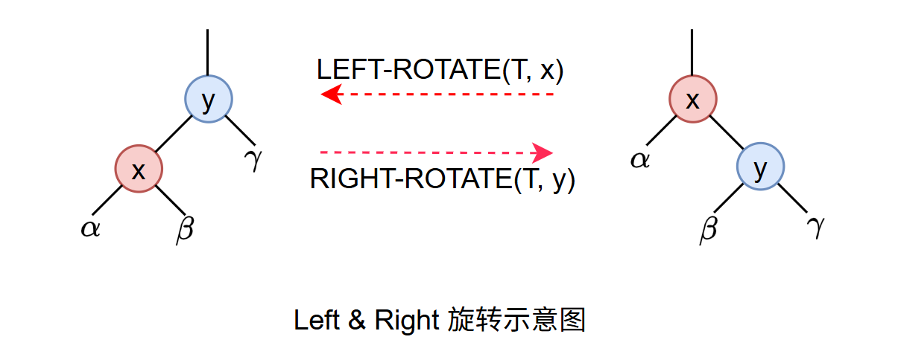
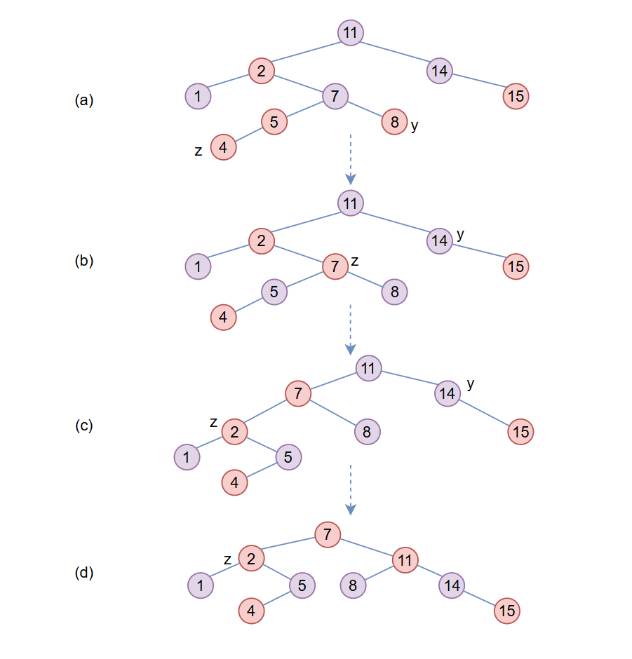
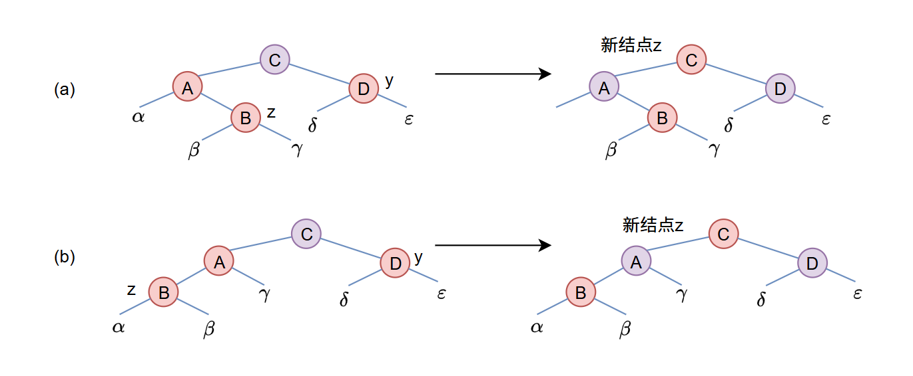
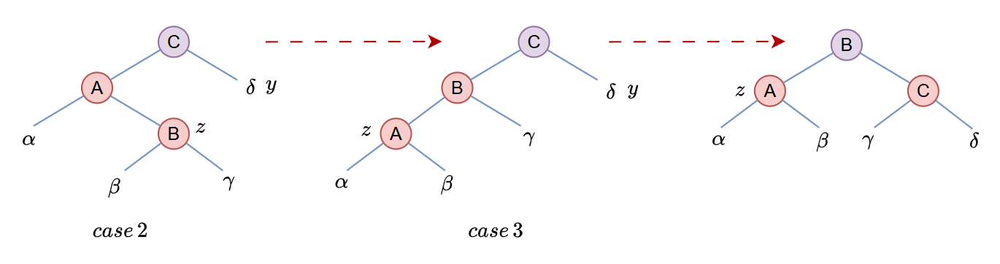
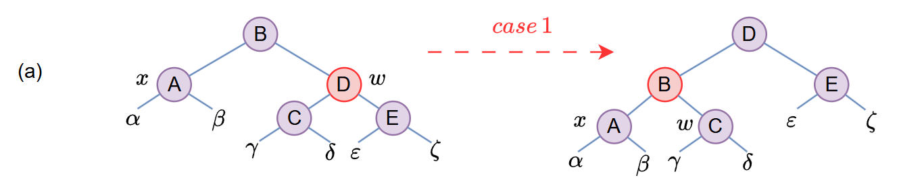
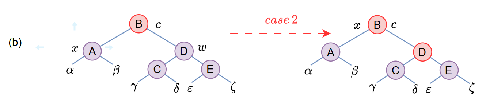
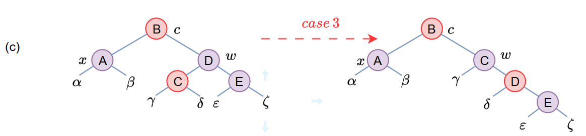
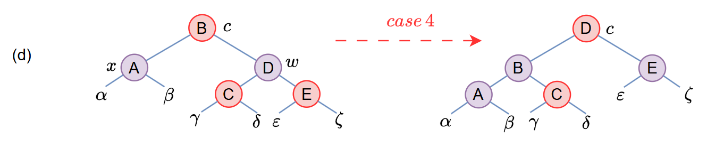

### 算法导论-11-红黑树

#### 1.总述

​	红黑树是一棵二叉搜索树，它在每个结点上增加了一个存储位来表示结点的**颜色**，可以是RED或者BLACK。通过对任何一条从根到叶子结点的简单路径上各个结点颜色进行约束，红黑树确保没有一条路径会比其他路径长出 2 倍，因而是近似于平衡的。

​	树中每个结点包含 $$ cloor，key，left，right，p $$ 五个属性。如果一个节点没有子节点或者父节点，则对应指针应置为 NIL，对于 $$ left  $$ 和 $$ right $$ 为 NIL 的情况，我们将 NIL当做外部节点，而其他包含整成属性的结点称为内部结点。

红黑树是满足下面红黑性质的一棵搜索二叉树：

1. 每个结点或是红色的，或是黑色的
2. 根结点颜色为黑色
3. 每个叶节点（NIL）是黑色
4. 如果一个结点是红色的，则它的两个子结点都是黑色的
5. 对每个结点，从该结点到其所有后代叶节点的简单路径上，均包含相同数目的黑色结点。

​	为了后续实现便于处理，在这单独使用一个哨兵结点来代表所有的NIL，它的 $$ color $$ 为 BLACK，其它属性可以是任意值。定义从某个结点 $$ x $$ 出发到达一个叶结点的任意一条简单路径上的黑色结点个数称作该结点的**黑高**，记为 $$ bh(x) $$，于是定义红黑树的黑高为其根结点的黑高。

**引理**	一棵有 $$ n $$ 个内部结点的红黑树的高度至多为 $$ 2 \lg (n + 1) $$ 。

**证明**	先证明以任意结点 $$ x $$ 为根的子树中至少包含 $$ 2^{bh(x)} - 1 $$ 个内部结点。对此，我们对 $$ x $$ 的高度进行归纳。如果 $$ x $$ 的高度为 0，则 $$ x $$ 必为叶节点，且以 $$ x $$ 为根结点的子树至少包含  $$ 2^{bh(x)} - 1 = 2^0 - 1 = 0 $$ 个内部结点。对于归纳步骤，考虑高度为正值且有两个子节点的内部结点 $$ x $$ 。每个子结点有黑高 $$ bh(x) $$ 或 $$ bh(x) - 1 $$ ，其分别取决于自身颜色是红还是黑。由于 $$x $$ 子结点的高度比 $$ x $$ 本身的高度低，可以利用归纳假设得出每个子结点至少有 $$ 2^{bh(x)} - 1 $$ 个内部结点的结论，于是以 $$ x $$ 为根的子树至少包含  $$ 2^{bh(x)} - 1 + 2^{bh(x)} - 1 + 1 = 2^{bh(x) - 1} - 1 $$ 个内部节点，因此得证。

​	假定 $$h$$ 为树的高度，根据红黑树性质 4，从根结点到叶结点（不包括根结点）的任何一条简单路径上都至少有一半的结点为黑色，因此树的黑高至少为 $$ h/2 $$，于是：
$$
n \geqslant 2^{h/2} - 1
$$
可以得到：
$$
h \leqslant 2\lg (n + 1)
$$
证明完成，因此可以知道对该树进行查找、取最大/小值、前驱后继等操作都可以在 $$ O(\lg n) $$ 时间内完成。

#### 2.旋转

旋转是一种能保持二叉搜索树性质搜索树局部操作，分左旋和右旋，下面给出示意图：



具体实现：

```c
void left_rotate(RBT* T, TNode* x) {
    TNode *y = x->right;
    x.right = y->left;
    if (y->left != T->nil) {
        y->left->p = x;
    }
    y->p = x->p;
    if (x->p == T->nil) {
        T->root = y;
    } else if (x == x->p->left) {
        x->p->left = y;
    } else {
        x->p->right = y;
    }
    y->left = x;
    x->p =y;
}
```

上述左旋实现对照着图很容易理解，不在这细说，另外后续的关于 $$ right\_rotate $$ 等代码，或者代码中涉及相关的数据结构，放在**附录**章节。

#### 3.插入

##### 3.1.概述

红黑树的插入建立在二叉搜索树插入基础上，先找到合适插入位置，然后插入结点，默认结点颜色为红色。下一步就是检查红黑树的性质是否被破坏并通过一些操作进行修复，代码如下：

```c
void rb_insert(RBT* T, TNode* z) {
    TNode *y = T->nil;
    TNode *x = T->root;
    while (x != T->nil) {  			// 先找到合适的插入位置
        y = x;						// 用y记录需要插入的父结点
        if (z->key < x->key) {
            x = x->left;
        } else {
            x = x->right;
        }
    }
    z->p = y;
    // 检查 y 的情况，插入结点
    if (y == T->nil) {
        T->root = z;
    } else if (z->key < y->key) {
        y->left = z;
    } else {
        y->right = z;
    }
    // 设置其它属性
    z->left = T->nil;
    z->right = T->nil;
    z->color = RED;
    // 用于维护插入后被破坏掉的红黑树性质
    rb_insert_fixup(T, z);
    return;
}
```

上述插入过程相对简单，麻烦点儿的是后面插入结点后的红黑树性质维护，先看实现：

```c
void rb_insert_fixup(RBT* T, TNode* z) {
    while (z->color == RED) {
        if (z->p == z->p->p->left) {
            y = z->p->p->right;
            if (y->color == RED) {
                z->p->color = BLACK;			// case 1
                y->color = BLACK;				// case 1
                z->p->p->color = RED;			// case 1
                z = z->p->p;					// case 1
            } else if (z == z->p->right) {
                z = z->p;						// case 2
                left_rotate(T, z);				// case 2
            }
            z->p->color = BLACK;				// case 3
            z->p->p->color = RED;				// case 3
            right_rotate(T, z->p->p);			// case 3
        } else {
            // same as then clause with "right" and "left" exchanged
        }
    }
    T->root->color = BLACK;
}
```

上述调整红黑树属性过程，分三个步骤。首先确定当结点 $$ z $$ 被插入并着色为红色后，红黑属性中有哪些性质不能被继续保持。其次，分析上述 $$ while $$ 循环的总目标。最后，分析 $$ while $$ 循环中的三种情况，看看它们是如何达成目标的。书中给了个例子，很好的帮助我理解了整个过程，在这记录下。



上图中，(a) 为插入结点 $$z$$ 后，$$ z $$ 及其父节点都为红色，违反红黑树性质4 。由于 $$ z $$ 的叔结点 $$ y $$ 为红色，满足程序中 $$ case 1 $$ 的情况，结点重新着色后，指针 $$ z $$ 沿树上升，结果如 (b) 图所示。再一次，$$ z $$ 及其父节点都为红色，但此时其叔结点为黑色，满足 $$ case 2 $$ 情况，执行一次左旋操作后，结果如 (c) 所示。此时 $$z$$ 为其父结点的左孩子，满足程序中的 $$ case 3 $$ ，重新着色并执行一次右旋后得到图 (d) 中的树，此时是一棵合法的红黑树。

现在我们来看看，当插入结点之后红黑树的哪些性质会被破坏。性质1和性质3会继续保持，因为插入的结点为红色，并且插入结点子结点都是哨兵结点。对于性质5，因为插入红色结点，也不会被改变。对于性质2，第一次插入时，根节点应该为黑色。对于性质4，插入的结点的父结点可能是红色的。

##### 3.2.证明

接下来证明上面程序的正确性，给出其循环不变式：

​    a.  结点 $$ z $$ 是红结点。

​    b. 如果 $$ z $$ 的父节点是根结点，则其父节点为黑色。

​    c. 如果任何红黑性质被破坏，则至多只有一条被破坏，或是性质2，或是性质4 。如果性质2被破坏，那原因是 $$ z $$ 是根结点且为红色结点。如果性质4被破坏，其原因为 $$ z $$ 和 $$ z $$ 的父结点都为红色结点。

​	我们需要证明三件事儿，分别是循环不变式在循环开始时为真，第二是没次循环都都保持这个循环不变式成立；第三在循环结束时，该循环不变式会给出一个有用的性质。

​	从初始化和终止的不变式证明开始。通过细致考察循环体如何工作来说明该不变式如何被保持，以及每次循环有两种结果：或者指针 $$ z $$ 沿着树向上移，或者执行某些旋转后循环终止。

**初始化：**

​	循环从一棵正常红黑树开始，在此基础上新增一个红结点 $$ z $$ ，需要证明的是当 $$ rb\_insert\_fixup $$ 被调用时循环不变式的每一个部分都成立。插入的结点为红色结点，因此 $$ a $$ 部分成立。如果 $$z$$ 的父节点是根，那么原本就为黑色，因此 $$ b$$ 部分成立。调用 $$ rb\_insert\_fixup $$ 时，性质1、3、5成立，如果违反性质2，那么红色根结点为新增的结点 $$ z $$ ，但其父节点和两个子节点都为黑色，没有违反性质4；如果违反性质4，那只能是因为被插入的结点也是红色的，即 $$ z $$ 结点的父节点是红色结点，其它性质没有被违反，综上两条，c部分成立，初始化证明完成。


 **终止：**

​	循环终止是因为 `z->p` 是黑色的，循环在终止时没有违反性质4，对于性质2，在循环退出时会对该性质进行恢复，因此函数调用完成后所有红黑性质将保持成立。

**保持：**

​	实际需要考虑 $$ while $$ 中的6种情况，此处暂讨论`z->p` 为左孩子的3种情况，剩下的是对称的，在附录中补全剩余部分代码。首先，根据进入循环条件可知，`z->p` 为红色时才进入，因此不可能为根节点，`z->p->p` 也必定存在。

​	三种情况的区别在于 `z->p` 的兄弟结点（$$y$$ 结点）的颜色不同，$$ y $$ 为红色则走 $$ case 1 $$ ，否则归属到后续两种情况。在所有情况中，需要明确一点的是因为 `z->p` 为红色，所以 `z->p->p` 必定为黑色结点，因此，性质4仅在 $$ z $$ 和 `z-p` 之间被破坏了。


**情况1：$$ z $$ 的叔结点 $$ y $$ 是红色的。**



看图，很容易理解不管 $$ z $$ 是左孩子还是右孩子，确定了 $$ y $$ 结点为红色，就只需要将 `z->p->p` 改为红色，然后它的两个子结点该改为黑色，看起来是将上面 C结点的黑色下移了，能够保持整体上红黑树性质5不会被改变，同时 $$ z $$ 指针向上移动。

​	因 $$ z $$ 指针上移，a部分能被保持。

​	对于b部分，`z->p->p->p` 没有被改过，所以依旧成立。

​	对 $$c$$ 部分，如果 `z->p->p` 在下一次迭代时是根结点，那么本次迭代仅修复了被破坏的性质4，此时仅违反了性质2，如果不是根结点，此时 `z->p->p` 为红色，只有可能违反性质4 。对于 $$ c $$ 部分也能看出，性质5是被保持的，也不会引起性质1, 3被破坏，因此循环不变式的 $$ c $$ 部分也成立。


**情况2： $$ z $$ 的叔结点 $$ y $$ 是黑色的且 $$ z $$ 是一个右孩子**

**情况3： $$ z $$ 的叔结点 $$ y $$ 是黑色的且 $$ z $$ 是一个左孩子**

在后面两种情况中，其叔结点 $$ y $$ 是黑色，通过 $$ z $$ 是左右孩子来进行区分。看下图：



从图中可以看到，情况 2经过一次旋转，转换到情况3进行处理，在两个红色结点之间旋转，不影响其它性质。在情况3中，图中B结点颜色改为黑色，$$ C  $$ 结点颜色改为红色，基于 $$ C  $$ 结点做一次右旋操作，得到最终结果，此时被破坏的性质 4 已修复，调整完成。如果看不懂颜色为何这么设置，可以对比下左边两种情况，会发现颜色的相对位置没有变过，改变的只是结点位置，更容易理解为何这么做。

下面进行证明保持了循环不变式。

对于 a 部分，结点 $$ z $$ 的颜色或是值都没有变过。

b 部分， `z->p` 被着为黑色，如果下一次循环开始 `z->p` 为根结点，性质成立。

c 部分，比较容易理解，修复了被破坏的性质4，其余性质都得到了保持。

因此，证明了循环的每一次迭代都会保持循环不变式后，也就证明了 $$ rb\_insert\_fixup $$ 能够正确的保持红黑性质。

##### 3.3.分析

​	因 $$ n $$ 个结点高度为 $$ O(\lg n) $$，因此 $$rb\_insert$$ 的结点插入部分时间为 $$ O(\lg n) $$ 。在  $$ rb\_insert\_fixup $$  中只有遇到情况1，$$ z $$ 沿树上升时才会重复执行 $$ while $$ 循环，因此能被执行次数也为 $$ O(\lg n) $$ 。因此，$$rb\_insert$$  总花费 $$ O(\lg n) $$ 的时间。同时也了解，该程序所做旋转不会超过 2 次，执行了情况2或者情况3程序就结束了。

#### 4.删除

​	与 $$ n $$ 个结点的红黑树上的其它操作一样，删除一个结点要花费 $$ O(n) $$ 的时间。与插入操作相比，删除操作稍微复杂。给出一个结点替换操作 $$ rb\_transplant $$ 实现，后续删除操作会用到。

```c
void rb_transplant(RBT *T, TNode* u, TNode* v) {
	if (u->p == T->nil) {
        T->root = v;
    } else if (u == u->p->left) {
        u->p->left = v;
    } else {
        u->p->right = v;
    }
    v->p = u->p;
    return;
}
```

​	简单讲下就是在 $$ T $$ 这棵树中，用 $$v$$ 结点替换掉 $$ u $$ 结点在树中的位置，需要注意的是 $$ u $$ 的子结点并没有交换给 $$v$$ ，仅让 $$u$$ 的父节点指向 $$v$$ ，并修改了 $$ v $$ 的父节点。

​	当想要删除结点 $$ z $$ 时，如果 $$ z $$ 的子结点数少于两个时，删除 $$ z $$ 并用其子结点替换 $$ z $$ 的位置即可。当 $$ z $$ 有两个子结点时，找到 $$ z $$ 的中序后继结点，用它来替换 $$ z $$ 。删除和插入都是可能会导致红黑树性质被破坏，删除结点 $$ z $$ 之后调用 $$ rb\_delete\_fixup $$ ，通过改变颜色和执行旋转来恢复红黑树性质。

```c
void rb_delete(RBT* T, TNode* z) {
	TNode *x, *y = z;
    enum Color oc = y->color;			// oc 用于记录y节点原始颜色
    if (z->left == T->nil) {
        x = z->right;
        rb_transplant(T, z, z->right);
    } else if (z->right == T->nil) {
        x = z->left;
        rb_transplant(T, z, z->left);
    } else {
        y = tree_minimum(z->right); 	// 求取 z 右子树上的最小值，即z的中序后继节点
        oc = y->color;
        x = y->right;
        if (y->p == z) {
            x->p = y;
        } else {
            rb_transplant(T, y, y->right);
            y->right = z->right;
            y->right->p = y;
        }
        rb_transplant(T, z, y);
        y->left = z->left;
        y->left->p =y;
        y->color = z->color;
    }
    if (oc == BLACK) {
        rb_delete_fixup(T, x);			// 修复可能被破坏的红黑树属性
    }
}
```

​	删除结点的过程都比较容易理解，代码实现和上述叙述一致。在这需要关注一点是，为何用 $$ y $$ 的颜色来判断是否要进行红黑树性质调整？答，不看结点值只看颜色情况下，实际被删掉的结点是 $$ y $$ 结点。为何只有在删除结点是黑色结点情况下才需要修复？因为只有删除黑结点才可能会导致红黑树性质2、4、5被破坏掉。$$ x $$ 结点是用来干嘛的？答，$$ x $$ 是用来记录 $$ y $$ 结点的子结点，如果还不理解，那你对照这红黑树插入操作中被插入的那个结点看看是否很相似？因为后面进行属性修复就是从 $$ x $$ 结点开始检查的。另外为何只需要一个 $$ x $$ 来记录就够了？答，因为不论在何种情况下，$$ y $$ 结点都只会有一个子结点。

接下来看看 $$ rb\_delete\_fixup $$ 实现：

```c
void rb_delete_fixup(RBT* T, TNode* x) {
    TNode *w;
    while (x != T->root && x->color == BLACK) {
        if (x == x->p->left) {
            w = x->p->right;
            if (w->color == RED) {
                w->color = BLACK;											// case 1
                x->p->color = RED;											// case 1
                left_rotate(T, x->p);										// case 1
                w = x->p->right;											// case 1
            }
            if (w->left->color == BLACK && w->right->color == BLACK) {
                w->color = RED;												// case 2
                x = x->p;													// case 2
            } else if (w->right->color == BLACK) {
                w->left->color = BLACK;										// case 3
                w->color = RED;												// case 3
                right_rotate(T, w);											// case 3
                w = x->p->right;
            }
            w->color = x->p->color;											// case 4
            x->p->color = BLACK;											// case 4
            w->right->color = BLACK;										// case 4
            left_rotate(T, x->p);											// case 4
            x = T->root;													// case 4
        } else {
            // same as then clause with "right" & "left" exchanged
        }        
    }
    x->color = BLACK;
}
```

​	再次说明下，上面删除操作中，实际对红黑是影响的结点位置是 $$ y $$ 结点，红黑树性质不关心结点值，而被树的结构和结点颜色所影响。换个思路，结点 $$ z $$ 的删除，实际上是结点 $$ y $$ 填充了结点 $$ z $$ 的位置，用原始$$ y $$ 的子节点$$ x $$ 替换了 $$ y $$ 的位置，那么我们可以认为结点 $$ x $$ 附着上了结点 $$ y $$ 的颜色，如果结点 $$ y $$ 为红色，那么此时 $$ x $$ 为红黑色，如果结点 $$ y $$ 为黑色，那么 $$ x $$ 为双重黑色，在此种情形下，我们仅需要考虑被破坏的红黑树性质1即可。

​	上述性质修复的代码，$$ while $$ 循环仅仅处理 $$ x $$ 为黑色结点的情况，因为如果 $$ x $$ 为红色结点的话，只需要简单将其染黑即可。上述的性质1的修复过程，可以理解为不断的将包含双重黑色结点的 $$ x $$ 的黑色不断的上移，直到 $$ x $$ 成为红黑结点，或者 $$ x $$ 移动到根结点，循环退出，最后将 $$ x $$ 简单的着色为黑色即可。在进一步介绍上述4种情况前，我们需要明确的一点是，上述几种情况的变换中，原始红黑树性质5如果保持，在变换后 $$ \alpha ， \beta ，\gamma，\delta ，\cdots ，\zeta $$ 的性质5依旧将被保持，看后续分析。

**情况1：$$ x $$ 的兄弟结点 $$w$$ 是红色的**



因为D为红色，因此其子结点必定是黑色，改变下 $$ w $$ 的颜色和 `x->p` 的颜色，并在 `x->p` 上做一次左旋操作，不违反红黑树任何性质，可以将该情况转换为后面的情况2、3、4（$$ w $$为黑色的情况）了。


**情况2：$$ x $$ 的兄弟结点 $$w$$ 是黑色的，且 $$w$$ 两个子结点都为黑色**



此时可以从 $$ x $$ 和 $$w$$ 上都去掉一层黑色，由此使得 $$ x $$ 上只有一重黑色，而 $$w$$ 变为红色。为了补充刚才去掉的一重黑色，在原来是红色或者黑色的 $$x->p$$ 上新增一层额外的黑色，通过将 $$ x $$ 指向 $$x->p$$ 重新开始新一轮循环。


**情况3：$$ x $$ 的兄弟结点 $$w$$ 是黑色的，$$w$$ 左孩子是红色，且 $$w$$ 右孩子是黑色**



此种情况先交换 $$w$$ 和其左孩子的颜色，然后对 $$w$$ 进行右旋而不改变红黑树的性质。现在$$ x $$ 新的兄弟结点 $$w$$ 是一个有红色右孩子的黑色结点，此时情况3转换为情况4进行处理。


**情况4：$$ x $$ 的兄弟结点 $$w$$ 是黑色的，且 $$w$$ 右孩子为红色**

 

通过做代码中的颜色修改，并对 `x->p` 进行一次左旋，可以去掉 $$ x $$ 的额外颜色，从而使其变为单重黑色而不破坏红黑树性质，而后强行退出循环。比较容易能看出红黑树删除操作执行时间总花费 $$ O(\lg n) $$ 的时间。

#### 5.附录

数据结构定义

```c
enum Color {BLACK, RED};

typedef struct TNode {
    int key;
    enum Color color;
    struct TNode *p;
    struct TNode  *left, *right;
} TNode;

typedef struct RBT {
    TNode *root;
    TNode *nil;
} RBT;
```

右旋操作

```c
void right_rotate(RBT* T, TNode* y) {
    return;
}
```


待续。。。

#### 6.诗词

《梅花》 -- 王安石

墙角数枝梅，凌寒独自开。遥知不是雪，为有暗香来。

《山园小梅》 -- 林逋

众芳摇落独暄妍，占尽风情向小园。疏影横斜水清浅，暗香浮动月黄昏。

霜禽欲下先偷眼，粉蝶如知合断魂。幸有微吟可相狎，不须檀板共金樽。

《卜算子·咏梅》 -- 陆游

驿外断桥边，寂寞开无主。已是黄昏独自愁，更着风和雨。

无意苦争春，一任群芳妒。零落成泥碾作尘，只有香如故。
