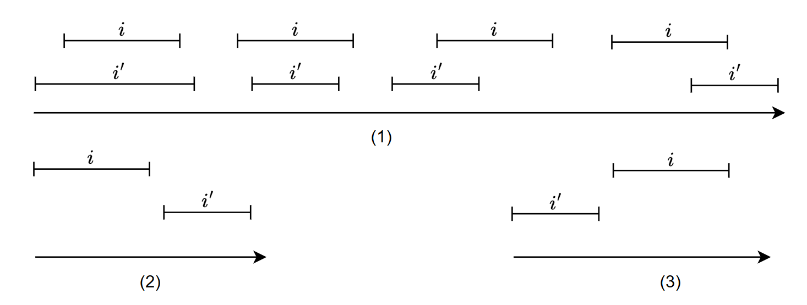
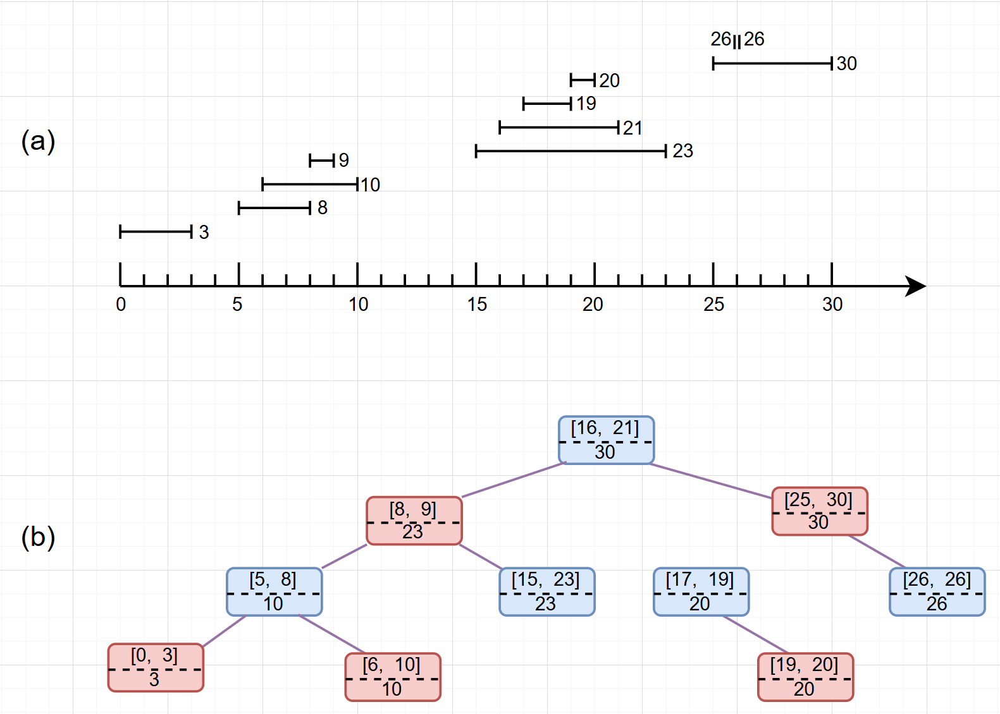

### 算法导论-12-数据结构的扩张

#### 1.写在前面

一些工程应用只需要用到 “教科书” 中的标准数据结构，然而，也有许多其它应用需要对现有的数据结构进行少许地创新和改造，比较少情况需要创造出一些全新类型数据结构。更为通常的是，通过存储额外信息的方法来扩张一种标准的数据结构，对该结构实现新操作来支持所需应用。

#### 2.动态顺序统计

##### 2.1.概述

本节介绍通过改造红黑树结构来实现在 $$O(\lg n) $$ 时间内计算一个元素的秩，即它在集合线性顺序中的位置。在之前介绍红黑树结点通用属性 $$ key， color，p，left， right $$ 基础上，新增 $$size$$ 属性，称作**顺序统计树**。该属性包含了以 $$x$$ 为根的子树的结点数，即这棵树的大小。在一棵顺序统计树中，我们并不要求关键字各不相同，在这顺带修改下秩的定义，即元素 $$x$$ 在顺序统计树中以中序遍历输出时的位置称作它的秩。

##### 2.2.查找给定秩的元素

这个问题可以简单的理解为求解 顺序统计树中第 $$n$$ 小的元素，看实现：

```c
TNode* os_select(TNode* x, int i) {
	int r = x->left->size + 1;
    if (r == i) return x;
    else if (r > i) return os_select(x->left, i);
    return os_select(x->right, i);
}
```

很容易理解，当左子树的大小加1等于i的时候，当前节点就是需要找的结点。如果大于 $$i$$ 就需要往左子树上去找，反之右子树。当然需要注意的是，上面的实现没考虑意外情况，即查找的第 $$ i $$ 小元素不存在。

##### 2.3.确定一个元素的秩

给定指向的顺序统计树 $$T$$ 中结点 $$x$$ 的指针，返回对它在 $$T$$ 中中序遍历输出的位置。

```c
int os_rank(RBT* T, TNode* x) {
    int r = x->left->size + 1;
    TNode *y = x;
    while (y != T->root) {
        if (y == y->p->right) r += y->p->left->size + 1;
        y = y->p;
    }
    return r;
}
```

也容易理解，如果给的 $$x$$ 结点是根结点，那简单的将右子树的节点数加1即可，但大概率不是，所以 $$while$$ 循环的作用是从当前节点往上查，把小于当前结点的元素数量加起来就行。那什么元素小于 $$x$$ 的 $$key$$ 呢？看代码第5行。


##### 2.4.对子树规模的维护

​	红黑树的插入操作分两个阶段，第一个阶段从根结点向下查找插入的位置并插入，第二阶段沿树上升，做一些变色和旋转操作来保持红黑树的性质。

​	在第一阶段，我们只需要在向下查找插入位置的路径上每个结点的 $$size$$ 加1即可，维护 $$size$$ 属性代价为 $$O(\lg n) $$ 。

​	第二阶段，对红黑树的结构改变仅会因为旋转所致，且旋转次数至多为2 。旋转是一种局部操作，会导致两个结点的 $$ size $$ 属性失效，因此我们需要在红黑树旋转操作上加上对 $$size $$ 属性的维护代码。

```c
void left_rotate(RBT* T, TNode* x) {
    TNode *y = x->right;
    x.right = y->left;
    if (y->left != T->nil) {
        y->left->p = x;
    }
    y->p = x->p;
    if (x->p == T->nil) {
        T->root = y;
    } else if (x == x->p->left) {
        x->p->left = y;
    } else {
        x->p->right = y;
    }
    y->left = x;
    x->p = y;
    y->size = x->size;
    x->size = x->left->size + x->right->size + 1;
}
```

附上旋转示意图：


对于删除操作，维护 $$size$$ 也比较简单，同插入操作一样分两个阶段，参考红黑树文档，第一阶段删除 $$y$$ 结点，只需要考虑从 $$y$$ 结点到根结点路径上的每个结点 $$size$$ 减1即可。第二阶段同插入一样，做一些颜色改变和旋转操作对红黑树属性进行修复。


#### 3.扩张数据结构

先给个扩张数据结构的一般过程和定理，后续再次对红黑树进行扩张，讲述一个区间树的结构。

1. 选择一种基础数据结构
2. 确定基础数据结构中需要维护的信息
3. 检验基础数据结构上的基本操作能否维护附加信息
4. 设计一些新的操作

​	上面讲述设计动态顺序统计树时，我们是依照上述四个步骤来做的。对于步骤一，我们选择红黑树作为基础数据结构。在步骤二中，我们对每个结点添加了 $$size$$ 属性，存储了以 $$x$$ 为根的子树大小。对于步骤三，我们也保证了插入和删除操作能够在 $$O(\lg n) $$ 的时间内完成。对于步骤四，我们新增了查找特定秩的元素和查找指定元素的秩两个操作。步骤作为参考，不至于没有目标和方向。


**对红黑树的扩张**

用红黑树作为基础数据结构时，可以证明下在某些类型的附加信息总是可以用插入和删除操作来进行有效维护，从而使得上面步骤三很容易做到。

**定理**：设 $$f$$ 是 $$n$$ 个结点的红黑树 $$T$$ 扩张的属性，且假设对任一结点 $$x$$ ，$$f$$ 的值仅依赖于结点 $$x$$ 以及其左右孩子结点的信息。那么我们可以在插入和删除操作期间对 $$T$$ 的所有结点的 $$f$$ 值进行维护，并且不影响这两个操作的 $$O(\lg n) $$ 渐进时间性能。


#### 4.区间树

区间分为开区间、半开区间、闭区间三种，在这里我们假定区间都是闭区间。我们将一个区间 $$ [t_1,\; t_2] $$ 表示成一个对象 $$i$$ ，其中 $$i.low = t_1 $$ ，$$i.high = t_2$$ ，分别为低端点和高端点。区间与区间之间存在重叠和不重叠关系，任何两个区间 $$i$$ 和 $$i'$$ 之间满足**区间三分律**，即下面三条性质之一成立：

1. $$i$$ 和 $$i'$$ 重叠
2. $$i$$ 在 $$i'$$ 左边（也就是 $$i.high < i'.low $$）
3. $$i$$ 在 $$i'$$ 右边（也就是 $$i'.high < i.low $$）



上图分别显示了对应的三种关系。

**区间树** 是一种对动态集合进行维护的红黑树，其中每个元素 $$x$$ 都包含一个区间 $$x.int$$，支持以下操作：

1. 将包含区间属性 $$int$$ 的元素 $$x$$ 插入到区间树 $$T$$ 中。
2. 从区间树 $$T$$ 中删除元素 $$x$$ 。
3. 返回一个指向区间树 $$T$$ 中元素 $$x$$ 的指针，使 $$x.int$$ 与区间 $$i$$ 重叠；若元素不存在，则返回 $$T.nil$$ 。



注：(a) 图中自左下向右上顺序是b图中序遍历的顺序结果，(b) 图中每个结点包含两个属性，区间 $$int$$ 属性显示在虚线上方，下方显示的是当前子树中包含的区间端点最大值。

**步骤1：基础数据结构**

​	选择的是红黑树作为基本数据结构，每个结点 $$x$$ 包都包含一个区间属性 $$int$$，且结点 $$x$$ 的关键字为区间属性的低端点 $$x.int.low$$ ，因此可以看懂上面 $$(a)$$ 图为何是那样的。

**步骤2：附加信息**

​	每个结点 $$x$$ 除了包含自身区间信息外，还包含一个值 $$x.max$$ ，它是当前子树中包含的区间端点最大值。

**步骤3：对信息的维护**

比较容易验证，通过给定区间 $$x.int$$ 和结点 $$x$$ 的子结点的 $$max$$ 值，可以确定 $$x.max$$ 值：
$$
x.max = max(x.int.high，x.left.max，x.right.max)
$$
根据上面给的定理，可以知道插入和删除的操作时间为 $$O(\lg n) $$ 。

**步骤4：设计新操作**

​	这仅新增了一个操作，即 $$interval\_search(T, i) $$ ，从树 $$T$$ 中查找与 $$i$$ 重叠的结点，实现如下：

```c
TNode *interval_search(RBT* T, TNode* i) {
    TNode *x = T->root;
    while (x != T->nil && !overlap(x, i)) {
        if (x->left != T->nil && x->left->max >= i->low) {
            x = x->left;
        } else {
            x = x->right;
        }
    }
    return x;
}
```

比较容易理解，$$overlap(x, i) $$ 用来判断 $$x$$ 和 $$i$$ 结点区间是否重叠，需要关注的是里面条件判断，当前结点的左子树最大值如果大于等于 $$i$$ 结点区间的低端点，那么重叠的区间只可能在左子树上，否则就去右子树查，很容易看出来执行时间为 $$O(\lg n) $$ 。对于正确性的证明，就不在这细述了。


#### 5.诗词

**《芙蓉楼送辛渐》 -- 王昌龄**

寒雨连江夜入吴，平明送客楚山孤。洛阳亲友如相问，一片冰心在玉壶。


**《鹿柴》 -- 王维**

空山不见人，但闻人语响。返景入深林，复照青苔上。

> 注：瞬间与永恒，变与不变，空与有，诗人呈现出来的片刻供诸君体会。


**《山居秋暝》 -- 王维**

空山新雨后，天气晚来秋。明月松间照，清泉石上流。

竹喧归浣女，莲动下渔舟。随意春芳歇，王孙自可留。
