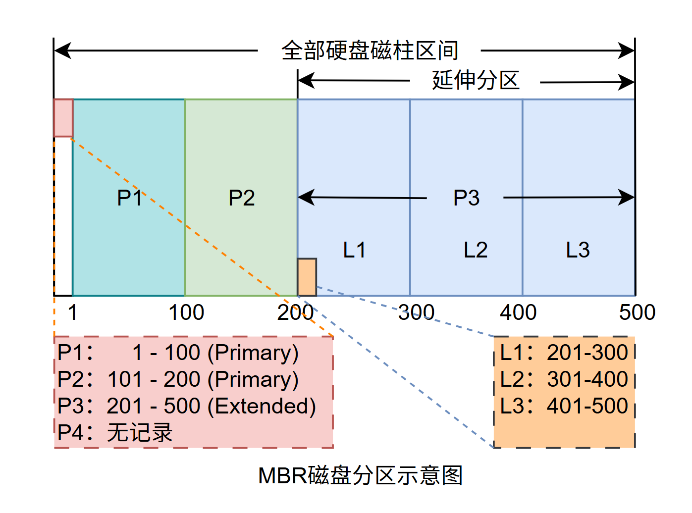
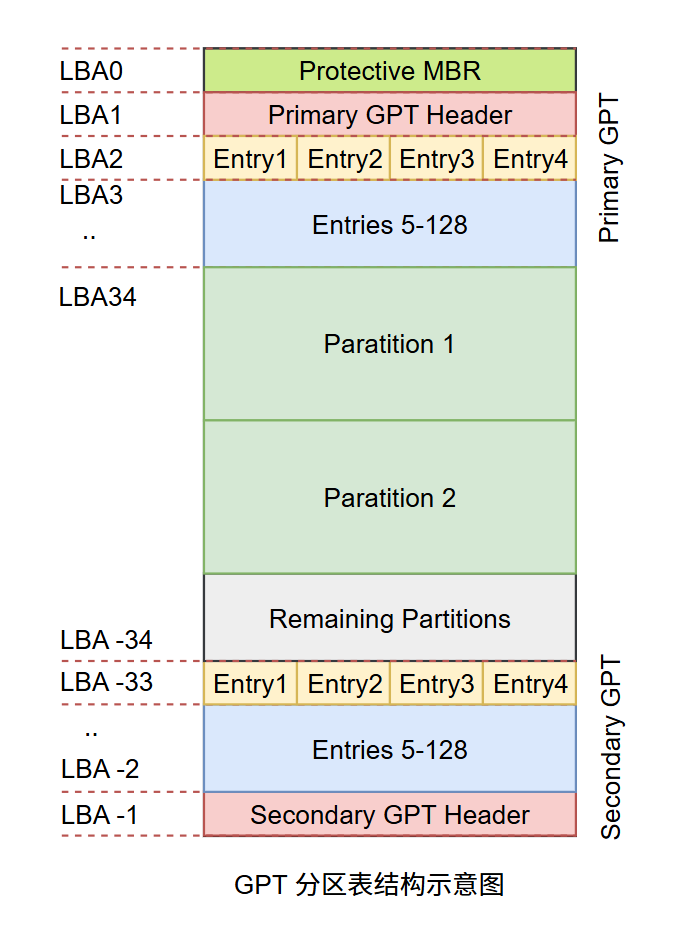

#### Linux-磁盘分区

#### 1.写在前面

Linux这个磁盘分区看过很多次，但每次看过又忘了，便于以后复习，写篇文章记录下

#### 2. 概述

常见的磁盘接口SATA、M.2、PCIe、SAS，下面是他们的说明：

> SATA：全称**Serial Advanced Technology Attachment**，一种串行接口，广泛应用于台式机和笔记本电脑的机械硬盘和固态硬盘。
>
> M.2：该接口主要是固态硬盘的，支持ACHI协议，即走SATA；另一个是NVME协议，即走PCIE，后者性能比前者强很多。
>
> SAS：全称**Serial Attached SCSI**，该接口兼容SATA接口，但传输速率更高，可能达到12Gbps（来自维基百科）。

如果用虚拟机，那么磁盘可能使用了/dev/vd[a-p]这种文件名，正常实体机则是/dev/sd[a-]，下面说说磁盘的两种分区格式，MBR（Master Boot Record）格式和GPT（GUID partition table）。

#### 3.MBR格式

全称是Master Boot Record，Linux早期采用这种方式来处理开机管理程序与分区表，这些信息则是通通放在磁盘的第一个扇区，大小通常是512Bytes，因此第一个扇区有两个数据：

1. 主要开机记录区：安装开机管理程序的地方，有**446Bytes**。
2. 分区表（partition table）：记录整个硬盘的分区状态，有**64Bytes**。

因为只有64Bytes存放分区表信息，因此最多只能存4组记录区，参考如下：



上图示意的磁盘划分了P1、P2、P3三个分区，P4无记录，其中P1、P2为主分区（Primary），P3为扩展分区（Extended）。上述提到64Bytes空间只能够放4组记录对应4个分区，但实际上平常用的PC Windows中往往可以看到有超过4个分区，这是通过扩展分区实现的。P3范围是从201-500，更进一步将P3划分为L1、L2、L3三个逻辑分区，实际上逻辑分区的分区信息在每个逻辑分区的前几个扇区都有存在，此处做了简化。

在Linux系统中，假如该磁盘名称是/dev/sda，那么对应分区的名称是下面这样的：

```tex
P1：/dev/sda1
P2：/dev/sda2
P3：/dev/sda3
L1：/dev/sda5
L2：/dev/sda6
L3：/dev/sda7
```

两个主分区和一个扩展分区使用了sda1-3，逻辑分区从sda5开始，为何？因为Linux前面4个编号是给主分区或者扩展分区准备的，因此逻辑分区起始编号是5。关于MBR分区格式的一些限制：

1. 主分区和扩展分区总共只能有4个 -- 硬盘格式限制
2. 扩展分区只能有一个 -- 操作系统限制
3. 扩展分区无法格式化，磁盘格式化后作为数据存取的分区只区分逻辑分区与主分区。
4. Linux SATA硬盘逻辑分区可以突破63个的限制。

MBR分区格式存在着一些问题，其表中每组信息只有16Bytes空间，记录信息有限，操作系统无法抓取2.2T以上的磁盘容量；MBR记录只有一个区块，若被破坏则很难或者无法恢复；MBR内存放开机管理程序的区块仅446Bytes，无法容纳比较多的代码，为了解决这些问题有了下面的GPT磁盘分区格式。

#### 4.GPT格式

GPT将所有磁盘区块以LBA（Logic Block Address）来进行规划，与MBR仅使用第一个512Bytes区块来记录不同，GPT使用34个LBA区块来记录磁盘分区信息，每一个LBA大小为512Bytes。GPT格式除了前34个LBA区块之外，整个磁盘的最后33个LBA也拿来做一个备份，防止前面坏后操作系统还能读取进行修复，结构类似下面这样：




**LBA0：**该块用于存储MBR模式兼容信息，前446Bytes用于存第一阶段开机管理程序，在原本分区表的记录区内放入一个特殊标记，用于表示此磁盘为GPT格式。

**LBA1：**这个部分记录了分区表本身位置与大小、备用的GPT分区放的位置信息，同时也放置了分区表的校验码，若错误操作系统可读取备份GPT来恢复GPT运行。

**LBA2-33：**从LBA2开始，每个LBA都可以记录4笔分区记录信息，在默认情况下GPT允许128笔分区记录。GPT去除了原本MBR中的主分区、扩展分区和逻辑分区的概念，每一笔记录都是独立存在，可用于格式化。

**注：**需要提一下的是并非是所有的操作系统或者磁盘管理工具都能够识别GPT，比如fdisk，要使用得类似gdisk或者parted这俩的命令才行。


#### 5.BIOS/UEFI

BIOS（Basic Input Output System）是主板上的一个固件（写入到硬件上的一个软件程序），这是开机时执行的第一个程序。BIOS会根据使用者设置去取得能够开机的硬盘，并且去硬盘中读取第一个扇区的MBR位置，找到那里面446Bytes的开机程序（该程序由操作系统在安装时提供），由它转到内核去执行。

MBR中的程序提供下面三个功能：

1. 提供菜单，使用者可以选择不同的开机项目
2. 载入核心文件，即指向可开机程序的区段开始操作系统
3. 将开机管理功能转交给其它loader负责。

关于第3点，需要知道的是开机管理程序可以安装在MBR以及其它分区的Boot Sector这两处即可，细节还没看到。

UEFI（Unified Extensible Firmware Interface），原本BIOS在与现阶段的操作系统发展已经不匹配，因此产生了UEFI取代了原有的BIOS固件界面，其差异借用个表格说明：

| Entry                  | 传统BIOS                                               | UEFI               |
| :--------------------- | :----------------------------------------------------- | :----------------- |
| 程序语言               | 组合语言                                               | C语言              |
| 硬件资源控制           | 使用中断（IRQ）管理 不可变内存存取 不可变输入/输出存取 | 使用驱动程序与协定 |
| 处理器运行环境         | 16位                                                   | CPU保护模式        |
| 扩充方式               | 通过IRQ链接                                            | 直接载入驱动程序   |
| 第三方厂商支持         | 较差                                                   | 较佳且支持多平台   |
| 图形化能力             | 较差                                                   | 较佳               |
| 内置简化操作系统前环境 | 不支持                                                 | 支持               |


#### 6.参考资料

鸟哥私房菜第四版&网上查了一部分硬盘接口信息
