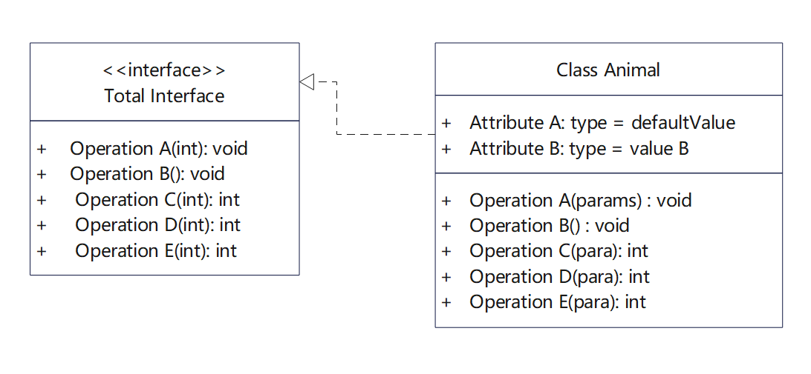
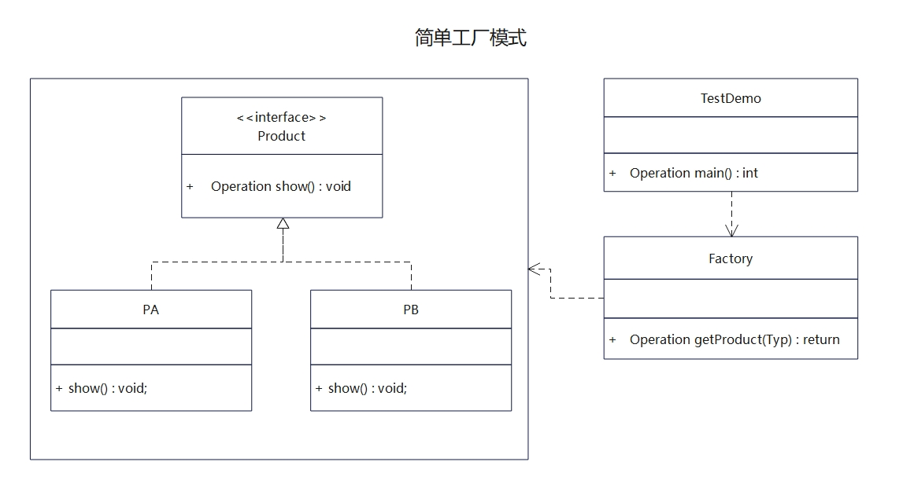
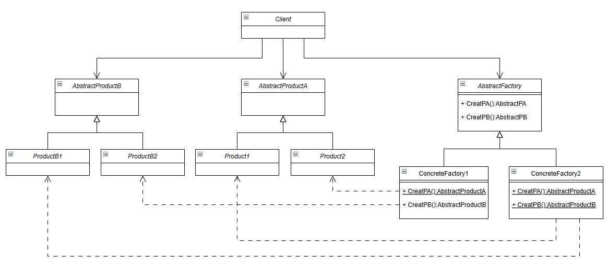
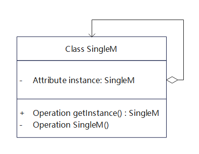

## 	0006-设计模式记录 

### 1. SOLID原则

#### 1.1. S-单一职责原则

​	该原则描述的是一个类或者一个函数应该指做一件事儿，比如不能将数据库处理逻辑和日志处理逻辑放在一个类里面。如何做到只做一件事儿？即不能将不同层次的抽象糅杂在一起，逻辑上是独立的。比如在数据库类里面对外提供了read(),write()两个数据库操作接口，但同时你还提供了write_file()的日志接口。函数实现时内部的调用应该是在同一个抽象层次上，比如实现一个解释elf执行的函数elf_exec，那指令执行分加载指令load_inst()、解释指令resolve_inst()、执行指令inst_exec()。elf_exec中应该调用的是这三个函数，而不是先调用了前面一个，然后将resolve_inst和inst_exec实现散落在elf_exec中。


#### 1.2. O-开闭原则

​	对扩展开放，对修改关闭，即我们在添加一个新功能时尽量做到不修改原有的代码情况下完成功能添加，开和闭是对扩展和修改两个行为的描述。对修改关闭并非杜绝修改，而是做到尽量小的代码改动。同时也需要注意**在同样的代码改动情况下粗粒度下认定为“修改”，细粒度下被认定为“扩展”**。


#### 1.3. L-里氏替换原则

​	在使用父类对象的地方我们都能使用其子类对象进行替换而不会破坏原有程序逻辑行为和正确性。继承假定了子类继承父类的一切，子类行为可以扩展但不会收窄。违反该原则容易导致程序中出现一些难以发现的问题。


#### 1.4. I-接口隔离原则

​	我们应该使用多个接口而非一个总的接口类，当接口类太大时我们需要对其进行拆分。客户端在依赖接口时应该依赖其最小接口，而非去实现一堆其不需要用到的接口，比如下面的类

​	

#### 1.5. D-依赖倒置原则

​	该原则要求程序依赖于抽象接口，而不是依赖于具体的实现。传统的编程思维是按照搭积木的模式，即一个个组件组合构成更大的组件，这样比较符合人们的思考习惯和认知方式。但该方式存在一个问题，即更高的层次依赖于低层次的实现，抽象依赖于具体的细节了。依赖倒置原则要求我们调整高层对象依赖于抽象接口，低层对象负责实现接口，这样就做到了高层抽象与低层实现之间的弱耦合性。使用该方式的前提是程序得符合里氏替换原则。


### 2. 工厂模式

#### 2.1. 概述

简单工厂模式，提供了一个独立的工厂类，通过传入的不同参数类型创建不同的产品（所有产品都继承于同一个抽象基类）。

#### 2.2. UML



PA和PB两个产品类继承Product接口，Factory类依赖于左侧的产品类，实际上是依赖于Product接口。这样做得好处是如果有新增加的产品，则只需要实现Product接口并在Factory类中添加新产品的生成代码即可。

#### 2.3. 代码


### 3. 抽象工厂模式


概述


UML图



代码

```c++
class AbstractFactory {
 public:
  virtual AbstractProductA *CreateProductA() const = 0;
  virtual AbstractProductB *CreateProductB() const = 0;
};

class ConcreteFactory1 : public AbstractFactory {
 public:
  AbstractProductA *CreateProductA() const override {
    return new ConcreteProductA1();
  }
  AbstractProductB *CreateProductB() const override {
    return new ConcreteProductB1();
  }
};

class ConcreteFactory2 : public AbstractFactory {
 public:
  AbstractProductA *CreateProductA() const override {
    return new ConcreteProductA2();
  }
  AbstractProductB *CreateProductB() const override {
    return new ConcreteProductB2();
  }
};

void ClientCode(const AbstractFactory &factory) {
  const AbstractProductA *product_a = factory.CreateProductA();
  const AbstractProductB *product_b = factory.CreateProductB();
  std::cout << product_b->UsefulFunctionB() << "\n";
  std::cout << product_b->AnotherUsefulFunctionB(*product_a) << "\n";
  delete product_a;
  delete product_b;
}

int main() {
  std::cout << "Client: Testing client code with the first factory type:\n";
  ConcreteFactory1 *f1 = new ConcreteFactory1();
  ClientCode(*f1);
  delete f1;
  std::cout << std::endl;
  std::cout << "Client: Testing the same client code with the second factory type:\n";
  ConcreteFactory2 *f2 = new ConcreteFactory2();
  ClientCode(*f2);
  delete f2;
  return 0; 
}
```


### 4. 单例模式

1. 懒汉模式：需要使用时候才创建，在初始化时需要考虑线程安全问题
2. 饿汉模式：系统一运行时就初始化该实例，初始化本身就线程安全


需要考虑问题：

1. 线程安全问题
2. 性能问题（主要是指加锁）


UML图



```C++
class Singleton
{
public:
	static Singleton* Instance()
	{
        if (singleton == nullptr) {
            std::unique_lock<std::mutex> lock(m_mutex);
            if (singleton == nullptr) {
                singleton = new Singleton();
            }
        }
		return singleton;
	}

	static void DestoryInstance()
	{
		if (nullptr != singleton)
		{
			delete singleton;
			singleton = nullptr;
		}
	}

	void DoSomething()
	{
		std::cout << "something done!" << std::endl;
	}

private:
	Singleton() {}
    ~Singleton() {}
	Singleton(const Singleton& obj) = delete;
	Singleton& operator=(const Singleton& obj) = delete;
	static Singleton* singleton;
    static std::mutex m_mutex;
	
};

//Singleton* Singleton::singleton =  new Singleton();
```


###  5. 观察者模式

定义对象间的一种一对多的依赖关系，当一个对象状态发生改变时，所有依赖于它的对象都得到通知并被自动更新。

```c++
#include <iostream>
#include <string>

using namespace std;

class Observer;
class Subject
{
public:
    virtual ~Subject() {}
    virtual void registerObsvr(Observer* obsvr) = 0;
    virtual void removeObsvr(Observer* obsvr) = 0;
    virtual void notify(const std::string &msg) = 0;
};

class Observer
{
public:
    virtual ~Observer() {}
    virtual void update(const string &msg) = 0;
    virtual string getName() = 0;
protected:
    Observer() {}
}

class InfoPublisher : public Subject {
public:
    InfoPublisher() {_observers = new list<Observer*>();}
    void registerObsvr(Observer *obsvr) {
        list<Observer*>::iterator it = find(_observers->begin(), _observers->end(), obsvr);
        if (it == _observers->end())
            _observers->push_back(obsvr);
        return;
    }
    void removeObsvr(Observer *obsvr) {
        list<Observer*>::iterator it = find(_observers->begin(), _observers->end(), obsvr);
        if (it != _observers->end())
            _observers->remove(obsvr);
        return;
    }
    void notify(const string &msg) {
        list<Observer*>::iterator it = _observers->begin();
        for (; it != _observers->end(); it++) {
            (*it)->update(msg);
        }
        return;
    }

private:
    list<Observer*> _observers;
}

class SomeOne : public Observer
{
public:
    SomeOne(string name, string action) : _name(name), _action(action) {}
    void update(string &msg) {
        cout << "msg: " << msg << endl;
    }
    string getName() {return _name;}

private:
    string _name;
    string _action;
}

int main(void)
{
    SomeOne *A = new SomeOne("A", "get dressed and run to classroom");
    SomeOne *B = new SomeOne("B", "playing games");
    SomeOne *C = new SomeOne("C", "shopping");

    InfoPublisher info;
    
    info.registerObsvr(A);
    info.registerObsvr(B);
    info.registerObsvr(C);
    info.notify("notify information!");
}
```

### 6. 适配器模式

用于接口转换。

```c++
#include <iostream>
using namespace std;

class InfA
{
public:
    virtual void useInfA()
    {
        cout<<"use InfA."<<endl;
    }
};

class IAdaptee
{
public:
    void virtual useplug() = 0;
};

class InfB : public IAdaptee
{
public:
    void useplug()
    {
        cout << "use InfB." << endl;
    }
};

class Adapter : public InfA //公有继承目标
{
private:
    IAdaptee *pA;   //适配对象
public:
    Adapter(IAdaptee *p)
    {
        pA = p;
    }
    void useInfB()
    {
        pA->useplug();
    }
};

int main()
{
    InfA *pA = new InfA();
    InfB *pB = new Adapter(pA);
    pB->useInfB();
    delete pA;
    delete pB;
    return 0;
}

```


### 7. 策略模式

用于将不同的算法封装在不同的类中，算法之间的关系是平行的，解决相同问题。

```c++
#include <iostream>
using namespace std;

class Strategy {
public:
    virtual ~Strategy() {}
    virtual void exec() = 0;
}；

class StrategyA : public Strategy
{
public:
    void exec() { cout << "strategy A" << endl;}
}；

class StrategyB : public Strategy
{
public:
    void exec() { cout << "strategy B" << endl;}
}；

class Content {
public:
    Content(Strategy *st) : strate(st) {}
    void exec() {
        strate->exec();
    }
    void setStrategy (Strategy *st) {strate = st;}
private:
    Strategy *strate;
}

int main()
{
    StrategyA stA;
    StrategyB stB;
    Content cont(&stA);
    cont.exec();
    cont.setStrategy(&stB);
    cont.exec();
}
```


### 8. 责任链模式 

概述

实现

### 9. 桥接模式

概述

实现


### 10.迭代模式


### 11.访问者模式


