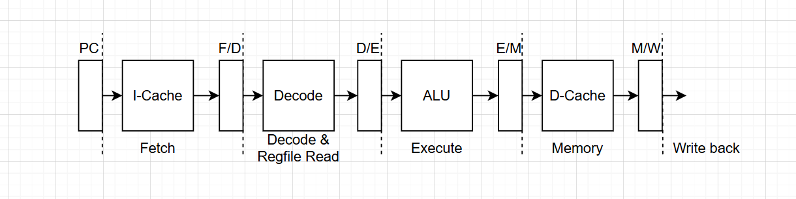
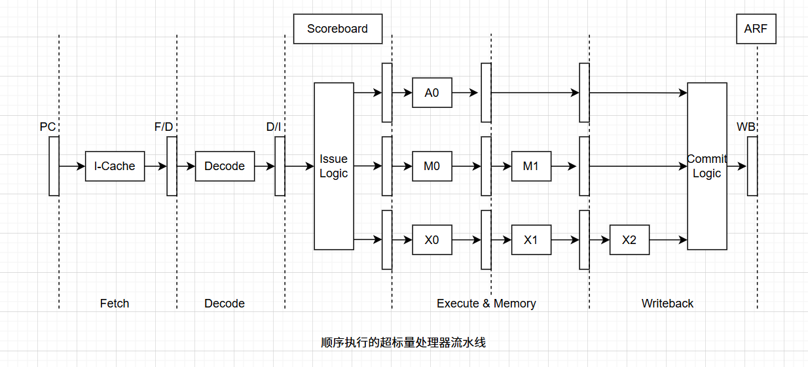
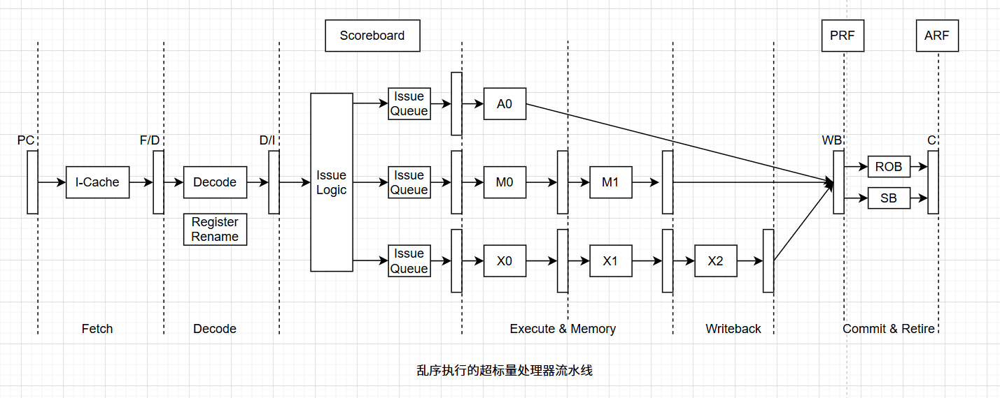
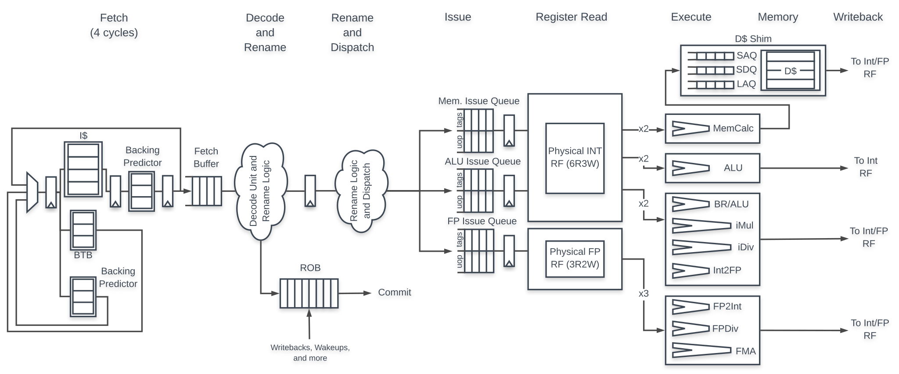
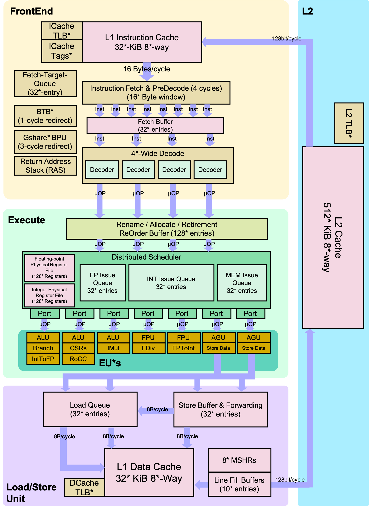

### 超标量处理器设计 -- 总述

#### 0. 写在前面

​	本系列文章旨在系统性梳理超标量处理器微架构的设计原理与实现方式，既为工作实践所需，也作为学习归纳与知识输出的整理。最近看《余华文学课》，提到了柯勒律治认为的四类阅读方式中，我希望能做到阅读学习并非只是为了自身获益，说不上能有什么新的，但也希望能够分享给他人。

#### 1. 概述

​	处理器就处理器，但为何还需要提超标量处理器？从什么是标量处理器讲起，标量处理器是指每周期执行指令数一条以内的处理器，而超标量处理器每周期执行指令数超过1条指令，这两者在微架构设计实现上有较大区别，后续叙述超标量处理器设计实现。下面给出程序执行时间计算公式解释：
$$
Total \; Instructions \times \frac{Cycles}{Instructions} \times \frac{Seconds}{Cycle}
$$
​	*Total  Instructions* : 程序总共需要执行的指令数量，这个和软件自身的实现工作量、编译器、指令集定义相关，当程序已经完成后这个值是固定的。

​	*Cycles / Instructions* : CPI（Cycle per Instruction），表示处理器执行一条指令所需要的Cycle数，没有流水线的处理器，一条指令需要多个Cycle才能完成，对于普通流水线处理器，一个Cycle最多执行一条指令。

​	*Seconds / Cycle* : 处理器频率倒数，即每个Cycle对应的时间，这个由实现微架构对应的工艺决定。

​	根据上述公式，降低程序执行时间可以从三个方面入手，第一个修改程序实现算法，或者降低工作量以减少程序总执行的指令数；第二个降低处理器执行CPI，这个依赖于处理器微架构设计，也是本系列所讨论的内容；第三个即提高频率，比如1GHZ到2GHZ，后者每个Cycle时间一定比前者少。

​	在总指令数一定情况下，我们想更快的执行则需要有比较高的IPC以及更高的频率，但在实际实现中，这两个因素是相互制约的、此消彼长关系，对于这一点可以简单的说明下，当要求有更高的IPC时，硬件电路的设计复杂度会急剧上升，导致处理器周期时间很难下降，因为在很短的时间内很难容下复杂的逻辑设计，虽然可以通过划分更多的阶段来执行，即更深的流水线，但这又会导致处理器在各种预测失败时有更高的惩罚，严重降低IPC，增加功耗，由此出现高频低能现象。

​	关于超标量VLIW这种处理器也能每周期执行超过一条指令，但该处理器不是超标量处理器，因为是由程序告诉处理器哪些可以并行执行而不是处理器自身做出决断。对于通用处理器来说，超标量是必须的，程序员可以抛开底层硬件细节专注于软件实现，并且程序能很好的运行在支持该指令集的任意CPU上面。VLIW 的并行性由编译器静态决定，而超标量依赖硬件动态调度，具有更强的通用性和适应性。

#### 2. 普通处理器流水线

​	在未采用流水线的情况下，指令从取指到执行的全过程一次性完成，假设总耗时为 D。引入流水线后，D 被划分为 N 个阶段，每个阶段之间需加入缓存，用于传递中间结果，因此单条指令的总执行时间增加为 D + S（其中 S 为缓存引入的额外延迟）。流水线的优势在于可以并行处理多条指令，从而提高整体吞吐率，缩短多条指令的平均执行时间。然而，流水线的引入也带来了额外的硬件开销（如阶段间缓存）和单条指令延迟的增加。在微架构设计中，此类性能、成本与延迟之间的权衡非常常见，设计者需在多种因素中权衡利弊，做出最合适的取舍。

##### 2.1. 流水线基本划分

理想情况流水线划分需要满足一下条件：

1. 流水线各阶段所用时间应该是相等的，实际上只能做到近似相等，最长的流水段时间决定了处理器的周期时间。
2. 流水线每个阶段的操作都会被重复执行，但因处理器支持指令种类繁多，实际上比如算术指令在访存指令访问存储器阶段什么都不做就行。
3. 流水线中各阶段操作都和其它流水段相互独立、互不相干，但很难满足，现实中指令与指令之间执行存在多种相关性

上图展示了一个简单的5级流水线划分，每个阶段完成功能如下：

> ​	Fetch：取指功能，根据给定的PC从I-Cache中取出指令
>
> ​	Decode & Regfile Read：解码指令，根据解码结果读取寄存器堆，得到指令源操作数
>
> ​	Execute：根据上阶段解码出来的结果执行指令功能
>
> ​	Memory：访问D-Cache，这个主要针对访存指令，其它指令不做任何事
>
> ​	Write Back：指令如果存在目的寄存器，则将结果写回到目的寄存器中

​	上述流水段的划分并非最优化的，一种可能执行时间情况分别是Fetch-7ns、D&R-11ns、Exec-5ns、Mem-10ns、WB-3ns，（处理器周期时间取其最大则是11ns）有两种方式可以对其平衡，使其各阶段执行时间大致相等，一个方向是合并流水段，另外则是进一步拆分流水段了。但现代处理器一般追求较高的主频，因此合并方法并不合适，对于拆分流水段较深的流水段则会导致硬件开销增大，功耗随之增加，寄存器读写端口增加，而且前面也提过较深的流水线增加分支预测失败时的惩罚，多种因素制约着该方式的使用。

##### 2.2. 指令间相关性

​	一个程序的不同指令之间存在着多种相关性，所谓相关性是指一条指令的执行依赖于另一条指令的结果，可以分为数据相关性、存储数据相关性、控制相关性、结构相关性这几类。其中数据相关主要有写后读相关（RAW）、读后写相关（WAR）、写后写相关（WAW），这三种相关性对于存储地址之间的关系也是适用的，控制相关则是由于分支指令而产生的一种相关性，可以通过分支预测进行解决，结构相关是指指令在执行过程中需要等某些部件空闲之后才能执行，比如发射队列（Issue Queue）或者重排序缓存（ROB）是否满了。

#### 3. 超标量处理器流水线

​	超标量处理器指令执行有两种方式，顺序执行和乱序执行，下表给出具体特点：

|                          | Frontend | Issue        | Write Back   | Commit   |
| :----------------------: | :------: | ------------ | ------------ | -------- |
|   In-Order Superscalar   | in-order | in-order     | in-order     | in-order |
| Out-of-Order Superscalar | in-order | out-of-order | out-of-order | in-order |

​	表格中Frontend表示流水线的取指和解码阶段，这俩阶段很难也没必要进行乱序；顺序与乱序的区别在于指令发射到指令写回，最后的指令提交都会是顺序提交，以保证程序按照原来的意图得到执行同时实现精确异常。Issue表示指令从发射队列中选出来送入到对应的功能单元中执行，Write Back表示指令执行完了将结果写回到对应的目的寄存器中。

##### 3.1. 顺序&乱序执行

在顺序执行的超标量处理器中，指令执行必须遵循程序中的指定顺序，概括图如下：

​	图中执行阶段包含三个功能单元，第一个执行ALU类型指令，第二个执行访存操作指令，第三个执行乘法操作指令，乘法指令所需时间最长，但上面两个功能单元后面就算什么都不做也需要跟着使用三级流水。Scoreboard用来记录流水线中每条指令执行情况，如某条指令在哪个FU中，什么时候可以得到结果等。顺序发射执行存在某些指令不存在依赖情况下也只能乖乖待着等前面指令发射执行完了也才能发射。指令间存在的三种数据相关情况，对于RAW真相关，这多了啥处理器都不好使，但对于WAW、WAR这两种而言，上述在最后统一顺序写回，因此没啥影响。

下面看看乱序执行示意图：

区别于顺序得是从发射阶段就变为了乱序发射，各功能单元执行完后乱序Write Back到PRF，最后由ROB统一拉回程序规定顺序。乱序执行中WAW、WAR这两种相关性的处理是在解码和重命名阶段。不同的FU有自己不同的流水线级数，各自执行完了写回到PRF即可，但因为异常和分支预测失败的存在，写入PRF的结果不一定都会更新到ARF，一条指令在Retire之前都是有可能会被刷掉，当指令Retire之后架构状态真正被修改，此时也无法回退了。对于store指令而言，则是存在一个SB（Store Buffer）用于存储未确定的结果，当对应指令Retire时才能从SB中写出到内存，这也就意味着Load指令除了要去D-Cache查之外，还要去SB看看数据是否在里面，这实际上增加了LSU的硬件设计复杂度。

##### 3.2. 流水段划分

对超标量流水段划分做一个简单的介绍，后续会进一步细化：

1. Fetch（取指）：由I-Cache（存储常用指令）和分支预测器（预测分支指令的下一条指令地址）组成，这部分负责从I-Cache中取出指令。
2. Decode（解码）：这个对取出来的指令进行解码生成对应UOP，RISC解码逻辑实现相较于CISC指令集比较简单，但也需要对一些特殊指令进行处理（增加硬件设计复杂度）。
3. Register Renaming（寄存器重命名）：将解码后拿到指令的逻辑寄存器映射到硬件中定义的物理寄存器上，物理寄存器个数是要远多于逻辑寄存器个数的，用来解决一些伪相关性。
4. Dispatch（分发）：将重命名后的指令分发到各执行单元对应的发射队列中，这个可以和前面的合并。
5. Issue（发射）：从发射队列中挑选出指令到功能单元中执行，该阶段是顺序执行到乱序执行的分界点，对于乱序处理器，指令在该阶段后按照乱序方式发射和执行，直到提交阶段才转为顺序。
6. Register File Read（读寄存器）：被仲裁电路选中的指令可以从寄存器堆中读取源操作数，当然也可以从旁路网络中获取（事实上很大一部分是从这拿的）。
7. Execute（执行）：得到源操作数后，立马送到对应FU中执行了，这FU可以是ALU、FPU、LSU等。
8. Write Back（写回）：将指令执行结果写入到物理寄存器堆中（PRF），同时通过旁路网络送到需要它的地方。
9. Commit（提交）：将乱序执行的指令拉回到程序中规定的顺序，能做到是因为前期在写ROB的时候是按顺序去写的，指令异常的处理也是在该阶段完成的。

还有另外一点需要提的是，超标量处理器的恢复技术，因为使用了分支预测提高性能，但预测就会存在失败的情况，错误取入的指令可能已经修改了某些寄存器或者寄存器映射等，此时需要依赖于恢复电路擦除错误指令执行痕迹，将流水线恢复到正确的执行状态，这些在后续详细进行讨论。

#### 4. 案例说明

##### 4.1. 项目简述

​	微架构遵循的是RISCV64GC指令集，有Berkeley Architecture Research 组研发，当前BOOMv3版本性能应该是可以和一些高性能商用乱序核去PK一下的，在这主要目的是用于学习。

> ​	The Berkeley Out-of-Order Machine (BOOM) is a synthesizable and parameterizable open source RV64GC RISC-V core written in the [Chisel](https://chisel.eecs.berkeley.edu/) hardware construction language. Created at the University of California, Berkeley in the [Berkeley Architecture Research](https://bar.eecs.berkeley.edu/) group, its focus is to create a high performance, synthesizable, and parameterizable core for architecture research. The current version of the BOOM microarchitecture ([SonicBOOM, or BOOMv3](https://carrv.github.io/2020/papers/CARRV2020_paper_15_Zhao.pdf)) is performance competitive with commercial high-performance out-of-order cores, achieving 6.2 CoreMarks/MHz.

##### 4.2. BOOMv3 微架构简化流水线图

​	理论上划分为Fetch、Decode、Rename、Dispatch、Issue、Register Read、Execute、Memory、Writeback 、Commit共记10段，和上面提到的基本对应，但有部分合一块儿了，实际是**Fetch**, **Decode/Rename**, **Rename/Dispatch**, **Issue/RegisterRead**, **Execute**, **Memory** and **Writeback**。

​	取指部分包含了一个分支预测器，对于已经取出的指令会先做一个预解码，检查是否包含分支指令，确定是否做预测；下一阶段对取出的指令进行解码，产生UOP，同时将指令放到ROB中，同时将涉及的逻辑寄存器重命名为物理寄存器；重命名完成后下阶段将UOP放入到对应不同功能单元的Issue Queue中，这给了Mem Queue、ALU Queue、FP Queue，在这等着它们的源操作数Ready；发射阶段，根据指令是否Ready等，选择指令进入到对应的功能单元执行，进入Execute阶段；最后是访存和指令输出。

##### 4.3. BOOM 流水线细化图

#### 5. 参考链接

​	BOOM项目Github地址：https://github.com/riscv-boom/riscv-boom

​	BOOM项目说明文档：https://docs.boom-core.org/en/latest/index.html

作者：Atlas

最后修改时间：2025-06-19
