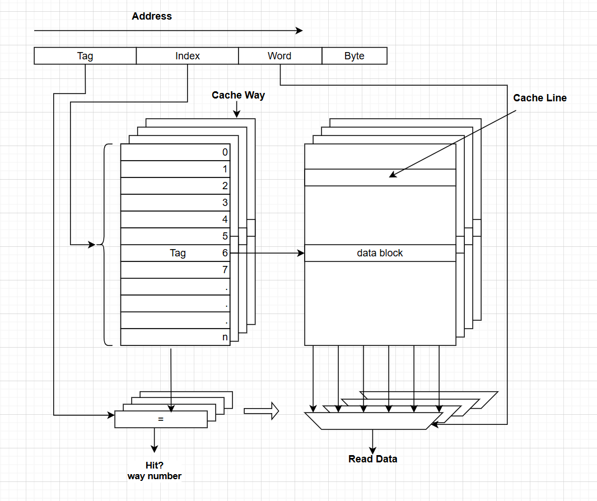
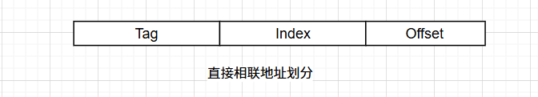
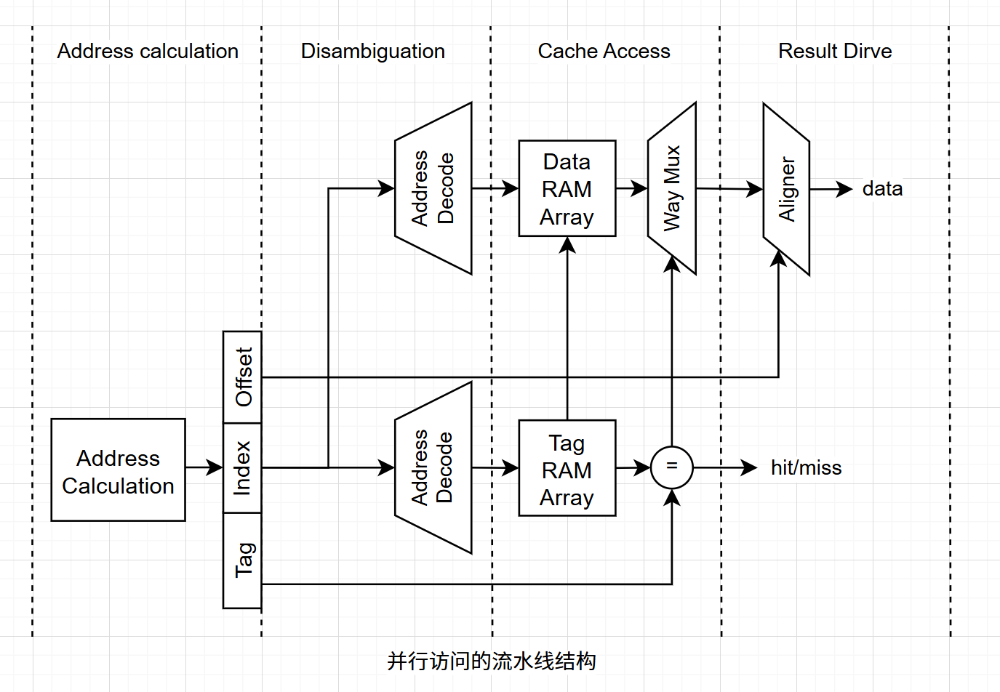
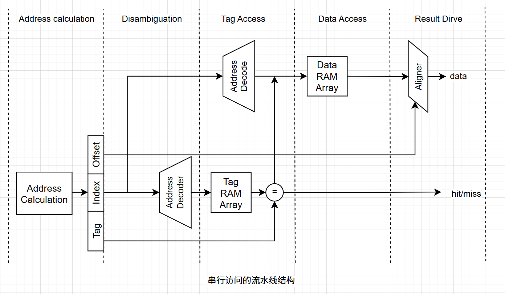
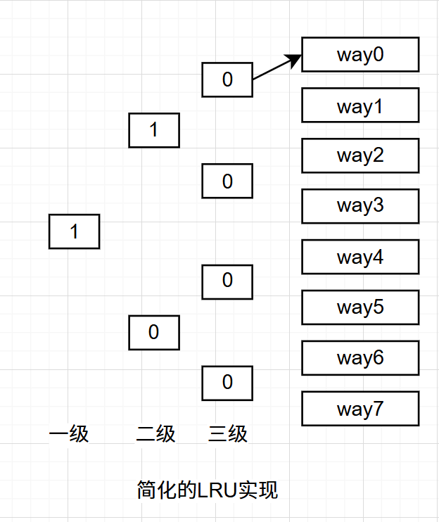
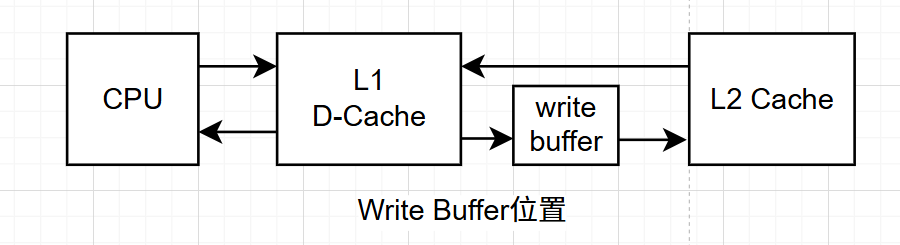
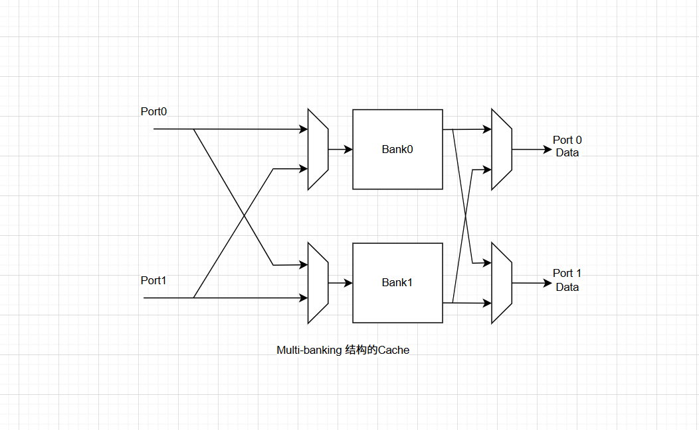

### 超标量处理器设计--Cache

#### 1. 简述

Cache的概念比较宽泛，本文限定只CPU中的L1，以及SOC上的L2，L3。而Memory在本文中指主存（Main Memory），即常见的DRAM内存条。

Cache之所以存在，直接原因是存储器的访问速度无法跟上CPU中的运算速度，对于这两点，我感觉这两者材料相差不大的情况下（容量相差巨大），存储器本身访问搜索速度一定跟不上CPU运算速度，原因是短距离的电流路径比长距离快。但总不能降低CPU运算速度去适配存储器吧？那怎么解决？缩小存储器，并且使用更快访问速度的材料，对应于一下两点：

1. Cache（SRAM）使用晶体管组成的锁存器来实现，Memory（DRAM）使用电容来存储电荷。
1. Cache不能太大，通常L1 在KB级别(或者1-2MB)，L2 L3在MB级别（40MB左右），参考Intel 6148CPU。

对于程序的时间局部性和空间局部性，这两者是程序能够使用Cache提速的必要条件。虽然Cache速度比Memory快但若程序没有这两个特点那也白搭。现代CPU设计基本都是使用了哈佛架构，其L1分为I-Cache和D-Cache在核内，容量通常在512KB到3MB级别不等；L2、L3基本在50MB左右，多核共享。对于L1的要求则是速度快，而L2和L3是要求全。

#### 2. Cache组成方式

Cache由Tag部分和Data两部分组成，Tag可以认为是一部分数据的公共地址，而Data则是对应数据，一个Tag和对应的所有数据组成了一个Cache Line，其中数据被称作数据块，下面给出示意图：

Cache与Memory之间的映射关系有三种，直接相联映射、组相连映射、全相联映射，实际上直接相联映射和全相联映射是组相连映射的两种极端情况，TLB和Victim Cache（后面会讲到）一般使用全相联，而直接相连应该没用的？对于L1 - L3一般用组相连。上图是Cache的一种实现方式，通过Index域段定位到具体表项（此处为对应的Set），再将该Set中的4个Tag取出来，一一和地址中的Tag进行比较，并给出way number，据此选择右侧的某一个data block，最后根据Word定位到data block中的具体数据。

##### 2.1. 直接相联

该方式是最容易实现的一种，处理器访存地址会被分为Tag、Index、offset三部分，根据Index找到对应表项，check表项是否有效，读出表项中的Tag与地址中的Tag比较，相等则命中，再根据offset定位到数据块中的数据（具体到某一字节）。

从之前的描述，所有Index相同数据块都会映射到同一个Cache Line上，这是直接相联致命缺点，两个Index相同的交互访问将导致Cache一直处于缺失状态，该方式不需要替换算法，但执行效率也是最低的，现代处理器很少采用。

##### 2.2. 组相联

组相连方式是用来解决直接相联的bug的，对Cache Line进行分组，使用Index作为组号访问，使用Tag在组内一一比较，在多个Cache Line中选出需要的结果。该方式缓解了直接相联单个Cache Line导致缺失率很高的问题，由于组内需要比较所有Tag，也增加了访问Cache的时延，但这是很划算的。

在实际Cache实现中，上述提到的Tag和数据块是分开存放的，对这俩的访问可以是串行的，也可以是并行的。串行访问方式则是先通过Index找到Cache Set，用Tag 去比较找到对应的Cache Line，根据比较结果去访问数据阵列。并行访问则是对应Index的Tag阵列被读取得同时对应的Data阵列同步访问该地址中数据，并读出来送到多路选择器中对数据进行选择，该多路选择器受Tag比较结果控制，下面看下这两者的流水线实现：

第一阶段对访存指令进行计算，得到访存地址，第二阶段对指令相关性进行检查，第三阶段访问Tag阵列和Data阵列，使用Tag比较结果进行选择，最后一阶段根据Offset定位到具体数据。下面看看串行访问实现的流水线：

对于串行访问，比并行访问的流水线多了一个Cycle，将Tag和Data访问分开，Data访问根据Tag的结果进行读取，少了个多路选择器，相比并行方式降低了功耗；另外一个是减少了Tag和数据访问延迟，对提高处理器频率有好处。

对于超标量处理器来说，使用串行方式可能更适合，理由是多出来的一个Cycle可以通过填充其它指令执行而进行掩盖，不会因为Cache访问多了一个Cycle导致明显性能降低，串行方式有利于提高处理器的执行频率。对于普通顺序处理器来讲，因为无法对指令调度，增加一个Cycle对性能影响较大，因此使用并行方式则是一个更好的选择。

##### 2.3. 全相联

全相联方式对于存储器中的任意一个数据来说，它可以放在任何一个Cache Line中，因此该方式也就没有了Index域段，只有Tag域段和offset域段了，在访问Cache的时候只需要拿Tag到Tag阵列中去挨个比较即可。该方式有最大的灵活度，缺失率是最低的，但很明显，它的延迟也是最高的，因此使用该方式一般都不会有太大的容量，TLB就是用该方式实现的，后续讲讲。

#### 3. Cache的写入

对于L1 中I-Cache而言，就算有自修改指令也不会对其直接写入，而是通过修改D-Cache，更新到下级如L2中，再将I-Cache中对应表项置为无效。对于D-Cache的写入，分为 **写通（Write Through）**和 **写回（Write Back）**两种。

> Write Through：指在写L1的同时同步写L2，但这会有个问题是下级存储器延迟高，每次都同步写则降低处理器效率，但好处是这两级存储器不会存在不一致状态。
>
> Write Back：只写L1级存储器，并给写入的Cache Line标记为Dirty状态，等该Cache Line被替换出去时再写入到下级存储器中，这会减少写慢速存储器的频率，该方式会导致上下两级存储器之间存在较多不一致的地方，增加了存储器的管理负担。

上述写入都假定写入的数据在D-Cache中存在，当数据不在D-Cache中时有两种处理方式，一是直接写入下级L2-Cache中，该方式称为非写分配方式，另外一种则是先将L2中的数据加载到D-Cache中而后再写D-Cache，称作写分配方式。为何要先加载再写，而不是找个空的写进去再更新到下级？因为写入的数据通常是小于一个Cache Line的，需要保证除了更新部分的数据外的其它数据同下级保持一致，否则更新到下级会导致数据覆盖。

根据上述描述，容易想到写通方式通常配合非写分配一起使用，而写回方式则配合写分配方式一起使用。

#### 4.Cache替换策略

近期最少使用法，实现的时候每个Cache Line给一个Age，每访问一次这个Line，要么这个Line Age加1或者减少其它Line的Age，该方式在Way的个数比较少的时候还行，但当Way数量增多后这种精确实现LRU的方式代价就比较高了，下面介绍一种比较实惠的伪LRU，每一组使用一位表示Age，如图所示：

上面有way0-way7共8个way，第一级将其分为两组，一组way0-way3四个way，二组way4-way7共4个way，一级的1表示way4-way7最近没有被访问过，0表示way0-way3最近没有被访问过，递归分下去，就可以最终定位到具体需要替换的way。

另外一种替换方式就是随机替换，从所有way中随便选个换出去，相比上述的LRU，缺失率会高一些，Cache容量增大会好些，当然现实中并不是实现严格随机，而是使用一个时钟算法来确定换那个，实现硬件复杂度比较低。

#### 5.Cache优化

##### 5.1. 写缓存

这个是用来解决这样一种场景下的延迟，CPU需要访问一个数据，但不在L1中在L2中，此时需要将L2中的数据加载到D-Cache中，刚好要替换的那个位置数据是脏数据，那么需要写回到L2中，这就要求先将脏数据写到L2，然后再读L2中的Line到D-Cache中，通常L2只有一个读写端口就要求上述是串行执行，这会导致D-Cache缺失处理时间变得很长，所以在D-Cache和L2之间加个buffer，加快处理速度，等L2有空了再将buffer的数据更新出去，但很明显，加入这个buffer之后提升了硬件设计复杂度。

##### 5.2. 流水线

对于Cache的流水线实现，上述已经记录过一次，这需要提的是对于Store来讲，Tag阵列的访问和Data的写只能是串行完成，对主频要求高的CPU则是将Tag的读取和比较放在一个周期，Data的写入放在下一周期。当流水线化了之后，Load指令需要去检查Load的数据是否在Store的Pipe中，以及指令被刷掉的恢复处理等，这些问题也存在于其它的流水线设计中，因此也并非是深度越深越好。

##### 5.3. 多级结构

现代的处理器设计都会是多级Cache结构了，寄存器 -> L1-Cache -> L2-Cache -> L3-Cache -> Memory -> 硬盘。Memory可以看做是硬盘的缓存，L3是Memory的缓存，L2是L3的缓存，L1是L2的缓存。。。

这需要记录两个概念：

> 1. Inclusive：下级缓存如L2包含了L1中的所有内容，称作Inclusive方式
> 2. Exclusive：下级缓存如L2的内容和L1中互不相同，称作Exclusive方式

Inclusive方式是比较浪费资源的，但它可以直接将数据写入L1而不必担心覆盖会有什么问题，同时也简化了一致性管理，在多核情况下使用Inclusive只需要检查最低一级Cache如果不存在则不影响其它核，如果存在给置为无效即可。Exclusive则全部要检查一遍，包括L1，会影响到其它流水线执行。

##### 5.4. Victim Cache

简单来讲就是假定组相联里面一个组有4个Way，但热点的数据有5个Cache Line，那不管怎么玩，总有一个Way装不下，在加载Cache Line替换的时候那个被替换的就被称作Victim，因此在两级缓存之间再加一个Victim Buffer，这个buffer比较小，临时放那些被换出去的Cache Line，一般采用全相联，Victim Cache就相当于给每个组都加了Way的个数，规避掉竞争有限的way问题。

##### 5.5. 预取

大概就是读取数据时去猜测，下一个数据会是什么，提前取出来，但为了避免污染Cache，一般都会放在一个独立的缓存中。对于指令的预取，这个是比较好猜测的，但也会有分支指令的情况。对于数据就不那么好预测了，预取可能提升性能，但也可能过多错误预取导致增加了功耗而没有什么性能收益。

上述讲的是硬件预取，而软件预取则是程序员在写代码的时候告诉编译器或者编译器自分析哪些是需要预取的可以做针对性的处理了。在实现了虚拟存储器的系统中，预取可能会导致一些异常如Page Fault、虚拟地址错误等，需要考虑这些情况。

#### 6.多端口Cache

处理器中为了提高性能一般会同时读取多条指令进入解码执行，这就要求Cache是多端口的，当然这也只是其中一种。多端口的视线有三种方式，一种是True Multi-port，这种方式针对SRAM中的每个Cell改成两根读取线，两根使能线，但每个Cell只能有一个写入线，这种方式处理器设计基本不用。

Multiple Cache Copies，这种方式是对Cache的Tag阵列和Data阵列进行复制，实际上是第一种的另类实现，这种麻烦在于浪费了芯片面积同时写入的时候还要保持两个数据的一致性，甚是麻烦，也很少用。

Multi-Banking，这种方式使用广泛，大概是像下面这样的：

将Cache分成多个小的Bank，每个bank都只有一个端口，如果一个周期内Cache的多个端口上访问的地址位于不同的bank之中，那么这样就不会引起任何问题，只有两个端口的地址位于同一个bank才会引起冲突，双端口Cache实现上面仍旧需要两个地址解码器，两个多路选择器，两套比较器和两套对齐器，这样做在提高并行度的同时在一定程度上降低了面积使用。

#### 7.取指问题

如果一个超标量处理器在一个周期内能够同事同时解码4条指令，那么I-Cache在每周期应该提供四条指令，但如何做到？对于n-Way处理器，简单的做法是一个Cache Line大小为n条指令的大小，读取一个数据块就行，但每次取指的PC都是Cache Line对齐的那可以，但存在分支指令，通常不是，需要取的指令落在两个Cache Line中，一个周期无法拿到足够的指令，可以简单的算下4-Way情况，$\frac{1}{4} \times 4 + \frac{1}{4} \times 3 + \frac{1}{4} \times 2 + \frac{1}{4} \times 1 = 2.5$，明显对于4-way而言是不够的，但对于2-Way处理器来说足够了，这也是很多处理器的做法。

另外一种方法是不用一次取一个Cache Line，假定是4-Way处理器，将它的Cache Line数据放大到8条指令的大小即可，只要取指的地址没有落在最后条指令数据位置上，就能保证每次都能取到四条指令。当然，该方式如果是在Cache总容量一定的情况下，这是减少了Cache Set的数量为代价的，也势必会引起Cache Miss率的升高，实现假定用8个32bit的SRAM实现，每个SRAM周围会有一堆保护电路，SRAM过多会导致保护电路占用太多面积，同时从8个SRAM中选4个也是一件比较浪费电路的事儿，实际则是使用4个SRAM去实现，可这也引入一些其它麻烦，不做深入讨论。

超标量处理器中实现了分支预测，取指过程就还会更复杂一一些，分支预测后续进一步深入讨论。

#### 8.对于打工人（我）

通常用perf工具对这个东西进行观察和分析 -- 针对系统性能，或者程序的性能，perf相关的后面再单独写个总结吧。

