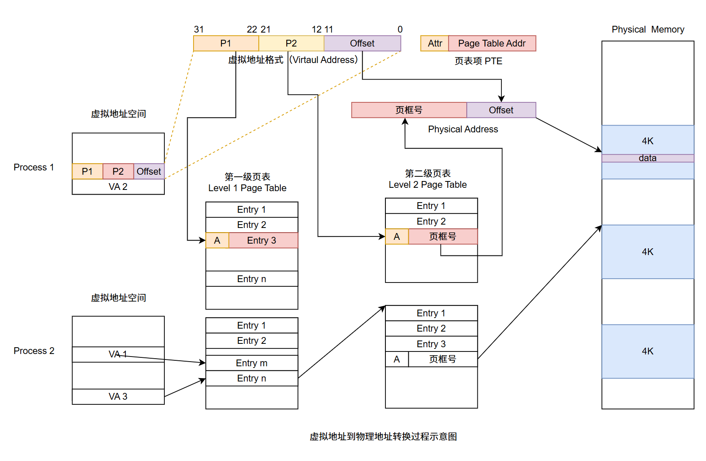
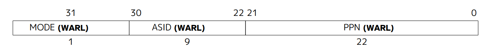
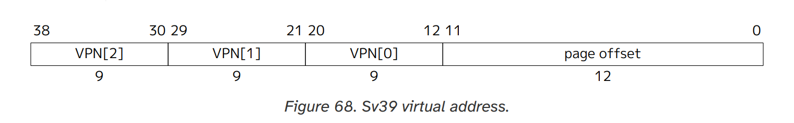
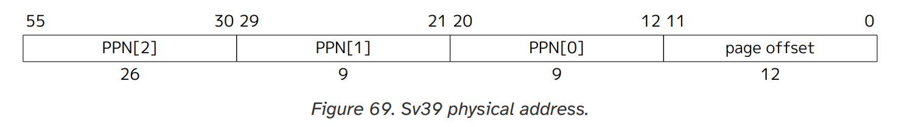
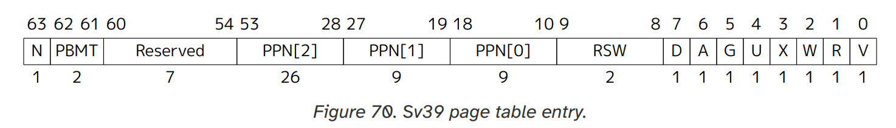
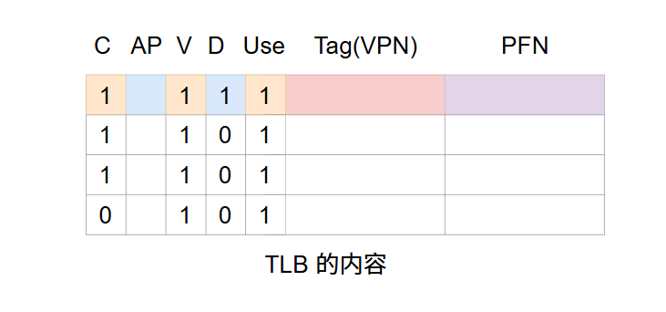
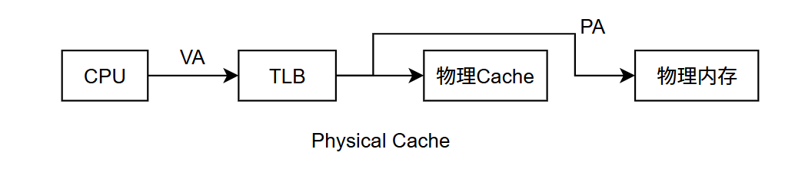
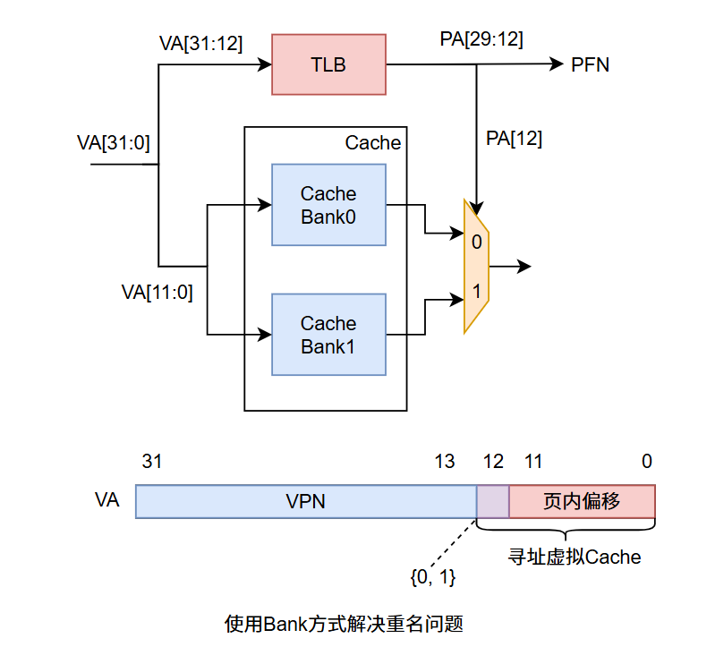
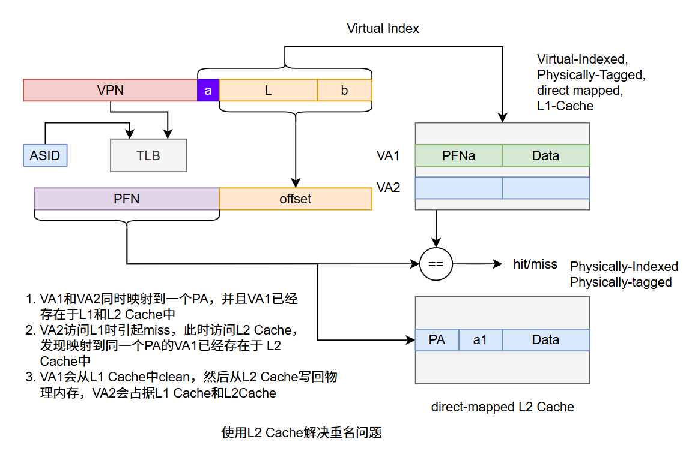

### 超标量处理器设计与实现-虚拟存储器

#### 1.概述

之前的讨论都是认为处理器送出的取指和数据地址是物理地址，但实际上现在高性能处理器都是支持虚拟地址的，为何会需要虚拟地址？虚拟地址不能直接寻址物理寄存器，需要通过MMU（Memory Manager Unit)将虚拟地址转换为物理地址才行。使用虚拟地址的好处：

1. 程序编写可以独立于内存编址（无需考虑内存布局），可以认为拥有所有内存空间（受限于处理器位数）。
2. 虚拟地址到物理地址映射给内存管理带来方便
3. 便于操作系统程序扩展，给OS提供了灵活的内存管理能力，对进程每一个页访问权限进行管理
4. 多进程总分配的物理内存之和大于总物理内存，虚拟内存管理使得此种情形下程序能正常执行

#### 2.多级页表

##### 2.1.地址转换

关于虚拟地址（Virtual Address）到物理地址（Physical Address）的转换过程，看下图：

上图描述了两个进程从虚拟地址到物理地址转换过程（两级页表），CPU给出的VA（Virtual Address）可以是PC，也可以是Load/Store指令访存的地址；对于每一个进程，其进程控制块中包含了该进程一级页表基址，进程执行时OS将其放入页表寄存器PTR（Page Table Register，一般处理器都会有）中。

内存页的划分以4KB大小为例，页表项PTE（Page Table Entry）4Bytes大小。32位的VA，前12bit（Offset，$2^{12}=4kB$）作为页内偏移，4kB / 4Byte = 1k个页表项（需要10位），因此一级页表和耳机页表项P1、P2分别用了10位寻址。页表项中大致分两个部分，一个部分是Attr属性域段，另一个则是页框号PFN（Physical Frame Number），页表项字段说明：

1. FPN，虚拟地址对应的物理页框号
2. Valid，表示当前页是否在内存中
3. Dirty，表示当前页是否被写过
4. Use，该页最近是否被访问过，用来实现简单的LRU算法
5. AP，访问控制，访问权限
6. Cacheable，是否可以被缓存
7. 当然还可以有其它，比如是否允许写入，比如用来标记下级是页表是页数据。

**转换过程：从PTR中获取一级页表基址，虚拟地址中的P1作为页表项偏移，寻址页表项，从中获取取第二级页表基址，再结合P2获取二级页表中页框号，将页框号与虚拟地址中的Offset组合得到最终的物理地址。**

注：对于页表这块，上面只是讲述了一个简单的二级页表转换过程，但实际的芯片中，通常是混合使用的，比如大页设计，多级页表通过不同的模式进行选择等。

##### 2.2.关于Page Fault

在地址转换过程中，可能存在PTE中Valid位为0的情况，此时对应的下级页表或者程序页并未被加载到内存中，因此在页表中缺少该映射关系，此时产生Page Fault。该异常的处理通常由操作系统完成，程序页从磁盘加载到内存中，同时更新对应的PTE。仅通过虚拟地址无法知道对应的页处于硬盘的的位置，操作系统会在营盘中开辟一个swap空间，用于存放进程的所有页，通过一个表格进行管理，理论上可以和页表合一块儿，因为进程页不在内存就在硬盘。

补充下关于写通和写回方式的使用，L2的写入时间可接受，因此写通方式一般用在L1和L2之间，简化一致性管理电路逻辑，而内存页与硬盘间则采用写回的方式。

##### 2.3.RISC-V 地址转换

Supervisor Address Translation and Protection (SATP) Register

SATP Register 是 RISC-V Supervisor 模式下控制地址转换和保护的寄存器，看上图，分成了MODE、ASID、PPN三个部分，MODE用来确定地址模式，分别可以是Bare，Sv39，Sv48 和 Sv57，摘抄如下：

| value | Name | Description                                        |
| ----- | ---- | -------------------------------------------------- |
| 0     | Bare | No translation or protection.                      |
| 1-7   | -    | Reserved for standard use                          |
| 8     | Sv39 | Page-based 39-bit virtual addressing               |
| 9     | Sv48 | Page-based 48-bit virtual addressing               |
| 10    | Sv57 | Page-based 57-bit virtual addressing               |
| 11    | Sv64 | Reserved for page-based 64-bit virtual addressing. |
| 12-13 | -    | Reserved for standard use                          |
| 14-15 | -    | Designated for custom use                          |

上面的ASID之前讲过，用来做虚拟地址空间划分用的，ASID的最高两位为11部分提供给用户使用，剩余的空间预留给未来。PPN存的是当前进程的root页表PPN。捡一个Sv39进行说明，下面是寻地址格式划分：

上述地址格式适用于指令取指地址和数据访问地址，长度必须是64位，其63到39位必须等于第38bit，否则产生page-fault异常。上述12到38bit共27bits 的VPN通过地址转换机制，转换到44bits的PPN（Physical Page Number）。低12位为页内偏移，无需做转换，下面给出转换后的物理地址格式：

显然，物理地址中的PPN来自于页表项，再结合VA中的page offset一块儿组成最终访存的物理地址，下面是页表项格式：

能看到一个页表项占8 Bytes，因此一页中包含$4K / 8B = 2^9$个Page Table Entry。

The V bit indicates whether the PTE is valid. The permission bits, R, W, and X, indicate whether the page is readable, writable, and executable, respectively. When all three are zero, the PTE is a pointer to the next level of the page table;otherwise, it is a leaf PTE. Writable pages must also be marked readable; the contrary combinations are reserved for future use.

Encoding of PTE R/W/X fields.

| X    | W    | R    | Meaning                             |
| ---- | ---- | ---- | ----------------------------------- |
| 0    | 0    | 0    | Pointer to next level of page table |
| 0    | 0    | 1    | Read-only page.                     |
| 0    | 1    | 0    | Reserved for future use.            |
| 0    | 1    | 1    | Read-write page.                    |
| 1    | 0    | 0    | Execute-only page                   |
| 1    | 0    | 1    | Read-execute page.                  |
| 1    | 1    | 0    | Reserved for future use             |
| 1    | 1    | 1    | Read-write-execute page.            |

The U bit indicates whether the page is accessible to user mode. U-mode software may only access the page when U=1. If the SUM bit in the SSTATUS register is set, supervisor mode software may also access pages with U=1.

The G bit designates a global mapping. Global mappings are those that exist in all address spaces. For non-leaf PTEs, the global setting implies that all mappings in the subsequent levels of the page table are global.

The RSW field is reserved for use by supervisor software;

Each leaf PTE contains an accessed (A) and dirty (D) bit. The A bit indicates the virtual page has been read, written, or fetched from since the last time the A bit was cleared. The D bit indicates the virtual page has been written since the last time the D bit was cleared.

PBMT（page-based memory types）用来表示映射页面的属性，0表示PMA，无属性；1表示普通内存，不可缓存，支持弱一致性内存模型；2表示I/O内存，不可缓存，支持强一致性内存模型；3保留将来使用。

当然，地址翻译的大致过程和上面讲的相同，但有比较多的细节需要去检查，比如上面的所有属性位合法检查、超级页判断等，详情可以参考RISC-V的特权级架构文档。

#### 3.TLB设计

##### 3.1.概述

从上面两级页表的转换过程可以看出，从VA到PA的过程中需要经过两次访存操作才能得到PA，最终再通过PA拿到内存数据，总共需要经过三次访存，如果采用更多级数的页表所需次数还会更多。实际内存访问时延是CPU时延上千倍，CPU每次送出一个VA都需要经历这样几个过程，这显然是无法接受的，TLB用于解决该问题。

TLB（Translation Lookaside Buffer）本质上是一个缓存，页表的缓存，历史原因被称作快表，而对应的内存中的页表则被称作慢表。不同于一般的cache，TLB只有时间相关性，一级TLB采用哈佛结构，使用全相联的方式，而二级TLB则采用组相连的方式降低TLB的缺失率。

下面看个TLB内容：

上图给出了一个TLB内容，使用全相联方式实现，相比于页表多了一个VPN，用来对TLB进行查找，其它项都来自于PTE，当发生TLB缺失时，从内存中找到对应的PTE并将其换入到TLB中。

TLB缺失处理：TLB哪些情况会缺失？一种是进程刚加载，执行到一个新的页，此时页表项不在TLB中也不在内存中，此时需要处理缺页情况，填到内存页表中并更新TLB，另一种情况是不在TLB中在内存中，那大概率是被踢出去了，此时读取内存页表重新回填TLB即可。

TLB缺失查找内存页表的过程被称为Page Table Walk，分为软件实现和硬件实现方式，软件实现则是由操作系统逐级去查找内存页表并回填TLB，此时需要定义对应的TLB读写操作指令，该实现方式灵活性较高，多种替换算法可选，对异常处理时会将流水线上的指令抹去，存在一定性能损失。硬件实现则是由MMU完成，当找到的PTE有效时就将其填入TLB，无效那只能产生一个Page Fault类型异常了，转交OS处理。

硬件方式实现和软件方式实现对于超标量处理器来讲，两者耽搁的时间前者主要是TLB miss异常处理时间 + 重新将指令放入流水线的时间，而后者则是硬件处理TLB缺失时将流水线暂停时间 + 恢复TLB miss发生之前状态时间，一般情况下硬件耗费时间是少于软件实现的，但不会相差很大，如果存在缺页的情况，那么这点时间差也就不重要了。

整个过程如上面那样，CPU给出一个VA给到TLB，TLB转换为PA访问物理缓存和物理内存。

##### 3.2.Virtual Cache

如果处理器给出的地址是Physical Address，那么可以直接使用该地址访问物理Cache，对于虚拟地址则需要在中间加入TLB转换这一过程，然后才能访问物理Cache，但显然，这增加了延迟，此时Virtual Cache可以出场了。当然，如果虚拟Cache中发生了缺失，那么还是需要走一遍地址转换流程，将虚拟地址转换为物理地址，用物理地址进行访存，虚拟Cache的作用则是加速这一过程。在流水线中使用这种虚拟Cache不会对处理器的时钟周期产生明显的负面影响，但它会引入一些新的问题。

###### 同义问题

也称同名问题，即多个不同的虚拟地址对应相同的物理位置（一个进程或者多个进程中）。这会导致两个问题，一个是对应着同一个物理地址的数据在Cache中占据着两块儿地方，浪费了Cache空间；另一个则是当对其中一个虚拟地址进行Store时，只会对该虚拟地址的内容更改，但实际上需要同步修改有着相同物理地址的Cache数据。但并非所有的虚拟Cache都有同义问题，这取决于页大小和Cache的大小，对于4kB页来讲，在地址转换过程中其低12位保持不变，因此当Cache小于4KB时，其寻址位数不会超过12位，即使有两个虚拟地址对应于一个物理位置，它们寻址虚拟Cache的地址也是相同的，相反，当Cache大于4kB时才会出现同义问题。

使用Bank方式解决重名问题：

用VA[11:0]寻址两个bank中的值，输出到一个多路选择器，根据TLB转换结果中的PA[12]选择对应的输出数据，当然Tag部分也同样会被读出，此时需要用输出PA的FPN检查是否命中。在写Cache的时候，由于只有等一条指令退休的时候才会写，此时PA已经拿到，所以写入时根据PA[12]选择一个bank进行写入即可。

此方法缺点是增加了一些硬件复杂度，在Cache Way不增加，随着Cache容量增大，需要的硬件也越来越多。另外由于使用bank结构，Cache的所有输入都需要送到所有bank，造成输入端负载变大，每次读取bank时所有bank都会参与，因此功耗也会增大。

###### 同名问题

即相同的名字对应不同的物理位置，不同进程相同的虚拟地址，大概率对应物理地址不同的，但虚拟Cache中只能寻找到一份数据。解决问题的办法是引入一个ASID（Address Space Identifier），对不同的进程分配不同的ID值用来做区分。可能存在共享页的问题，可以在表项中加入一个Global位，进程切换在刷掉TLB时只刷本进程相关条目，避免将G位为1的条目刷掉即可。

#### 5.TLB和Cache放入流水线

TLB具体实现时有几种方式，使用物理地址寻址并使用物理地址部分作为tag，该方式称为Physical-Indexed，Physically-Tagged Cache，相对的有Virtual-indexed，Physical-Tagged以及Virtual-indexed，Virtual-Tagged两种。第一种方式，相当于串行了TLB访问和Cache的访问，在真实处理器中较少被采用。

对于Virtual-Indexed，Physical-Tagged方式，分两种情况，Cache容量小于页大小的时候，此时索引TLB用的是VA中页内偏移，无异于第一种方式；Cache容量大于页大小时，是真正的Virtual-Indexed，可以在不增加way个数情况下获得较大容量，但会面临重名问题。解决重名的办法除了之前提到过通过Bank方式解决，还可以通过L2 Cache的方式解决，但要求L2容量大于L1-ICache和L1-DCache容量之和，简单记述一下：

上面VA1和VA2不同，但都映射到同一个PA，对于访问L1-Cache的虚拟地址，分为两部分，一部分是图中的a，另一部分是页内偏移，L2每个表项新增一个a字段，访问L2时一般都是PA，当找到对应条目时检查L2中读出的a是否与当前VA2相等，如果不等则表明映射到同一个PA的VA1在L2中，此时先将L1中的Cache清除，然后把VA2的换进去，大致流程就这样。

#### 6.诗歌

##### 江南

汉乐府

江南可采莲，莲叶何田田，鱼戏莲叶间。

鱼戏莲叶东，鱼戏莲叶西。

鱼戏莲叶南，鱼戏莲叶北。

##### 注：

水光潋滟的湖面上，层层叠叠的荷叶或懒懒地贴浮在水面，或伸展腰肢听力身姿，一眼望去，恍若绿绿的田地，这是典型的江南独有风光。这首诗看似简单、稚拙的重复，可以窥见采莲人观看游鱼时的关注和投入，也表现出了采莲人悠然自在的心境，满满的松弛感，这是我所羡慕的。

