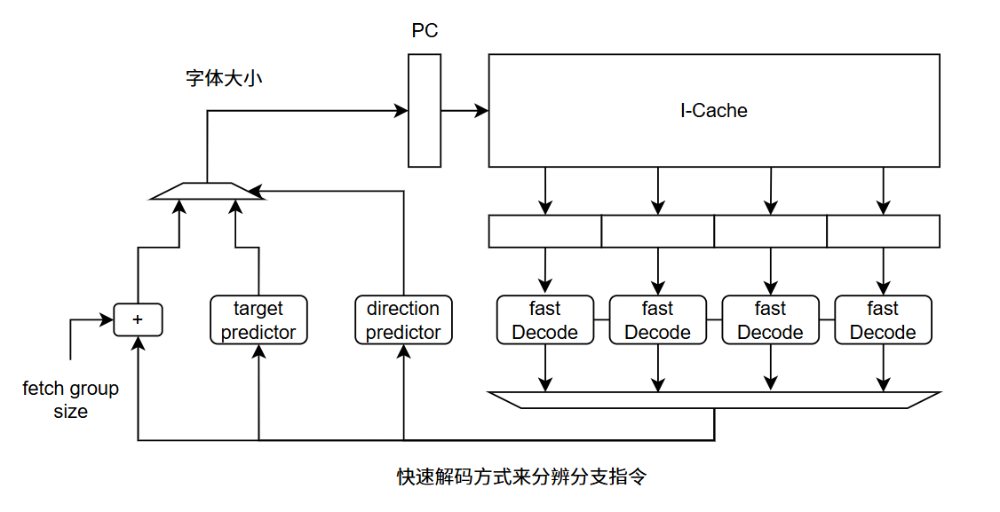
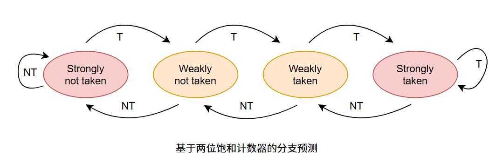
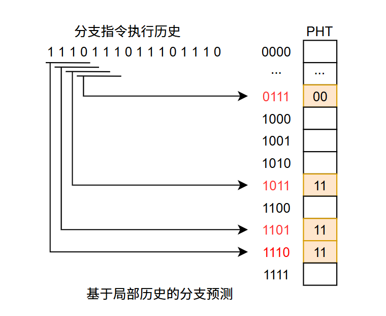
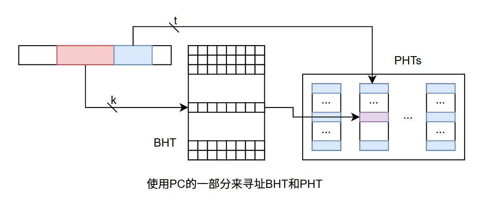
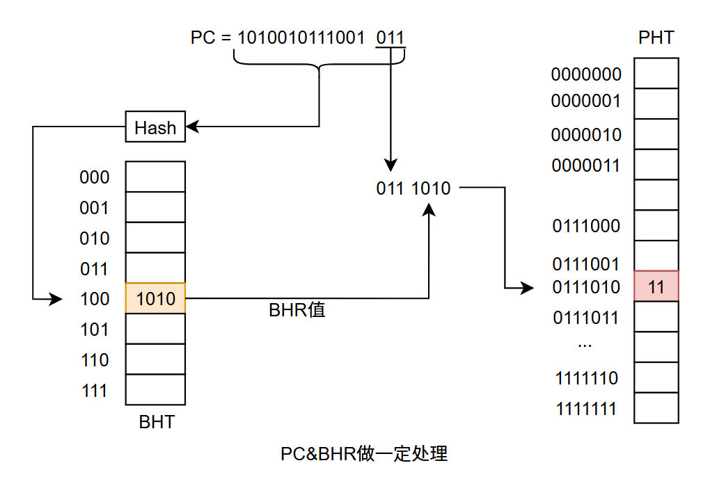
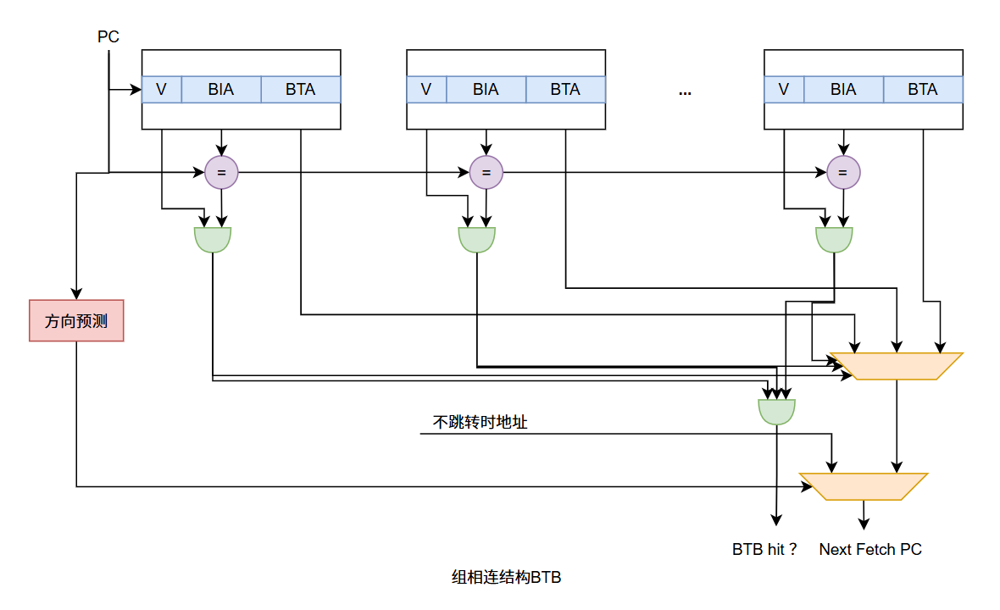
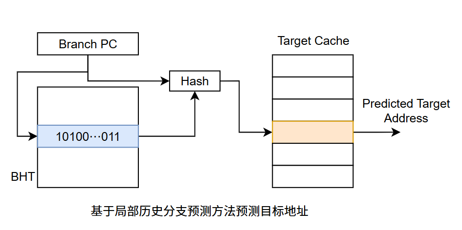
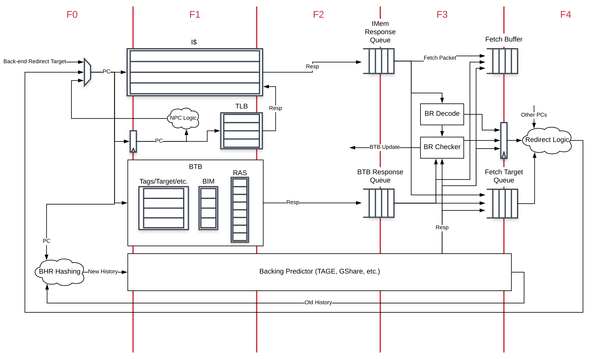

### 分支预测

#### 1.概述

现代处理器中分支预测是除了Cache外另一个重要的内容，它们的设计左右着处理器的性能，一个准确度很高的分支预测器是处理器的关键部件，但现实显然是给你打开了一扇门儿，另一扇必然给你关上了，一个准确度很高的预测器会导致设计复杂的算法电路，占芯片面积还高功耗，设计师在选择的时候需要平衡各种因素。

分支预测分为方向预测和目标地址预测。对于分支指令而言，其方向只会有 Taken or Not Taken 两个方向。对于目标地址预测分直接跳转（PC relative）和间接跳转（Absolute）两种，前者指令中给出相对于PC的一个偏移量，由于指令携带的立即数一般不会变化，这种类型的分支指令是容易进行预测的。间接跳转的目标地址来源于一个寄存器，一般是其它指令的结果，这种类型指令预测较为困难，但庆幸的是程序中大部分间接跳转来源于Call/Return两种，有着较强的规律性，比较容易处理。

介于分支指令的上述特性，在对一条分支指令预测时需要同时对其方向和目标地址进行预测，具体预测可以分为静态预测和动态预测，静态则是固定默认Take或者Not Taken，动态预测则需要根据其执行历史做出判断，后续讲述默认动态预测。

简单的提一个取指到分支预测的问题，要进行分支预测，首先得知道从I-Cache中取出来的指令哪跳是分支指令，容易想到的一个办法是指令从I-Cache中拿到之后进行快速解码（只需要判断是否是分支指令），如下图所示：

处理器周期比较小时，从I-Cache取指到拿到解码结果需要好几个Cycle，在这些周期内都无法拿到预测结果，只能顺序取指（预测不跳转），从而降低了预测准确度，拉低性能，而上图将快速解码和分支预测都放在同一个Cycle，将严重影响处理器周期时间。为了解决这个问题，可以在指令从L2-Cache加载到 I-Cache 之前进行快速解码，也被称作预解码，将指令是否是分支指令信息一并写入到I-Cache中，可以省掉上图的快速解码电路，可以在一定程度上缓解。另外一个比较重要的解决方案则是根据PC进行预测，而不需要解码。

#### 2.方向预测

##### 2.1.两位饱和计数器

现代处理器中应用最广泛的分支预测方法都是基于两位饱和计数器（2-bit saturating counter），并以之为基础引申出的各种分支预测方法，下面细述一下基于两位饱和计数器的分支预测，该方法可以用拥有四个状态的状态机来表示：

1. Strongly taken：计数器处于饱和状态，分支指令本次会被预测发生跳转。
2. Weakly taken：计数器处于不饱和转台，分支指令本次会被预测发生跳转。
3. Weakly not taken：计数器处于不饱和状态，分支指令本次被预测不发生跳转。
4. Strongly not taken：计数器处于饱和状态，分支指令本次被预测不发生跳转。

如图所示，状态机处于饱和状态时，需要两次预测失败才会改变预测的结果。当分支指令的方向总是朝着一个方向时，状态机就会一直处于饱和状态，此时预测准确率比较高，相反当分支指令方向总是变化时状态机就无法处于饱和状态，预测准确率就比较低。

两位饱和计数器的分支预测其核心理念是当一条分支指令连续两次执行的方向是一样时，那第三次执行时也会有同样的方向。如果只是偶尔一次方向改变，那么该分支指令预测值不会变化，有了一个过滤的效果。对于绝大多数程序来讲，两位计数器已经可以获得不错的分支预测准确率，如果增加计数器位宽将引起复杂度上升和更多存储资源需求。

分支预测是以PC为基础进行的，因此正常来讲对于每一个PC应该对应一个两位饱和计数器，实际上不现实也没有必要（32位地址宽度，并非所有指令都是分支指令）。在具体设计时一般从PC中选取k bit或者将PC通过Hash的方式映射到k bit范围内，选取Hash方式是为了降低从两个PC中选出的k bit刚好相同从而相互影响概率，存储计数器值的表称作PHT（Pattern History Table），对于PHT的更新，有以下三个时间点：

1. 流水线取指令阶段，根据分支预测的结果来更新PHT
2. 流水线执行阶段，分支指令结果计算出来时更行PHT
3. 流水线提交阶段，分支指令要离开流水线时更新PHT

分支预测结果可能错误，所以第一种不适用，后面两种因超标量处理器有较深的流水线，因此等拿到结果时可能同一条分支指令被取了很多次，使用的PHT并非最新，但考虑到计数器饱和的特点，更新晚也不会改变计数器状态，不会产生太大负面影响。第二种方案虽说早于第三种方案，但该指令更新时可能处于上一条指令错误的路径上，只有第三种更新是完全靠谱的，但此种使用分支预测的方法有一个98%预测准确率上限。

##### 2.2.基于局部历史的分支预测

理论上只要分支指令很有规律，应该就能进行预测，但基于两位饱和计数器分支预测方法并非完美方法，考虑一种情况，计数器初始状态为Weakly Not Taken，分支指令的执行情况为：TNTNTNTNTNTNTNTNTNTNTN ···，此种情况下分支预测的准确率为0，完美错过所有正确答案，如果初始状态位于Strong Not Taken时，准确率为50%，但这也都将无法接受。

如何去处理上述情况？可以考虑用一个寄存器来记录一条分支指令过去的历史状态，当这个历史状态有规律时就为分支预测提供了一个可以利用的工具，这样的寄存器被称作分支历史寄存器（Branch History Register，BHR），这种方法称作基于局部历史的预测方法，也称作自适应两级分支预测，执行情况如下：

该方法需要用BHR的值去寻址PHT（Pattern History Table），对于每条指令需要有一个BHR以及一个PHT，因此寻址大概是下面这样的：

上述设计需要较多的资源，下面这个是优化版本：

优化后的版本相比之前，PHTs取了一个只有一个PHT的极端情况，PHTs也就不需要用PC来寻址PHT了，对于一个BHR来讲，只会用到PHT中较少的部分，所以BHT中所有BHR可以都寻址这一个PHT，但只是这样会不同的PC存在相同的BHR记录会导致冲突飙升，相互间存在干扰。该方式将完整的PC做一个Hash，减小上一种方式不同PC但k相同的概率，同时PC的低位结合BHR的值，处理不同分支指令但其BHR相同时寻址同一个PHT位置相互影响的问题。

##### 2.3.基于全局历史的分支预测

基于全局分支预测是指一条指令在做分支预测时考虑到其它分支指令的执行结果的方法，实现上则是用一个GHR记录所有分支指令执行的跳转情况，可以理解为基于本地历史分支预测将分支历史寄存器缩减到一个的情况，其对空间的利用等优化同样适用于该预测方法，不做细述。

##### 2.4.基于竞争的分支预测

同时实现前面两种分支预测器，然后用一个两位饱和计数器去确定，预测时使用哪一个预测器的预测结果。

##### 2.5.预测器更新

在之前提到过得三个更新预测器的时间点中，对于全局分支预测GHR的更新可以放在取指阶段，当预测结果出来时直接更新，该方法可用的原因是如果预测错误，则后续的指令使用都在错误的分支路径上，用了对的或者错的结果就无所谓了，但需要考虑对GHR的恢复问题。

对于基于局部历史预测的BHR，更新则是在Commit阶段进行更新。对两者的PHT更新则都放在Commit阶段。

#### 3.地址预测

分支指令除了需要对其方向进行预测同时也需要对其目标地址进行预测。直接跳转类型分支指令目标地址有PC+offset和PC + Fetch Group Size两种情况，对于这类跳转指令，只需要考虑用个表格把每条分支指令的目标地址给记下来就行，当然在朴素思想之上实现肯定需要做一些优化，看下面：

上图展示的是一个组相连结构的BTB示意图，PC的部分作为组索引，检查组内每一个Entry的BIA（Branch Instruction Address，即tag）是否与PC是否相等，通过一个多路选择器选出对应的BTA（Branch Target Address），最后再通过一个多路选择器根据方向预测结果，选出下一个取指PC。当然，组相连的结构增加了一些复杂度，占用硅片面积增大同时降低了BTB访问速度，不过可以做一些优化，比如将BIA域段可以不用存完整的PC而只存部分域段或者用PC通过Hash算出一个固定长度的tag写入。

BTB缺失如何处理？一种方案是直接停掉取指，等这条指令的目标地址被算出来再开始，这种会导致流水线中出现气泡，不同类型分支指令出现多与少不同罢了。另外就是顺序取指，认为分支预测错误，这样做会浪费功耗。

对于间接跳转类型，先看下Call/Ret的处理，这两条指令一般是一一对应的，Ret指令目标地址一般是上一条Call指令的下一条指令地址，因此可以利用一个栈的结构保存Call指令的下一条指令PC，称为返回地址堆栈RAS（Return Address Stack），当对Return指令进行预测时会使用RAS最新进入的地址，因此综合看来，可以用BTB对Call指令进行预测，使用RAS对Return指令进行预测，对于RAS，存在一些优化，为了处理同一个函数连续多次调用存入相同的PC，可以给RAS每个表项增加一个计数，如果写入地址相同则增加计数即可。

当然需要识别出Call指令、Ret指令、其它跳转指令，存在个问题，如果等到从I-Cache取出到解码阶段出结果后才知道Call指令去更新RAS时，中间已经隔了很多周期，已经进入了比较多的指令，如果存在Ret则不能进行很好的预测。如何解决？可以通过在BTB中增加跳转指令类型字段，用来区分Call/Ret/其它指令。因此BTB表项中就包含了Tag、Vld、BTA、brTyp几个字段了。

对于其它分支指令的预测，可以考虑如下方法：

总结下：

1. 使用BTB对直接跳转和Call指令使用BTB进行目标地址预测
2. 使用RAS对Return指令进行预测
3. 使用Target Cache对其它类型分支指令进行预测

#### 4.预测失败恢复

分支指令能被发现预测失败有三个时间点，第一个是在解码阶段，比如一条无条件相对跳转指令被预测为不跳转，那此时可以知道其方向和目标PC，此时做调整和恢复代价是最小的；第二个在读取物理寄存器阶段，可以发现间接跳转指令目标PC是否预测准确，此时可以用正确的目标进行取指，但此时需要对其后续进入流水线的指令进行选择性清除（乱序CPU中发射队列），这个后面讨论；第三阶段是在指令执行时，不论什么分支指令，在此时都是可以判断预测是否准确，但到现在才发现预测错误，其惩罚也是最大的。

对于流水线的恢复，有两个方案，一个是通过ROB进行恢复，简单来讲就是在跳转指令的ROB Entry中对该指令进行标记，如果发现这条指令指令预测错误了，那立马停止取指，流水线持续执行等到该分支指令成为最老的指令后一把清空流水线，重新取指执行，该方案实现简单，但性能损失较多。

第二个是采用Checkpoint的方案，分支指令在进入重命名阶段时保存一些状态信息，主要是寄存器映射表和一些别的信息，在发现预测错误时能够及时恢复，这种方式相比于ROB实现上复杂些，但能够对处理器进行快速恢复。

使用Checkpoint方式相比于ROB方式，还需要将流水线中在错误路径上取出执行的指令进行清除，如何标记需要清除的指令？使用一个空闲编号列表和一个使用编号列表，每当解码到一条分支指令是从空闲列表中取出一个可用的编号，分配给该分支指令以及之后取出的所有指令并写入使用列表中，在分支指令退休时将其编号再从使用列表放回到空闲列表中。

一条分支指令在执行阶段被发现预测错误时，对于在流水线发射之前的所有指令无差别抹除即可（进发射队列之前都是顺序），这个过程在一个周期内可以完成。在发射阶段以及之后的指令，需要靠使用列表中的编号将其找出来并一一抹掉。以ROB为例，可以对需要清除的编号值进行广播，ROB中所有Entry都与广播编号进行比较，如果相等置为无效即可。

#### 5.实例

BOOM uses two levels of branch prediction - a fast [Next-Line Predictor (NLP)](https://docs.boom-core.org/en/latest/sections/terminology.html#term-next-line-predictor-nlp) and a slower but more complex [Backing Predictor (BPD)](https://docs.boom-core.org/en/latest/sections/terminology.html#term-backing-predictor-bpd) [[1\]](https://docs.boom-core.org/en/latest/sections/branch-prediction/index.html#id2). 

##### 5.1.NLP Predictions

BOOM core’s Front-end fetches instructions and predicts every cycle where to fetch the next instructions. If a misprediction is detected in BOOM’s Back-end, or BOOM’s own Backing Predictor (BPD) wants to redirect the pipeline in a different direction, a request is sent to the Front-end and it begins fetching along a new instruction path.

The NLP is an amalgamation of a fully-associative Branch Target Buffer (BTB), Bi-Modal Table (BIM) and a Return Address Stack (RAS) which work together to make a fast, but reasonably accurate prediction.

使用PC信息查询PC tags，找到BTB中匹配的表项，根据表项内容确定当前Fetch Packet中是否包含跳转指令，跳转指令类型。如果是条件跳转指令，则根据BIM确定跳转与否，对于无条件跳转而言则不需要关注BIM信息。对于Ret指令，其目标地址来源于RAS，同时Pop RAS（对于Call指令则将返回地址压栈），其它通过BTB中获取。其中bidx用于记录在该Fetch Packet中哪条指令是跳转类型指令。

The BTB is updated *only* when the Front-end is redirected to *take* a branch or jump by either the Branch Unit (in the Execute stage) or the BPD  (later in the **Fetch** stages).  If there is no BTB entry corresponding to the taken branch or jump, an new entry is allocated for it.

需要注意的是在NLP预测器中因为需要在Fetch阶段同步进行预测，因此使用的是Fetch Packet PC，而不是使用Branch Instruction PC。

##### 5.2.The Banking Predictor(BPD)

​	参考:https://docs.boom-core.org/en/latest/sections/branch-prediction/backing-predictor.html

#### 6.诗词

《青玉案 · 元夕》 -- 辛弃疾

东风夜放花千树，更吹落，星如雨。宝马雕车香满路。凤箫声动，玉壶光转，一夜鱼龙舞。

蛾儿雪柳黄金缕，笑语盈盈暗香去。众里寻他千百度，默然回首，那人却在，灯火阑珊处。

刚刷到伊朗给以色列刷大火箭的视屏，不知道我们的东风导弹是否取自辛弃疾的《青玉案·元夕》。

