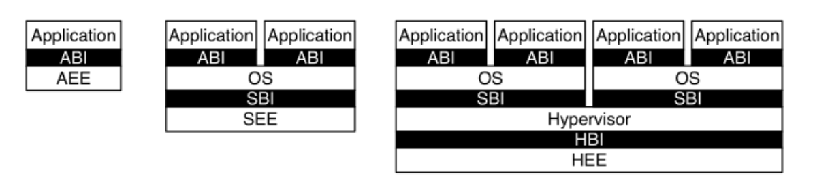

### RISC-V体系结构概述

#### 1.RISC-V概述

​	RISC-V是一种精简指令集计算机（Reduced Instruction Set Computer，RISC）架构，由美国加州大学伯克利分校开发。其中“V”表示第5代设计版本。RISC-V指令集规范分为两部分：

- **非特权架构：**定义用户态可用指令、寄存器数量与类型等类容。
- **特权架构：**定义不同的特权模式、操作系统运行所需要的功能，以及与外设交互的机制

两者相互独立，允许分别搭配使用。

##### 1.1.指令集优点

1. **设计简洁：**基础指令集规范和体系结构文档精炼，方便实现与移植。
2. **模块化：**提供了一个最小指令集，通过模块的方式扩展（原子、浮点、乘法等）增强功能。
3. **开源：**指令集完全免费开放，允许自由实现与修改，便于研究与商用实现。
4. **软件生态：**广泛被Linux内核、GCC等主流开源项目支持。

规范文档可在 [RISC-V 官网](https://riscv.org/) 免费获取。

#### 2.非特权架构

对于非特权架构（User-Level ISA），主要定义了：

- 基础指令集
- 扩展指令集
- 用户态寄存器配置

##### 2.1.基础指令集

​	**RV32I / RV64I** 分别表示32位与64位基础指令集。 RV64I 在 RV32I 基础上增加了对 64 位操作（Doubleword）及部分长整型运算的支持，并将所有通用寄存器扩展为 64 位。

##### 2.2.扩展指令集

RISC-V 提供了多种标准扩展，可根据需求自由组合：
- **M**：整数乘除法扩展（Multiply/Divide）
- **F**：单精度浮点运算（Floating-Point Single）
- **D**：双精度浮点运算（Floating-Point Double）
- **Q**：四倍精度浮点运算（Quadruple-Precision Floating-Point）
- **C**：指令压缩（Compressed）
- **A**：原子操作（Atomic）
- **B**：位操作（Bit-Manipulation）
- **E**：适用于嵌入式的精简寄存器版本（仅 16 个寄存器）

一个常用的组合是 **RV64G**（即 RV64IMAFD），包含整数、乘法、原子、浮点等常用功能。

##### 2.3.通用寄存器

RISC-V 定义了 32 个通用整数寄存器（`x0`~`x31`），每个寄存器都有固定的别名与功能：

| 寄存器编号  |  别名  | 用途说明                                         |
| :---------: | :----: | ------------------------------------------------ |
|    `x0`     |  zero  | 恒为零，读返回 0，写操作被忽略                   |
|    `x1`     |   ra   | 返回地址寄存器（Return Address）                 |
|    `x2`     |   sp   | 栈指针（Stack Pointer）                          |
|    `x3`     |   gp   | 全局指针（Global Pointer），用于全局变量访问优化 |
|    `x4`     |   tp   | 线程指针（Thread Pointer）                       |
|  `x5`~`x7`  | t0~t2  | 临时寄存器                                       |
|    `x8`     | s0/fp  | 保存寄存器 / 帧指针（Frame Pointer）             |
|    `x9`     |   s1   | 保存寄存器                                       |
| `x10`~`x17` | a0~a7  | 参数/返回值寄存器（Argument/Return Value）       |
| `x18`~`x27` | s2~s11 | 保存寄存器                                       |
| `x28`~`x31` | t3~t6  | 临时寄存器                                       |

此外，若支持浮点扩展，还包含 32 个浮点寄存器（`f0`~`f31`），命名与用途在浮点扩展规范中定义。

#### 3.特权架构

RISC-V 特权架构（Privilege Architecture）支持多种特权模式，以满足裸机、操作系统及虚拟化运行环境的需求。

##### 3.1.特权模式

- **M-机器模式：**最高权限模式，通常运行引导程序（bootloader）、固件以及设备管理代码，对硬件有完全的访问权限。
- **S-特权模式：**主要用来跑操作系统内核，为应用程序提供服务。
- **U-用户模式**：特权级别最低，用于运行应用程序。
- **HS：**在支持虚拟化的处理器中，原有S模式可扩展为HS模式，用于运行虚拟化管理程序（Hypervisor）
- **VS/VU：**分别对应与虚拟操作系统内核与应用程序

处理器的实现上，常见的模式组合有:

- **仅M模式：** 适用于嵌入式系统
- **M-U模式：**带安全特性的嵌入式系统
- **M-S-U模式：**运行通用操作系统如Linux
- **M-HS-VS-VU-U模式：**支持虚拟化的多操作系统环境

##### 3.2.软件栈结构

最左边是一个裸机程序，App通过ABI直接访问硬件资源；中间则是支持操作系统，App运行在U模式，通过ABI与OS交互，OS运行在S模式，通过SBI与SEE交互，SEE则是在M模式下运行的可信程序；最右边一个软件栈结构使用虚拟化功能，为用户提供多个特权模式的执行环境。

##### 3.3.CSR（控制与状态寄存器）

特权架构定义了大量控制与状态寄存器（Control and Status Register, CSR），用于管理不同模式下的运行状态。同时对寄存器地址编码空间继续做了约定，

​	**Bit[11:10]：**表示寄存器读写属性，0b11表示只读，其它可读写；

​	**Bit[9:8]：**表示允许访问该寄存器的模式，0b00-U，0b01-S，0b10-HS/VS，0b11-M；

​	**Bit[7:0]：**用作地址索引。

**各模式常见的CSR：**

| 模式   | 常见 CSR 寄存器                                              |
| ------ | ------------------------------------------------------------ |
| M 模式 | `mstatus`, `misa`, `medeleg`, `mideleg`, `mtvec`, `mepc`, `mcause`, `mtval`, `mip` |
| S 模式 | `sstatus`, `sie`, `stvec`, `sepc`, `scause`, `stval`, `sip`, `satp` |
| U 模式 | `fflags`, `frm`, `fcsr`, `cycle`, `time`, `instret`          |

对于寄存器功能在这不做细述，细节在RV的SPEC中有详细描述，在涉及使用到的文章内会有所提及。

