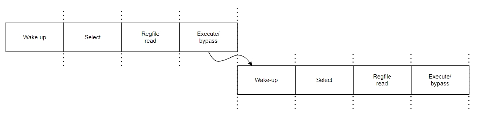
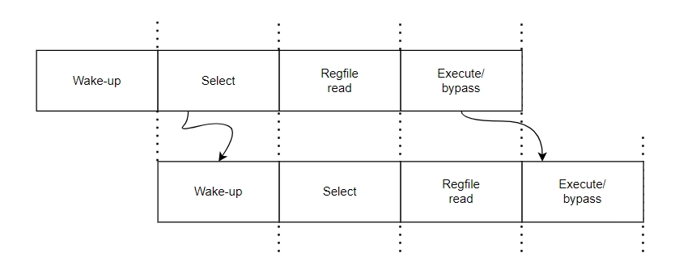

## 超标量处理器-08-发射

### 1. 概述

​	发射阶段是指在指令重命名之后写入ROB中的同时，指令也会写入到发射队列中，发射是指从发射队列中选出符合条件的指令送到FU中执行的过程。该阶段之前指令都是按照程序原始顺序流动，发射阶段是从顺序转向乱序的分界点，指令执行完成后在提交阶段通过ROB拉回顺序。给出发射阶段涉及的重要部件，包括一下几个：

1. 发射队列：用来存储重命名后的指令。
2. 分配电路：用来从发射队列中找到空闲的位置，将指令写入。
3. 选择电路：也称仲裁电路，在发射队列中已准备好的指令中选择合适的指令送到FU执行。
4. 唤醒电路：当一条指令执行完成得到结果时会将其通知给发射队列中等待该结果的指令，并设置该指令的源寄存器为有效状态。

发射队列实现包含了几种方式：

1. 集中式和分布式
2. 压缩方式和非压缩方式
3. 数据捕捉方式和非数据捕捉方式

上述三种结构正交，可以相互配合。

**集中式VS分布式**

​	现代超标量处理器支持并行执行情况下都会有多个FU，当所有的FU都共用一个发射队列，我们称这种方式为集中式发射队列（CIQ），而如果每个FU都有一个发射队列时我们称之为分布式设计(DIQ)。

​	集中式设计发射队列容量比较大，对缓存有比较高的利用效率，但这会使得选择电路和唤醒电路变得比较复杂，因为需要从数量庞大的指令中选出几条指令给到FU执行，并需要唤醒这几条指令相关的指令进行唤醒。

​	分布式每个FU都有一个发射队列，容量可以比较小，这样可以简化掉选择电路的设计，但存在一个问题，当某一个FU发射队列满了后，再次出现相应的指令时会阻塞发射阶段之前所有流水，直到这个队列中有空闲空间为止，其它发射队列也不能进入，发射队列使用效率低下，同时发射队列过多后会导致唤醒电路变得复杂，因此大多数电路设计会选择几个FU共用一个发射队列，部分则采用独立发射队列。

**数据捕捉VS非数据捕捉**

​	数据捕捉方式则是指在发射阶段之前进行源操作数读取，将读取到的操作数一并写入到发射队列中，没有读取到操作数的情况则会将寄存器编号写入到发射队列中（操作数则存储在payload RAM中），以供唤醒过程使用，标记为无法获得状态，在后续通过旁路网络获得，并不需要读取物理寄存器堆。当一条指令被选中时，会将其目的寄存器进行广播，发射队列中指令源操作数相同编号的情况位置进行标记，当指令在FU中执行完成时写入，这是通过旁路网络来实现的。

​	第二种是在发射阶段之后读取寄存器堆，因此发射队列中少了payload RAM这部分电路，但因发射width一般大于machine width，所以对物理寄存器要求比较高一些。实际上一般数据获取方式同重命名方式绑定，数据捕捉对数据存储位置变化不敏感，而非数据捕捉方式则对数据存储位置较敏感。

**压缩方式VS非压缩方式**

​	压缩方式是指当发射队列中有指令被选择到FU中进行执行时，发射队列中的指令向下移动一个到三个位置（压缩位置越多电路越复杂），将空间填满，保证空的位置在发射队列后端。选择电路容易按照old-first方式选择指令，选择电路挨个遍历发射队列信号时，它的延迟和表项个数成正比的。

​	总的来说这种方式分配电路比较简单，因为空位置都在发射队列顶端，用一个写指针维护即可。选择电路比较简单，因为发射队列中的指令已经从新到旧排好了。缺点也比较明显，实现起来比较费硅片面积，当并行执行指令越多则压缩的位置越多，需要大量的布线资源和复杂的多路选择器，另外一个功耗大，很多指令在队列中进行移动增加了功耗。

​	非压缩方式则不需要对指令进行移位，这减少了选择器和布线面积，减少了功耗，但当需要实现old-fist选择电路是比较复杂的，同时也带来更大的延迟，分配电路也变得复杂，无法像上面那样直接写入。

### 2. 发射过程流水线

​	非数据捕捉方式的流水线，发射阶段一般分为唤醒和仲裁两个阶段，唤醒阶段指令中的源操作寄存器会被设置为Ready状态，而仲裁则从Ready状态指令中选择指令进入FU,如下图所示：

上述两条存在RAW相关的指令无法获得背靠背执行，相差了3个Cycle，效率并非最高的，可以将唤醒操作提前，进一步改进如下:

上图中隐藏了一个细节，仲裁和唤醒同时进行，实际上并不是，仲裁和唤醒是串行执行的，先仲裁然后唤醒，后面的指令从旁路网络中获取源操作数结果。

### 3. 分配

### 4. 仲裁

### 5. 唤醒

